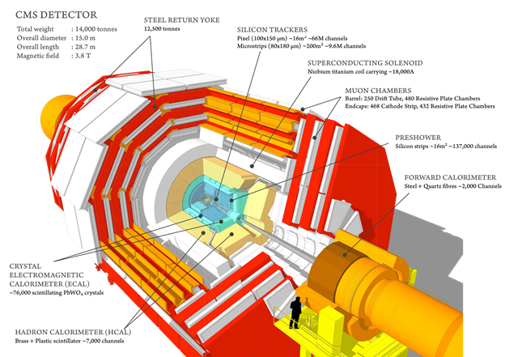

---
title:  'U.S. CMS Compact Muon Solenoid
Operations Program Quarterly Report
for the Period Ending March 31, 2015'
author:
- name: U.S. CMS Operations Program
abstract: |
    \vspace*{-1.0in}
    \ 
tags: [USCMS, report]
bibliography: r.bib
csl: /Volumes/Users/bauerdic/Docs/_Dev/pandoc-templates/csl/institute-of-physics-numeric.csl
...
\pagestyle{qr}
\makeoddfoot  {qr}{\hspace*{-0.07in} \small{U.S. CMS Operations Program 2015Q1}}{}{\small Page \thepage}
