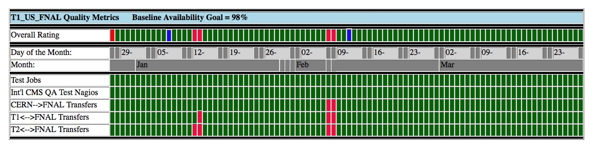
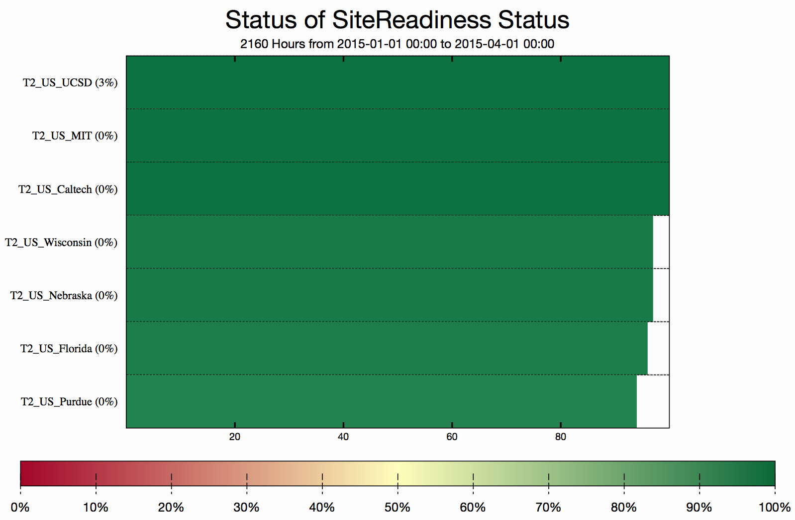
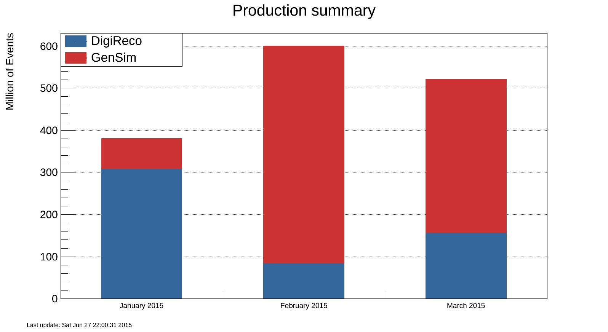

# Software and Computing 

The first quarter of 2015 has seen all of CMS prepare for the start of the 13 TeV collisions of Run 2, and U.S. CMS Software and Computing has been helping the collaboration be ready for this important moment in the history of the LHC.  The U.S. facilities, both Tier-1 and Tier-2, have deployed their full complement of computing resources -- processing, disk and tape -- by the April 1 start of the WLCG resource year.  All facilities have maintained high levels of availability and continued to evolve their systems to make use of new capabilities in areas such as multi-core job processing and wide-area network bandwidth expansions.  The team supporting Tier-3 facilities has also prepared for the start of the run via direct site support and the development of services such as CMS Connect.  Operations teams have been deeply involved in scale testing of processing at the Tier-0 facility and data movement at Tier-1 facilities, along with processing of important Monte Carlo samples for both the coming run and Phase 2 upgrades.  The Software and Services team continued to deploy new features in support of both of those running periods.  Efforts in the Computing Infrastructure and Services area included improving the functionality, stability and scalability of the grid and cloud based job submission infrastructure, enabling the use of opportunistic resources, and improving the availability of CMS data through more dynamic and flexible storage strategies.  Particularly interesting features included the production release of the CRAB3 analysis job submission system, and efforts to make use of ASCR facilities and commercial clouds as part of a strategy to add resources to the computing infrastructure more dynamically.  

## Fermilab Facilities

This was a productive quarter for the Fermilab Tier-1 facility, as we continued to prepare for the start of LHC Run 2.   In anticipation of the run, U.S. CMS has pledged to provide 120 kHS06 in CPU, 10,800 TB in disk, and 29,400 TB in tape resources at the Fermilab Tier-1 center.  All of these capabilities were successfully deployed and available to CMS in time for the April 1, 2015 deadline.  During this quarter FNAL facilities were available over 99% of the time, with site readiness metrics passing 94% of the time, as shown in Figure \ref{sc-fig1}. The site readiness metrics for a Tier-1 are expected to be above 98% averaged over the year during LHC running time.

Beyond increasing the quantity of computing to CMS this year, the Tier-1 facility improved the capability of those resources.  As luminosity increases in the upcoming run, CMS is expected to require its CPU resources be able to be used in a multi-core mode, with tasks utilizing multiple CPU cores simultaneously.  In early February, the FNAL Tier-1 became the first of the CMS Tier-1s to provide all its CPU as partitionable multi-core slots, allowing jobs to run any configuration from 1 to 8 simultaneous cores, as needed.  Early in March CMS began first tests of Tier-0 workflows which successfully used this capability.

This quarter we also aggressively tested data transfer capabilities from CERN, which also tested the new ESnet transatlantic link.  CMS expects to be able to transfer data at rates peaking at 600MB/s to FNAL disk only storage, and 400 MB/s to tape storage.  In February FNAL underwent a week-long test demonstrating 1.3 MB/s aggregate transfers from CERN.  In addition to the CMS requirements we also added simultaneous staging of 400 TB of data, and initiating a deletion of about 1 PB of test data to further strain the dCache storage servers.   These tests were successful in hitting needed rates and identifying potential bottlenecks in the software driving data transfers.

## University Facilities
### Tier-2 facilities

The first quarter of 2015 saw continued light usage of the U.S. CMS Tier-2 facilities. Most data analyses from the previous LHC run have been completed, and the demand for simulation samples for Run 2 has not picked up yet.

The seven U.S. sites have continued in their preparations for the coming data run through a program of technical improvements and the deployment of necessary hardware resources. Important improvements to networking in particular have been made in the past quarter. All seven sites have ~100Gbps WAN capability now. Also, ESnet is starting to connect Tier-2 sites to their LHCONE VPN. All sites have deployed the HTCondor-CE computing element, and have either retired or are planning to retire their GRAM CEs. CMS is also testing the running of very high-IO data reconstruction at the U.S. Tier-2 sites, instead of only at Tier-1 sites.

All sites have operated successfully this quarter. On our two official performance metrics based on CMS test jobs, all sites were at least 88% “available” and 94% “ready”, see Figure \ref{sc-fig2}. The CMS goal for each of these metrics is 80%. The U.S. Tier-2 centers hosted 39% of all CMS user analysis jobs (goal is 25%).

### Tier-3 support

Fourteen Tier-3 sites required assistance from the Tier-3 support team this past quarter.  These support activities include helping sites complete the transition from OSG 3.1 to 3.2 and assisting several sites in rebuilding their site in preparation for Run 2.  In addition, we migrated the centrally operated PhEDEx server for Tier-3 sites from SL5 to SL6 and the latest version of PhEDEx.  A majority of the issues concerned the following packages/tools: GUMS, HTCondor-CE, SUM tests, XRootD, Hadoop, CVMFS, glexec, PhEDEx, certificates, GlideInWMS, and squids.  In addition, we also helped resolve problems with Rocks, GIP/BDII, OIM, SSL, RSV tests, and lcg-tools.

The Tier-3 support team has undertaken an effort to refresh the documentation for Tier-3 configuration and administration.  This effort will continue into the next quarter.  We are also investigating options for making installation and administration of Tier-3 sites easier for sites by making use of modern cluster configuration and provisioning systems like Puppet and Foreman.  A survey was initiated to collect information on how site coordinators currently manage their sites.  This activity is ongoing.

### CMS Connect

The U.S. CMS software and computing project took the first concrete steps towards standing up a new service, CMS Connect, based on the CI-Connect platform developed for OSG.  The CI-Connect platform is also used to implement the OSG Connect and ATLAS Connect services.  Working with the OSG team from the University of Chicago, we have configured the login server and configures the service to send jobs to the CMS GlideInWMS factory operated at UCSD.  We have demonstrated the ability to submit and run jobs through the CMS Connect service, and are in the process of preparing documentation in anticipation of opening the system to the first beta testers in the next quarter.

## Computing Operations

In this quarter the Tier-0 was operating in data taking mode to support recording of cosmic ray events without and with magnet field on.  A sufficient number of cosmic ray events were collected to align the detector for the startup of LHC Run 2. In parallel, scale testing of the Tier-0 infrastructure directly using the OpenStack cloud at CERN was continuing, identifying several bottlenecks that were solved together with CERN-IT. Importantly for the Tier-0, CMS completed establishing the glideinWMS global pool, combining all previously separate analysis and production pools and allowing for more flexible provisioning and optimization of resources. The Tier-0 was the last system to be migrated. CMS decided to have a separate Tier-0 glideinWMS pool to guarantee undisturbed data taking, but with the ability to flock jobs to the global pool to run prompt reconstruction at all Tier-1 sites. Each Tier-1 site is now able to run multi-core pilot jobs using 4-8 cores, running the CMS reconstruction application multi-threaded across multiple cores, for data taking and re-reconstruction of data, at the Tier-0 and all Tier-1 sites. The global pool itself reached more than 110k parallel jobs and now is the largest HTCondor-based glideinWMS pool in the world.

On the data management side, all Tier-1s placed about 50% of their disk resources under dynamic data management. The remaining 50% of the disk space will be managed by operations to pre-stage input samples for processing and to keep freshly recorded data permanently on disk to allow for rapid re-reconstruction if the need arises in LHC Run 2. All Tier-1 sites ran tape staging scale tests and fulfilled the requirements for LHC Run 2.

On the processing side, a large number of high-priority Monte Carlo production campaigns were run particularly for the Phase 2 Upgrade efforts. The number of events produced is shown in Figure \ref{sc-fig3}. In addition, a re-digitization/re-reconstruction campaign of the data samples produced for the 2014 computing, software and analysis challenge (CSA14) was finished in this quarter. All these activities were delayed from their original schedule due to continuing issues with availability of validated CMSSW software releases, but computing operations did their best to make up for delays by increasing turn-around times for production, using the HLT farm when available, and through other measures. The Phase 2 Upgrade workflows put a particularly high stress on the systems due to their increased memory needs and high I/O rates from the mixing of very large number of pileup events. MC simulation ran in parallel producing the requested number of MC events.

## Computing Infrastructure and Services

During the LS1 period the work within U.S. CMS Computing Infrastructure and Services centered around infrastructure improvements needed to be fully ready for the next LHC run in 2015. Work in this area includes improving the functionality, stability and scalability of the grid and cloud based job submission infrastructure, enabling the use of opportunistic resources, and improving the availability of CMS data through more dynamic and flexible storage strategies.

During the quarter, work on the WMAgent concentrated on minor improvements needed for the impending Run 2. This entailed continued refinement and improved monitoring for multi-core workflows and progress towards abstracting how processing and storage locations are referenced to insulate the agents from internal changes at sites. The WMAgent team completed the migration to CouchDB 1.6 and made substantial progress towards replacing the request management system. For the next quarter we aim to release this system as well as to begin preparations for WMArchive, a new database which will store performance information about each job. 

The Tier-0 system was successfully operated through several test runs as well as through both the CRUZET (0 T) and CRAFT (3.8 T) cosmic-ray runs used for calibration. The system was scaled up to 9,000 cores (compared to the 14,000 cores expected for the final system). The ability to run multithreaded prompt reco on the Tier-1 systems was successfully tested. With development effectively finished for the Tier-0, the aim for the next quarter and beyond is to reliably operate the system during Run 2 data taking. 

The reporting period saw a major milestone on the analysis system as CRAB3 was declared to be in production and the preferred system for CMS analysis-job submission. The user base continued to expand, see Figure \ref{sc-fig4}, as improvements to end-user conveniences were put in place, including an option to predict the optimal job configuration parameters based on an automated test run. Work commenced on enabling CRAB jobs to be submitted to the FNAL LPC analysis facility, LPC-CAF. This capability is on track to be delivered late next or the following quarter.

DBS, DAS, and PhEDEx are U.S. data management products and are all in stable condition for the start of Run 2. Each has seen minor tweaks to adapt to new operating conditions. Furthermore, in this quarter CMS conducted a review aimed at improving data management and movement for end users; this review resulted in a number of recommendations which will be turned into work packages over the next year or so. This will impact all of the data management products, but is only a moderate amount of effort.

There was no glideinWMS release during the quarter. However, significant progress was made towards next quarter's goals: a master-slave high-availability mode for the VO frontend and a separation of the user collector from the collection broker. This will enable the infrastructure to scale more than 150,000 jobs in a pool.

Xrootd related activities in this quarter revolved around the xrootd-4.2 release, especially consolidations of the caching proxy code. We added support for using the xrootd built-in volume manager, allowing caching proxy to use several mount-points for data storage. We also implemented and tested a configuration for a cluster of caching proxies. As this is a rather novel usage, some minor changes needed to be implemented within xrootd itself. Following these two extensions we also consolidated the caching proxy configuration syntax. The hdfs healing code was rewritten in a more robust manner and packaged for inclusion into OSG software stack to make it more easily available to all CMS sites operating hdfs. At the end of January we helped organize a very successful XRootd workshop at UCSD, which brought together the XRootd developers with members of ALICE, ATLAS, CMS and OSG.

In addition to the global pool transition already mentioned above, we commissioned workflows on DOE (NERSC Carver) and NSF (SDSC Gordon) supercomputers, and submitted an Amazon Web Services (AWS) proposal that was accepted. The latter is a two-year pilot project for which AWS covers 90% of the cost. The goal of the proposal is to establish our capability to elastically grow resources to meet deadlines. In year one of the project, this elastic scaling is proposed to reach 50% increase in resources for CMS globally, sustained for 1 month. The proposal is a joint venture with Fermilab and OSG, and is thus driven by the U.S. both intellectually as well as regarding effort to execute the project. All of these activities are part of a larger objective towards more agile operations across traditional as well as less traditional types of resources in the future.

## Software and Support

The software group continues to produce improved software releases to support the development of the major fronts of CMS.  The two areas of primary development are Run 2 and Phase 2 upgrades, where the reconstruction software for both continues to evolve.  To be ready for the new challenges of Run 2, both the physics performance, particularly in preparation for 25 ns LHC operations, and the technical performance of this software has continued to improve. Recent accomplishments include the adoption of ROOT6 and continued adoption of the multi-threaded framework within the simulation and reconstruction areas. The software release for data taking is currently in its final preparation phase.

The CMSSW release cycle for SLHC upgrade studies, CMSSW_6_2_X_SLHC, continues to be the basis of simulation studies to support the preparation of the Technical Proposal for the CMS Phase 2 upgrade for the HL-LHC. This release supports both Phase 1 and Phase 2 detector studies. The Phase 2 simulation configurations for the Technical Proposal are now finalized, including recent work on the forward calorimetric systems, forward region shielding and support materials. There is a continued focus on the challenges of developing robust reconstruction algorithms despite the very high pileup conditions, which include up to an average pileup of 200 interactions per bunch crossing. Production campaigns of large Monte Carlo sample generations have continued as the software has been evolving. Significant improvements in both the operational and reconstruction quality of these very challenging applications have been achieved over the past three months.
