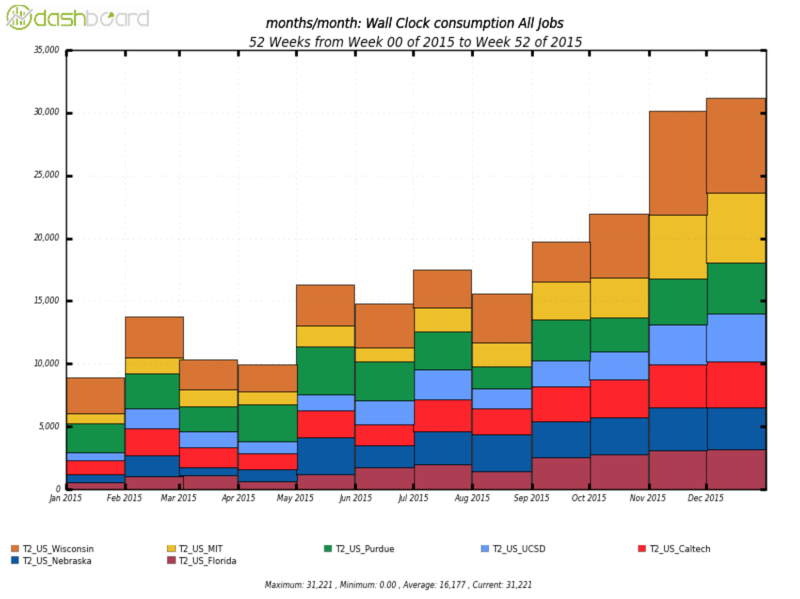
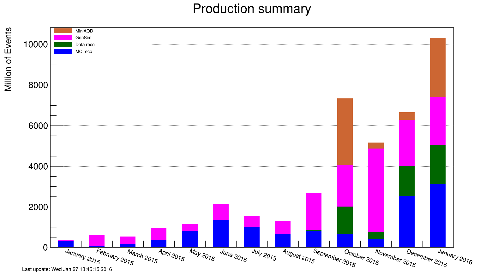

# Software and Computing

During this quarter, the LHC completed this year's proton-proton, run with collided heavy ions for a month, and then entered a year-end shutdown with no data taking. These LHC activities set the agenda for U.S. CMS Software and Computing this quarter. The end of the proton run led to the traditional reprocessing pass for both data and simulation samples. Much work was done in the software to be ready for that, and to prepare the facilities and infrastructure systems for the processing. The heavy-ion run put particular strains on many aspects of the system, which required fast turnaround on a number of development efforts. These will be useful within the proton program as higher luminosities are reached. And finally, the shutdown allowed all facilities to focus on reprocessing activities. All computing facilities had excellent performance during this period, with a record number of CPU hours delivered by the Fermilab Tier-1 facility (despite a few operational difficulties) and heavy use of the Tier-2 centers. The operations team used these facilities to deliver many samples that will be needed to present new physics results at the upcoming winter conferences. R&D efforts supported these activities, including the first scale tests of the Fermilab HEPCloud elastic facility, which is expected to have some major achievements during the second quarter.

Date            Milestone  
--------------  -----------------------------------------------
October 2015    Tier0 2.0.0 released
October 2015    CMSSW\_7\_6\_0 released with features needed for end-of-year reprocessing
November 2015   CMSSW\_7\_5\_0 deployed in the Tier-0 facility for HI data taking
November 2015   Tier 1 FY15 CPU and disk purchases deployed
December 2015   WMAgent 1.0.12 released
December 2015   End-of-year reprocessing begins

Table: Major milestones achieved this quarter

## Fermilab Facilities

The 2015 portion of LHC Run 2 completed in the first quarter of the 2016 fiscal year, with the Fermilab facility accepting almost 4 PB of collision and simulated data.  Over 8000 cores of additional CPU resources from the FY15 purchase cycle were also deployed this quarter. These resources were fully utilized as soon as they were deployed due to the increase in CPU demands by CMS in preparation for winter conferences.

Fermilab site readiness metrics were impacted by the many changes in deploying these resources. Two periods of failing metrics are seen in Figure {@fig:T1}. The first, in October was due to a controller failure on one of the older storage nodes, leading to failed test jobs and transfer failures until recovery. A second period of failing metrics is seen in November due to a misconfiguration of the new CPU nodes deployed at that time. The misconfiguration primarily affected the test jobs themselves. Despite these incidents FNAL provided over 33 million successful wall hours to CMS in the quarter, more than any quarter prior.

Late in this quarter the Tier-1 facility began working toward upgrading the dCache disk and tape storage pools to the latest supported version, and transitioning its support to the Data Management Services department within Fermilab Scientific Computing Division. That department also supports the Fermilab public dCache storage and the lab’s Enstore tape archive (including that for CMS), so this move is both a consolidation of effort and working toward a service model of support for CMS. The 8 PB of disk storage purchased in 2015 is being used to facilitate this upgrade by providing a separate pool to thoroughly test the targeted version for the dCache upgrade.

## University Facilities

The first quarter of FY16 saw a continuing increase in the usage of the U.S. CMS Tier-2 facilities, as seen in Figure 2. This increase was largely due to running the CMS data reconstruction at the U.S. Tier-2 sites. This workflow has been possible at Tier-2 sites since May 2015, thanks in part to development work undertaken during the shutdown. These workflows place a heavy strain on the internal networking capabilities of the sites, but the U.S. sites are all able to handle the increased load. Physics analysis with CRAB3 and other production activities are also increasing.

The seven U.S. sites have finalized their hardware deployments for 2015 and are planning or actively purchasing hardware for 2016. The connection of the Tier-2 sites to the LHCONE VPN by ESNet is proceeding in an orderly manner and should be completed during the current quarter. All sites have deployed the HTCondor-CE computing element, and over half of the sites have retired their GRAM CEs. The rest are planning to do so soon, perhaps in this quarter. The motivation for this transition is better stability and scalability as well as easier support.

All of the U.S. CMS Tier-2 sites have operated successfully this quarter. On our two zaofficial performance metrics based on CMS test jobs, all sites were at least 82.5% available and 93% ready. The CMS goal for each of these metrics is 80%. The U.S. CMS Tier-2 centers delivered 42.9% of all computing time by Tier-2 sites in CMS (our commitment to global CMS is &gt; 25%), making them seven of the eight most-used Tier-2 sites in all of global CMS.

{#fig:T2} 

Five Tier-3 sites required assistance from the Tier-3 support team this past quarter. Most sites have transitioned to OSG 3.2 so support efforts are primarily focused on helping sites that are rebuilding their sites (primarily Rice, FSU, and UMD). TAMU became the first U.S. Tier 3 site to implement the submission for local users via GlideinWMS/CRAB3; this allows physicists to use the exact same tools for submitting jobs both to the grid and to local resources. Support was also provided for updating PhEDEx parameters and keys.

This quarter, the CMS Connect effort focused on transitioning CMS Connect from a dedicated GlideinWMS factory hosted at UCSD to the global CMS ITB factory. The final software developments required to begin beta testing have been completed. Beta testers have been recruited to give feedback during the current quarter.

## Operations

Operations during Q1 was dominated by three main activities: finishing up the data processing for the 13 TeV pp run, closing the
CMSSW\_74x DIGI-RECO processing, and processing the 2015 heavy-ion data. The very end of the quarter was dedicated to the preparation of the CMSSW\_76x re-reconstruction of all data, which finally got started on December 18 and ran well throughout the end-of-year break. In the first quarter of FY16 we have completed 3.6 B
DIGI-RECO events (including some 76x re-reco), 8.9 B GEN-SIM events and redone 3.9 B MINIAOD and 3.7 B data events re-reconstructed. This is a substantial increase with respect to the production activity during the year as shown in Figure {@fig:ops}.

{#fig:ops}

The Computing Operations project has transitioned into the new organizational structure of the CMS Offline Software and Computing project. The ‘Central Services’ and the ‘Facilities and Infrastructure’ groups in Computing Operations have been replaced with a single Liaison to new level-2 organization ‘Facilities and Services’. A new Computing Operations group, ‘Tools and Integration’ is being established to better address the topics of integration of our tools.

## Computing Infrastructure and Services

This quarter came to a close with the LHC heavy-ion running. This was a challenge for the CMS Tier0, as the facility was pushed beyond its design limits to maximize the amount of data collected. However, due to improvements made during the quarter to WMAgent and the Tier0, particularly performance enhancements and increased robustness of data publication and injection, the Tier0 performed well under this extreme load.

Among numerous improvements to WMAgent, the developers added settings to allow workflows to overflow into opportunistic resources. Planning has begun for a needed refactoring of WMAgent to better use resources available for a limited time and to reduce operational effort. The WMArchive project to store all the performance and monitoring data as well as provide access to debugging data from WMAgent made good progress as the principal contributors met several times and determined their roles and finalized the architecture.

All projects have finished modernizing their Python code in preparation for the move to Python3. Enhancements to DBS and WMAgent to improve the memory performance of the applications went into production.

Towards our long-term goal of “elastic scale out,” we made considerable progress in collaboration with the HEPCloud project. We have an allocation on AWS to establish sustained operations at a level of 50,000 cores. We use the standard CMS production infrastructure to submit workflows to the Fermilab Tier-1, and augment its resources by elastically scaling out to AWS via HEPCloud. During Q1, we successfully achieved first 1% and then 10% scale, i.e. initially 500, and then 5000 cores sustained operations. The 100% scale operations planned for Q2 will produce actual simulation requests at AWS that are necessary for the CMS science program.

## Software and Support

During this quarter significant effort went into understanding the detector response to the extra out-of-time pileup at 25 ns bunch spacing relative to the previous running conditions at 50 ns bunch spacing. The knowledge gained was captured in the code and calibrations delivered in the CMSSW 7\_6\_0 release, which was used to reprocess all of the data collected in 2015.

The commissioning of the heavy-ion data taking required many modifications to the CMSSW 7\_5\_0 release used to acquire the data. Thanks in part to being able to run the heavy-ion HLT and Tier0 applications in multi-threaded mode, the data was collected and processed at unprecedented rates and operations were considered very successful.

## Technologies and Upgrade R&D

The R&D area has continued work on evolving and scaling the CMS computing system, as well as prototyping new technologies for future use.

During this quarter, significant improvements in HTCondor negotiator service were delivered. These improved the speed of the central daemons sufficiently to keep 130k cores occupied and allow the central daemons to limit the number of concurrent jobs that utilize the AAA data federation. Within the “global pool,” we prototyped and delivered a mechanism for utilizing data federations within the production system (and otherwise reroute jobs to other sites). This was extensively used to run jobs on the CERN HLT over the end-of-year shutdown. To further improve accessibility of data, we have focused on integrating machine learning techniques to predict dataset popularity for initial placement.

Beyond the WLCG facilities, we have maintained the capability to run at DOE supercomputing facilities (namely, NERSC). We have managed the NERSC allocation of 2.5M CPU hours for U.S. CMS. As NERSC is transitioning to new hardware, the focus has been on continued benchmarking via the Docker-like “Shifter” interface provided by the NERSC team.

On the software side, we have migrated all production and experimental CMSSW architectures to GCC 5.3.0 and a single branch. In this quarter, we were able to get CMSSW functioning on the POWER8 architecture. The ARM work was presented at Linaro Connect SFO 2015 ("ARM64/AArch64 for Scientific Computing at the CERN/CMS Particle Detector"). There has been continuous background activity with Intel on Intel C++ Compiler and CMSSW; a number of issues have been reported, confirmed and resolved for future releases. This will improve our ability to quickly deploy on new platforms, such as the upcoming Xeon Phi KNL.

For the tracking prototype, this quarter has focused on code consolidation and cleanup to establish a baseline as well as a common development platform for different architectures. We are utilizing Intel VTUNE to try and explore and understand the outstanding issues observed with the baseline (with respect to vectorization and parallelization efficiencies).
