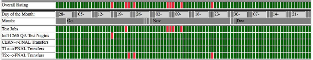

# Software and Computing

LHC activities set the agenda for Software and Computing this quarter. The end of the proton running allowed for a reprocessing pass for both data and simulation samples. A lot of work was done in the software to be ready for that, and to prepare the facilities and infrastructure systems for the processing. The heavy-ion run with its higher data taking rate put particular strains on many aspects of the system, which required fast turnaround on a number of development efforts. These will be useful for the proton program as higher luminosities are reached. Finally, the start of the LHC technical stop allowed all facilities to focus on reprocessing activities. 

All computing facilities showed good performance during this period, with a record number of CPU hours delivered by the Fermilab Tier-1 facility (despite a few operational difficulties described below, which unfortunately impacted the measured Tier-1 availability metric), and rather heavy use of the Tier-2 centers. The operations team used these facilities to deliver a large number of data samples that are needed for data analysis to show new physics results at the upcoming winter conferences. Ongoing development efforts supported these activities, and this quarter included the first scale tests of the Fermilab HEPCloud elastic facility, in preparation of major use expected for the coming quarter.

Date            Milestone  
--------------  -----------------------------------------------
October 2015    Tier0 2.0.0 released
October 2015    CMSSW\_7\_6\_0 released with features needed for end-of-year reprocessing
November 2015   CMSSW\_7\_5\_0 deployed in the Tier-0 facility for HI data taking
November 2015   Tier 1 FY15 CPU and disk purchases deployed
December 2015   WMAgent 1.0.12 released
December 2015   End-of-year reprocessing begins

Table: Major milestones achieved this quarter

## Fermilab Facilities

During Run 2 the Fermilab facility collected almost 4 PB of collision and simulated data. Over 8,000 cores of additional CPU resources from the FY15 purchase cycle were deployed this quarter. As soon as they were deployed the new resources were fully utilized  due to the increase in CPU demands by CMS in preparation for winter conferences.

Fermilab site readiness metrics were impacted by the many changes in deploying these resources. Two periods of failing metrics are seen in Figure {@fig:T1}. The first, in October was due to a controller failure on one of the older storage nodes, leading to failed test jobs and transfer failures until recovery. In November a mis-configuration of the new CPU nodes deployed at that time impacted performance metrics. The mis-configuration primarily affected the test jobs themselves. Despite these incidents FNAL provided over 33 million successful wall hours to CMS in the quarter, more than any quarter prior.

{#fig:T1}

Late in this quarter the Tier-1 facility began working toward upgrading the dCache disk and tape storage pools to the latest supported version, and transitioning its support to the Data Management Services department within Fermilab Scientific Computing Division. That department also supports the Fermilab public dCache storage and the lab’s Enstore tape archive (including that for CMS), so this move is both a consolidation of effort and working toward a service model of support for CMS. The 8 PB of disk storage purchased in 2015 is being used to facilitate this upgrade by providing a separate pool to thoroughly test the targeted version for the dCache upgrade.

## University Facilities

This quarter saw a continuing increase in the usage of the U.S. CMS Tier-2 facilities, as seen in Figure {@fig:T2}. This increase was largely due to running the CMS data reconstruction at the U.S. Tier-2 sites. This workflow has been possible at Tier-2 sites since May 2015, thanks in part to development work undertaken during the shutdown. These workflows place a heavy strain on the internal networking capabilities of the sites, but the U.S. sites are all able to handle the increased load. Physics analysis with CRAB3 and other production activities are also increasing.

The seven U.S. sites have finalized their hardware deployments for 2015 and are starting to plan hardware procurements for 2016. The connection of the Tier-2 sites to the LHCONE VPN by ESNet is proceeding in an orderly manner and is approaching completion. All sites have deployed the HTCondor-CE computing element, and over half of the sites have retired their old GRAM CEs. The rest are planning to do so soon. The motivation for this transition is better stability and scalability as well as easier support.

All of the U.S. CMS Tier-2 sites have operated successfully this quarter. On our two official performance metrics based on CMS test jobs, all sites were at least 82.5% available and 93% ready. The CMS goal for each of these metrics is 80%. The U.S. CMS Tier-2 centers delivered 42.9% of all measured computing provided by Tier-2 sites in CMS (our commitment to global CMS is > 25%), making them seven of the eight most-used Tier-2 sites in all of global CMS.

{#fig:T2}

Five Tier-3 sites required assistance from the Tier-3 support team this past quarter. Most sites have transitioned to OSG 3.2 so support efforts are primarily focused on helping sites that are rebuilding their sites (primarily Rice, FSU, and UMD). TAMU became the first U.S. Tier 3 site to implement the submission for local users via GlideinWMS/CRAB3; this allows physicists to use the exact same tools for submitting jobs both to the grid and to local resources. Support was also provided for updating PhEDEx parameters and keys.

This quarter, the CMS Connect Integration Test Bed factory hosted at CERN. The final software developments required to begin beta testing have been completed. Beta testers have been recruited to give feedback during the current quarter.

## Operations

Operations during the quarter was dominated by three main activities: finishing up the data processing for the 13 TeV pp run, closing the
CMSSW_74x DIGI-RECO processing, and processing the 2015 heavy-ion data. The very end of the quarter was dedicated to the preparation of the CMSSW_76x re-reconstruction of all data, which finally got started on December 18 and ran well throughout the end-of-year break. In the first quarter of FY16 we have completed 3.6 Billion DIGI-RECO events (including some CMSSW_76x re-reconstruction), 8.9 Billion GEN-SIM events, and redone 3.9 Billion MINIAOD and 3.7 Billion data events re-reconstructed. This is a substantial increase with respect to the production activity during the year as shown in Figure {@fig:ops}.

{#fig:ops}

The Computing Operations project has transitioned into the new organizational structure of the CMS Offline Software and Computing project. The ‘Central Services’ and the ‘Facilities and Infrastructure’ groups in Computing Operations have been replaced with a single Liaison to new level-2 organization ‘Facilities and Services’. A new Computing Operations group, ‘Tools and Integration’ is being established to better address the topics of integration of our tools.

## Computing Infrastructure and Services

This quarter came to a close with the LHC heavy-ion running. This was a challenge for the CMS Tier-0, as the facility was pushed beyond its design limits to maximize the amount of data collected. However, due to improvements made during the quarter to WMAgent and the Tier-0, particularly performance enhancements and increased robustness of data publication and injection, the Tier-0 performed well under this extreme load.

Among numerous improvements to WMAgent, the developers added settings to allow workflows to overflow into opportunistic resources. Planning has begun for a needed refactoring of WMAgent to make better use resources available only for a limited time, and to reduce operational effort. The WMArchive project to store all the performance and monitoring data as well as provide access to debugging data from WMAgent made good progress, in outlining the project plan and finalizing the architecture.

All projects have finished modernizing their Python code in preparation for the move to Python 3. Enhancements to DBS and WMAgent to improve the memory performance of the applications went into production.

Towards our long-term goal of “elastic scale out,” we made considerable progress in collaboration with the Fermilab HEPCloud project. We have an allocation on the Amazon Web Services (AWS) cloud, to establish sustained operations at a level of 50,000 simultaneous cores. We use the standard CMS production infrastructure to submit workflows to the Fermilab Tier-1, and augment its resources by elastically scaling out to AWS via HEPCloud. During this quarter we successfully achieved initially a 1% and then a 10% scale, that is 5000 cores sustained operations. The 100% scale operations planned for the next quarter will produce actual simulation requests at AWS that are directly used and needed for the CMS science program.

## Software and Support

During this quarter significant effort went into understanding the detector response to the extra out-of-time pileup at 25 ns bunch spacing relative to the previous running conditions at 50 ns bunch spacing. The knowledge gained was captured in the code and calibrations delivered in the CMSSW 7_6_0 release, which was used to reprocess all of the data collected in 2015.

The commissioning of the heavy-ion data taking required many modifications to the CMSSW 7_5_0 release that was used to acquire the data. Thanks in part to being able to run the heavy-ion HLT and Tier-0 applications in multi-threaded mode, the data was collected and processed at unprecedented rates and operations were considered very successful.

## Technologies and Upgrade R&D

The R&D area has continued work on evolving and scaling the CMS computing system, as well as prototyping new technologies for future use.

During this quarter, significant improvements in the HTCondor negotiator service were delivered. These improve the speed of the central daemons sufficiently to keep up to 130k cores occupied while allowing the central daemons to limit the number of concurrent jobs that utilize the AAA data federation. Within the production system “global pool” we prototyped and delivered a mechanism for utilizing data federations (and otherwise reroute jobs to other sites). This was extensively used to run jobs on the CERN HLT farm over the end-of-year shutdown. To further improve accessibility of data, we have started to integrate machine learning techniques to predict dataset popularity for initial placement.

Beyond the CMS-owned computing facilities, we have further developed the capability to run at DOE supercomputing facilities (namely, NERSC). We have managed the NERSC allocation of 2.5M CPU hours for U.S. CMS. As NERSC is transitioning to new hardware, the focus has been on continued benchmarking via the Docker-like “Shifter” interface provided by the NERSC team.

On the software side we have migrated all production and experimental CMSSW architectures to GCC 5.3.0 and a single branch. In this quarter, we were able to get CMSSW functioning on the POWER8 architecture. The ARM work was presented at the Linaro Connect SFO 2015 conference ("ARM64/AArch64 for Scientific Computing at the CERN/CMS Particle Detector"). There has been continuous background activity with Intel on Intel C++ Compiler and CMSSW; a number of issues have been reported, confirmed and resolved for future releases. This will improve our ability to quickly deploy on new platforms, such as the upcoming Xeon Phi KNL.

For the tracking software prototype, this quarter has focused on code consolidation and cleanup to establish a baseline as well as a common development platform for different architectures. We are utilizing Intel VTUNE to try and explore and understand the outstanding issues observed with the baseline (with respect to vectorization and parallelization efficiencies).

