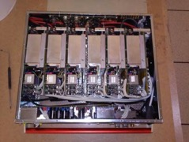

\clearpage

# Detector Operations

During this quarter LHC and CMS were in a year end technical stop (YETS).  This provided an opportunity to make repairs and enhancements to the various elements of the detector as described below.   Importantly extensive work was undertaken on the CMS magnet's liquid helium system, which include repairs, enhancements and most importantly cleaning.   The cleaning procedure confirmed that the system had been contaminated with BREOX oil which has now been successfully removed.   By the end of quarter the work was completed and process to cool down the magnet and turn on the field was underway.  It is anticipated that the magnet will be at full field by late April.  

During the technical stop there was a campaign of global running with cosmic rays that allowed the commissioning of the detector to proceed without beam.  As there was no colliding beams, we are not reporting metrics this quarter.

## BRIL

The main emphasis of the US-CMS hardware effort as part of the BRIL sub-detector group is the pixel luminosity telescope (PLT). It is part of a set of detectors to measure the beam conditions and provide luminosity-equivalent particle rate measurements.Last year the PLT detector was installed inside the CMS detector and successfully participated in Run 2 as primary online luminosity detector. The PLT provides fast triple-coincidences in 3-layer telescopes, but also, at a lower rate, full hit-information readout. Based on the latter detailed studies were performed that resulted in the luminosity publication for the new 13 TeV data set.

The detector has been successfully recommissioned and already participated in first collisions of the 2016 run. A trigger has been added that significantly increases the acquisition rate of full hit-information at high beam currents. The online monitoring and DQM have been improved to include the experiences during the 2015 running. As the data taking commences warning and alarm tools are commissioned that are expected to reduce the pressure on shift personnel.

Subsystem   Description                   Scheduled   Achieved
----------  ---------------------------- ---------- ----------
BRIL        Recommission Hardware             March      March
BRIL        Ready to deliver Lumi               May 
BRIL        Improved Lumi Numbers for 2016  December 

  : BRIL Milestones\label{BRILMilestones}.

## Tracker

#### Pixels

Pixel completed the calibrations and software upgrades needed before beam and is ready for collisions. The frequency to send data to the central DAQ was increased via a hardware intervention. This was deemed necessary in order to handle the data rates expected in 2016. Timing and bias scans will be performed with early collisions.

#### Strips

The Strip detector completed the calibrations needed before beam and is ready for collisions. The strips provided a beamspot for the LHC in some early collisions testing, verifying the beam is still fairly well centered. There is an increase in the leak rate of coolant in one part of the strip tracker and we are keeping an eye on it. Timing and bias scans will be performed with early collisions.

Subsystem   Description                      Scheduled   Achieved
----------  ------------------------------- ---------- ----------
Tracker     Ready for Physics                      May 
Tracker     Pixel Phase 1 ready to install        Nov.

Table: Tracker Milestones

## ECAL

The first quarter of 2016 was a technical stop in which a number of important issues were addressed.  A planned refurbishment of the MARATON (MAgnetic and RAdiation TOleraNt) low voltage crates took place.  All 136 crates were retrofitted with stainless steel water  connectors shown in Figure {@fig:Maraton} to replace the brass connectors that are susceptible to corrosion. This was a considerable undertaking as the crates are mounted on the detector so they must be carefully removed and transported to the Meyrin site for repair and testing before re-installation.  The work was completed successfully in late February.

{#fig:Maraton}

In the preshower detector a number if low voltage connectors had proved unreliable  leading to dead regions during the fall 2016 run. These were replaced in February and all sections of the pre-shower are now functional and ready to take data. The high voltage system which provides power to the crystal photo detectors was re-calibrated during the shutdown leading to improvements in the performance of the system. Routine maintenance of the laser monitoring system was conducted. The laser system has performed excellently during the fall run showing excellent stability.

In addition the Level-1 calorimeter trigger upgrade has been commissioned leading to significant improvements in the ECAL Level-1 trigger performance. The trigger is now better able to see the granularity of the 5x5 trigger primitive via the use of dynamic clustering within the 5x5. Figure {@fig:ECAL_RES} shows the improvement in the energy and position resolution that results. This leads to higher efficiency in the trigger.

{#fig:ECAL_RES}

Subsystem   Description                         Scheduled   Achieved
----------  ---------------------------------- ----------  --------- 
ECAL        Complete LV Connector Repairs           March     March 
ECAL        Reestablish same level of
            working channels as fall                April
ECAL        Reestablish L1 Performance                May
ECAL        Confirm resolution performance            May

Table: ECAL Milestones\label{ECALMilestones}.

## HCAL

During the year-end technical stop (YETS) in the first three months of 2016, the HCAL focused on preparing for the 2016 Run. In addition to routine hardware repairs and maintenance, many upgrades were deployed during the YETS. These included: switching to  $\mu$TCA (Phase 1) back-ends as the primary read-out for HB/HE, switching to the Stage-2 Level-1 trigger based on HB/HE trigger primitives from the $\mu$TCAs as well as increased segmentation in the HF trigger towers, and the installation of a split readout from one PMT box for HF where the signals from 22 PMTs go both to the current QIE8 front-ends and a prototype Phase 1 Upgrade HF QIE10 front-end.

This will enable the HCAL group to gain valuable operational experience with the Phase 1 Upgrade front-ends prior to their installation in the 2016-17 EYETS. The HCAL group also is also commissioning a small system on the Castor table located close to the beam line to study radiation damage to new scintillators that might be used in a possible replacement of some of the HE scintillator during Long Shutdown 2 or as the scintillator for the Phase 2 Upgrades. This system uses prototype Phase 1 HE electronics and will enable HCAL group to gain valuable operational experience with this new electronics as well. The software necessary to control and monitor the all new hardware was deployed and commissioned.

During late March 2016, the HCAL successfully participated in data taking for the first beam splash events from the LHC.

Subsystem   Description                                Scheduled   Achieved
----------  ----------------------------------------  ----------  --------- 
HCAL        Ready for Physics                                May
HCAL        Provide resource loaded schedule
            for EYETS work                                  July
HCAL        Prepared for HE/HF front end
            electronics installation                        Dec.
HCAL        Complete Rad Dam studies                        Dec.

  : HCAL Milestones\label{HCALMilestones}.

## EMU

The water leak in YE+1, discovered in December 2015, was investigated and repaired during the access period of the year end technical stop.  The leak was located in the electronics cooling circuit of the chamber ME+1/1/13.  This chamber was removed and taken to the surface for investigation.  The leak occurred at one joint of the copper cooling pipes, and x-ray investigation showed that the joint had insufficient solder in the weld. After investigation, the cooling circuit was replaced and the electronics reinstalled.  Two additional chambers at the bottom of the station were also removed and repaired due to water collateral damage.  All three chambers were replaced after refurbishment and testing and are working properly.

Additional actions were taken to prevent future leaks.  All circuits were tested at 12 bar pressure.  Accessible shut-off valves were installed to permit rapid isolation of any leaking chamber.  Humidity sensors and water leak detection cables were installed inside the YE1 nose to give early detection of any leak.  Water collectors were installed around the YE1 nose and inside YB0. A possible preemptive replacement of the ME1/1 cooling circuits is under study and is being followed up by a CMS Technical Incident panel. 

Several individual electronics problems were fixed during the technical stop, including a low voltage issue that had disabled an entire chamber and the replacement of one VME crate.  By the end of the access period, 99.4% of the CSC electronics channels are enabled and functioning properly.

The CSC system was powered up on 22 January and participated in all midweek global runs.  The new EMTF trigger came on line in MWGR#2, and the CSC electronics were timed in for the new trigger with cosmic rays. At the end of March, the timing was examined further with beam splash events.  The CSC is on track for stable operations in the 2016 physics run.

Subsystem   Description                                Scheduled   Achieved
----------  ----------------------------------------- ---------- ---------- 
EMU         CSC ready for collisions                         May
EMU         Extract SEU rates for DCFEBs                    June
EMU         Implement additional coincidence
            counters in (O)TMB                              July
EMU         Implement improved CSC segment 
            pattern recognition                           August 

  : EMU Milestones\label{EMUMilestones}.

## DAQ

Extensive measurements of the DAQ system were carried out during YETS 2015-16 to understand and mitigate  performance bottlenecks in the system. We are confident that the system can handle the expected load with some margin. Further improvements on the transport layer could yield an additional performance boost.

In preparation for the 2016 run,  the computing infrastructure, DAQ, TCDS, DCS were consolidated and improvements based on the 2015 operational experience were implemented. The consolidated system successfully used during Midweek Global Runs and ready for collisions. Integration of new sub-detector back-end electronics of the Level-1 trigger upgrade, were also completed during Year-End Technical Stop 2015-2016 (YETS 2015-16).

Candidate PC servers for the next generation HLT nodes have been evaluated. An order for the replacement of the HLT nodes acquired in 2011 has been issued and host are delivered to CERN. They will be installed in mid-April and will be commissioned in the following weeks. During YETS 2015-16, the HLT farm was used partly as a cloud infrastructure for offline data processing. In particular, during February, it provided ~40\% of the combined T0/T1 capacity, including workflows with demanding I/O requirements.

Subsystem   Description                                Scheduled   Achieved
----------  ----------------------------------------- ---------- ---------- 
DAQ         New HLT Nodes
            installed and commissioned                       May
DAQ         $\mu$TCA test system added to DAQ2VAL            Aug
DAQ         DAQ2 ready for 2 MB event size
            and 50 event pileup                              Dec

  : DAQ Milestones\label{DAQMilestones}.

## Trigger

The Regional Calorimeter Trigger (RCT) and Stage-2 Layer-1 Calorimeter Trigger are U.S. deliverables. The RCT operation operated during the first CMS Global Run (GR) at the beginning of February 2016.  It operated without any issues.  For the second GR two weeks later, it was used to verify calorimeter trigger timing and before making the switch to operating with the CaloL1.  The switch to triggering with new trigger systems was made during the 2nd Global Run.  CaloL1 was fully integrated into CMS Run Control by the 3rd global run at the beginning of March.  The new control software, called SWATCH,  configures, operates, and monitors the new hardware.  Additionally, in the 4th CMS global run, the configuration using the database was enabled, allowing configuration keys to be used, so that tasks such as masking inputs for special runs are simplified.  Immediately after the 4th global run, at the end of March, this mechanism was used to mask off most of the calorimeter for the LHC beam splash data taking.  A two-trigger-tower wide region of ECAL was left in to simulate collision timing as much as possible with splash.   In addition, during the 4th global run CaloL1 Data Quality Monitoring became available on-line, and was used during splash operations.  In the next month, before first collisions, CaloL1 will continue to work on remaining issues to be ready for physics data taking.

### Endcap Muon Trigger

The Rice University, Northeastern, and University of Florida groups have successfully deployed the phase-1 upgrade for the endcap muon trigger over the winter shutdown and are preparing for operations with the Endcap Muon Track-Finder, which replaces the CSC Track-Finder used last year and in Run 1. The Endcap Muon Track-Finder has been used for cosmic muon data runs since February this year. A single track segment trigger was recently added to aid in detector commissioning with cosmic muons. The DAQ readout is working, and a complete online DQM package has been developed and is in operation to monitor the input trigger primitives and output tracks as was done with the CSC Track-Finder. Hardware for a muon sorter has been installed in order to provide local triggering for CSC operations, and will be commissioned soon. The online control and monitoring software is undergoing rapid development to keep pace with central software developments and has achieved core functionality and monitoring. One Muon Sorter was shipped to CERN in February.  Experts from the university groups have maintained on-call coverage of the system during the global commissioning runs that took place during this quarter. 

Subsystem   Description                                Scheduled   Achieved
----------  ----------------------------------------- ---------- ---------- 
TRIG        Restore RCT for Physics                        March       done
TRIG        Stage 2 Layer 1 ready for
            Med. Lumi. Physics                             April   in progress
TRIG        Commision Stage 2 Layer 1  for
            High Lumi. Physics                               Dec
TRIG        CSCTF Ready for physics                        April   Expected May
TRIG        Ship one $\mu$TCA Muon Sorter to CERN          April         Feb.
TRIG        Commission initial $\mu$TCA Muon Sorter
            Firmware                                        July
TRIG        Commission final $\mu$TCA Muon Sorter
            Firmware (Ghostbusting)                          Dec

  : Trigger Milestones\label{TriggerMilestones}.

