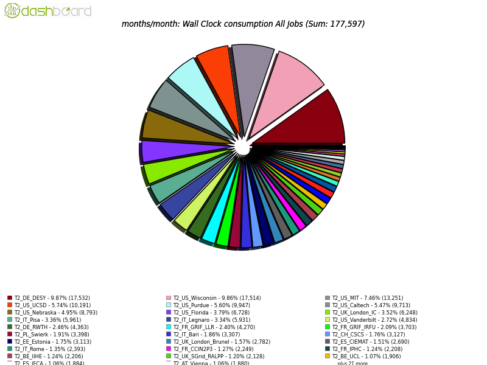
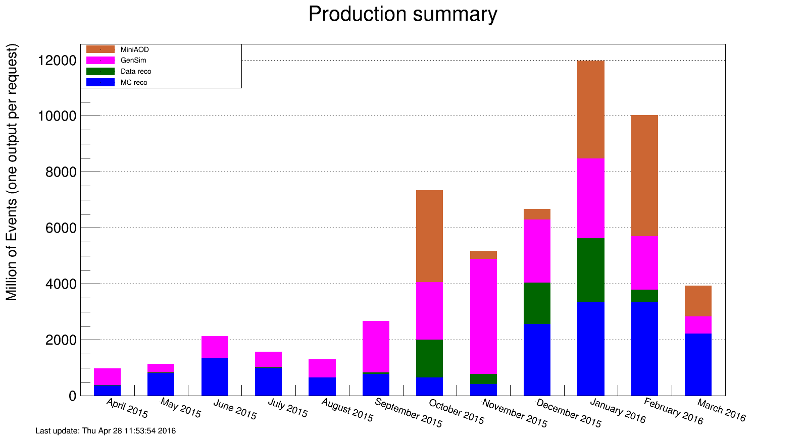

\clearpage

# Software and Computing

In general, Software and Computing was focused on preparations for 2016 data-taking and the high-profile ICHEP conference where results from the 2016 data will be presented.  The Tier-1 and Tier-2 facilities all met their performance metrics, while also undergoing upgrades and enhancements that will improve their throughput.  The Tier-1 facility in particular was engaged in a significant upgrade of the storage systems.  The operations teams wrapped the processing of 2015 data events and then proceeded to deliver simulated events at huge rates, resulting in high utilization of the U.S CMS facilities.  A particular highlight was the use of the Amazon cloud computing service to deliver large simulation samples in time for use in results presented at winter conferences.  The infrastructure and services area made steady improvements to many systems to be prepared for this year’s event rates and complexity.  Quite a few developments across all areas of the program were related to the deployment of multi-core jobs running multi-threaded applications.  A major version of experiment software (CMSSW) was released, which is targeted at 2016 data taking and supports multi-threading and many other features.  The R&D area continues activities that have made immediate impacts on operations and also prepare us for the longer term.

Date            Milestone  
--------------  -----------------------------------------------
February        Deliver enhancements necessary to run the digitization step 
                in multi-threaded mode efficiently.
February        Deliver CMSSW_8_0_0 for 2016 data taking. A required feature 
                for this release is software to support the L1 trigger upgrade. 
February        Migrate the production architecture to CC7 and GCC 5.3.
March           Deployment of the 2016 WLCG resource pledge at Tier-1 and Tier-2 sites. 
March           Commission multi-core submission at all Tier-2 sites. 
March           Completed migration from SE names to abstract names across all  tools.
March           Conduct review of data management tools. 

Table: Major S&C milestones achieved this quarter 

## Fermilab Facilities 

Fermilab Facilities work was dominated by preparing for the 2016 LHC running and delivery of the 2016 pledged resources to CMS.   The CPU portion of the pledge was deployed and made available to CMS earlier in the year, and the disk storage portion made ready for CMS during this quarter.  The 8 PB of disk storage purchased in FY15 enabled a rebuild of the disk storage endpoint for the Tier-1 facility, with an upgrade to the latest dCache "Golden Release", 2.13, to be completed in April.  During March data was transferred from the production dCache instance into this new dCache at impressive rates, setting a PhEDEx transfer record of nearly 10 GB/sec, and copying nearly 10 PB of data in that month.

Figure {@fig:sc1} shows the site readiness metrics for the Tier 1 during the quarter.  Late in Februrary, along with the rest of the WLCG Tier 1 and 2's, FNAL took a downtime to address a critical glibc vulnerability.  The site-wide reboots enabled a java change which prevented transfer attempts from many sites to authenticate properly, leading to the failed metrics during that period.  

{#fig:sc1}

Site utilization was also high during this quarter with high priority simulation and reprocessing needed for the winter conference results in March.   These workflows consumed data at a very high rate, often reaching sustained network read rates of 30 GB/s between dCache storage and the CPU farm.  During this time the Tier 1 provided 32 million wall hours to CMS.  Utilization also ramped up with analysis use of the LPC farm, often peaking at nearly 5k cores in use at a time.  

In January and February the FNAL HEPCloud tests generated over half a billion Monte Carlo events for CMS in time for winter conferences.  In these tests FNAL facilitated the use of AWS cloud resources by CMS's production infrastructure.  During this exercise close to 60,000 AWS cores were utilized continuously for almost 2 weeks, providing over 15 million wall hours.   These tests demonstrated commercial cloud resources like those at AWS can be acquired at large scales for costs that are larger than, but comparable to, the cost of similar on-site resources.

## University Facilities 

 The second quarter was a very busy time for the U.S. CMS Tier-2 facilities, where multi-CPU scheduling was deployed at every site. In order to complete the upcoming Monte Carlo DIGI-RECO campaign in a timely manner with available resources before the ICHEP conference this summer, CMS must use a multi-threaded application.  All seven of the U.S. Tier-2 sites completed multi-core deployment before the DIGI-RECO campaign began on April 1 and are ready to support production fully.

 The seven U.S. sites are actively purchasing hardware for 2016 and met their WLCG deployment goals before April 1. The connection of the Tier-2 sites to the LHCONE VPN by ESNet is still proceeding with two sites remaining. All sites have deployed the HTCondor-CE computing element, and all but two of the sites have retired all of their GRAM CEs. The motivation for this transition is better stability and scalability as well as easier support.

All of the U.S. CMS Tier-2 sites have operated successfully this
quarter. On our two official performance metrics based on CMS test jobs,
all sites were at least 90% "[available](https://www.google.com/url?q=http://wlcg-sam-cms.cern.ch/templates/ember/%23/historicalsmry/heatMap?end_time%3D2016%252F04%252F01%252000%253A00%26granularity%3DDaily%26profile%3DCMS_CRITICAL_FULL%26site%3DT2_US_Caltech%252CT2_US_Florida%252CT2_US_MIT%252CT2_US_Nebraska%252CT2_US_Purdue%252CT2_US_UCSD%252CT2_US_Wisconsin%26start_time%3D2016%252F01%252F01%252000%253A00%26time%3DEnter%2520Date...%26type%3DAvailability%2520Ranking%2520Plot&sa=D&ust=1462482293735000&usg=AFQjCNHMjpDpLhhKYLcE_R7NfrDUXkFjlQ)”
and 93% “[ready](https://www.google.com/url?q=http://dashb-ssb.cern.ch/dashboard/request.py/sitereadinessrank?columnid%3D45%26view%3DSite%2520Readiness%23time%3Dcustom%26start_date%3D2016-01-01%26end_date%3D2016-04-01%26sites%3Dmultiple%26timebins%3Dfalse%26nodata%3Dfalse%26binsselect%3Ddefault%26clouds%3Dall%26site%3DT2_US_Caltech,T2_US_Florida,T2_US_MIT,T2_US_Nebraska,T2_US_Purdue,T2_US_UCSD,T2_US_Wisconsin&sa=D&ust=1462482293736000&usg=AFQjCNGJ22rF0BXy4PW8HthPq_APUKj-BA)”.
The CMS goal for each of these metrics is 80%. The U.S. CMS Tier-2
centers delivered [42.9%](https://www.google.com/url?q=http://dashb-cms-jobsmry.cern.ch/dashboard/request.py/consumptions_individual?sites%3DT2_AT_Vienna%26sites%3DT2_BE_IIHE%26sites%3DT2_BE_UCL%26sites%3DT2_BR_SPRACE%26sites%3DT2_BR_UERJ%26sites%3DT2_CH_CSCS%26sites%3DT2_CN_Beijing%26sites%3DT2_DE_DESY%26sites%3DT2_DE_DESY_Test%26sites%3DT2_DE_RWTH%26sites%3DT2_EE_Estonia%26sites%3DT2_EE_Estonia_Test%26sites%3DT2_ES_CIEMAT%26sites%3DT2_ES_IFCA%26sites%3DT2_FI_HIP%26sites%3DT2_FI_HIP_Test%26sites%3DT2_FR_CCIN2P3%26sites%3DT2_FR_GRIF_IRFU%26sites%3DT2_FR_GRIF_LLR%26sites%3DT2_FR_IPHC%26sites%3DT2_GR_Ioannina%26sites%3DT2_HU_Budapest%26sites%3DT2_IN_TIFR%26sites%3DT2_IT_Bari%26sites%3DT2_IT_Legnaro%26sites%3DT2_IT_LegnaroTest%26sites%3DT2_IT_Pisa%26sites%3DT2_IT_Rome%26sites%3DT2_KR_KNU%26sites%3DT2_MY_UPM_BIRUNI%26sites%3DT2_PK_NCP%26sites%3DT2_PL_Swierk%26sites%3DT2_PL_Warsaw%26sites%3DT2_PT_NCG_Lisbon%26sites%3DT2_RU_IHEP%26sites%3DT2_RU_INR%26sites%3DT2_RU_ITEP%26sites%3DT2_RU_JINR%26sites%3DT2_RU_PNPI%26sites%3DT2_RU_RRC_KI%26sites%3DT2_RU_SINP%26sites%3DT2_TH_CUNSTDA%26sites%3DT2_TR_METU%26sites%3DT2_UA_KIPT%26sites%3DT2_UK_London_Brunel%26sites%3DT2_UK_London_BrunelTest%26sites%3DT2_UK_London_IC%26sites%3DT2_UK_SGrid_Bristol%26sites%3DT2_UK_SGrid_RALPP%26sites%3DT2_US_Caltech%26sites%3DT2_US_Florida%26sites%3DT2_US_MIT%26sites%3DT2_US_Nebraska%26sites%3DT2_US_Purdue%26sites%3DT2_US_UCSD%26sites%3DT2_US_Vanderbilt%26sites%3DT2_US_Wisconsin%26sitesSort%3D2%26start%3D2016-01-01%26end%3D2016-04-01%26timeRange%3Ddaily%26granularity%3DMonthly%26generic%3D0%26sortBy%3D0%26series%3DAll%26type%3Dewa&sa=D&ust=1462482293737000&usg=AFQjCNGQXS1JO6QHGT-U5OCXI2sHSQPZow) of
all computing time by Tier-2 sites in CMS (our commitment to global CMS
is > 25%), making them seven of the eight most-used Tier-2 sites in
all of global CMS, see Figure {@fig:sc2}.

{#fig:sc2}

Nine Tier-3 sites required assistance from the Tier-3 support team this past quarter on issues related to OSG software upgrades, PhEDEx, XrootD, and gfal2.  The T3 documentation was completely rewritten, achieving a 2016 milestone.  Progress on CMS Connect continues with the first beta testers starting to use the system.

## Operations 

Operations started the quarter with the highest event production rate observed in the past year during January and February, which tapered off afterwards.  Activity started with the re-MINIAOD campaign and the heavy-ion data production, which was leftover from the very high-throughput runs. At the same time we continued activities on the GEN-SIM and MC RECO campaigns. The very end of the quarter was dedicated to the preparation of the CMSSW\_8\_0\_x campaigns that will follow, in particular the first slice of about 3 billion events that the physics groups have requested to prepare for the ICHEP conference (Aug 3-10).

In this quarter we have completed 8.8B DIGI-RECO events (including 5.5B 76x re-reco), 4.8 B GEN-SIM events and redone 9.2B MINIAOD and 2.0B data events re-reconstructed. This is a substantial increase with respect to the production activity earlier in the year as shown in Figure {@fig:sc3}.

{#fig:sc3}

The Computing Operations group has worked on integrating the new multicore processing, the new RequestMgr2 and the premixing production workflow. All those efforts are will play an important role to continue to use all resources efficiently in view of the increase in pileup and the more complex logistics of the processing requests. A good fraction of March was used for the integration of those new features, which is continuing.

## Computing Infrastructure and Services 

This quarter was a period without data taking, but the Tier-0 was busy catching up from the enormous data taking rates of the heavy-ion run at the end of Q1. Weaknesses in the Tier-0 in coping with these rates were identified and improvements made to make this easier next time.

WMAgent and WMArchive progressed with an initial version of WMArchive being provided and 10%-scale data being sent from WMAgent to WMArchive for both short-term and long-term storage and analytics. WMAgent was also improved to cope with several various premixing scenarios that may be required, leaving the decision on the exact scenario for later. Significant work also went into streamlining how workflows are constructed and finished to reduce the time from workflow start to data being announced as ready for physicists.

CMS S&C initiated a review of its data management tools and procedures. Short-term development goals were defined for PhEDEx as well as a medium-term goal of identifying the exact needs for Run 3 and Run 4 and evaluating possible solutions. PhEDEx was deemed suitable for Run 2 and possibly Run 3. Also in the data management arena, discussions were begun with WLCG and CERN IT to turn the CMS SpaceMon project into a common WLCG project to monitor the use of disk space with the aim of reducing “dark” disk space.

In XRootd, a number of changes were made to the core software in order to improve the caching performance of the proxy layer. The caching proxy is a core component of our “T3 cluster in a box” strategy proposed as part of the next five-year NSF Cooperative Agreement proposal, and piloted as part of the NSF-ACI funded “Pacific Research Platform” project. The caching proxy software was originally developed by the NSF funded “Any Data, Anytime Anywhere” (AAA) project, and is now being refined as limitations are discovered and understood.  All of these improvements are going directly into the repository of the core XRootd project, and thus benefit all customers of XRootd rather than just CMS.

## Software and Support

During this quarter, S&S completed three of its major milestones for the year.  CMSSW_8\_0\_0, intended to be used for 2016 data taking, was released in February, to give plenty of time to the physics organization to validate it.  It contains the necessary changes to the reconstruction and the L1 trigger for the upgrades installed over the end-of-year shutdown.  A long series of minor releases followed throughout March for patches in L1 trigger monitoring and emulation code as the L1 trigger software itself evolved.

The CMSSW_8\_0\_0 release uses CC7 and GCC 5.3 as its default architecture, thereby completing another milestone.  Staying current with the compiler improves technical performance, and moving to CC7 allows us to take advantage of the latest OS developments.  In particular the improved support of lightweight containers gives us greater flexibility in the area of workload management.  Also as of the CMSSW_8\_0\_0 release, it is possible to run all CMS workflows efficiently in multi-threaded applications.  Since the reconstruction was used this way to reprocess the 2015 data, and the multi-threaded Geant4 application was validated last year, the only remaining piece was the digitization code which includes the pileup handling.  This is a major achievement for CMSSW, but it means that heightened vigilance is needed to keep it thread safe.  In order to help the FNAL framework team with this maintenance task, we have engaged our university colleagues at Florida who will help monitor and fix problems as they arise.

## Technologies and Upgrade R&D 

 During this quarter, we did initial prototyping of “resizable jobs”.  This is a modification to the HTCondor-based global pool allowing for the number of cores in a given job to be dynamically adjusted based on the runtime environment found on the worker node; this will improve overall utilization of resources. Within the “global pool,” we continue to utilize AAA-based mechanisms to overflow workflows between sites; the system put in place last quarter for production was in expanded use this quarter (to about 10% of all production work).  We are investigating using the same mechanism to tune memory and runtime limits.  To better understand how the AAA infrastructure could fit better into the larger HTTP ecosystem, beyond the Xrootd protocol, we have allocated hardware at Caltech to do comparative performance studies.

To further improve accessibility of data, we have focused on integrating machine learning techniques to predict dataset popularity for initial placement.  The original results were presented on ACAT'16 conference[^1] and subsequently published[^2]. Further work was continued in collaboration with a student from Lithuania.

Beyond the WLCG facilities, we have maintained the capability to run at DOE supercomputing facilities (namely, NERSC).  This quarter, we continue work on automating the end-to-end job submission process.  The current focus areas include performance issues with Cori worker node network and our inability to generate images that include CVMFS (this can currently only be done by NERSC administrators, leading to long turn-around times).

For next-gen architectural and platform work, we have been able improve CMSSW support on GCC 6, Clang 3.8.0, AArch64, and PPC. This includes the full chain: from integration tests to deployment on CVMFS. We have been involved in CERN Openlab to provide HEP-centric feedback to vendors (such as Huawei and Intel) on their respective future architectures.

For the tracker prototype, this quarter focused on the next step on improving vectorized track building; further, the prototype is working toward improved integration with realistic CMSSW-based data.  This is in collaboration with NSF PHY-1520969, PHY-1521042 and PHY-1520942.

[^1]: ACAT'16, Predicting dataset popularity for the CMS experiment.  V. Kuznetsov, T. Li, L. Giommi, D. Bonacorsi, T. Wildish.  [https://indico.cern.ch/event/397113/session/12/contribution/164](https://www.google.com/url?q=https://indico.cern.ch/event/397113/session/12/contribution/164&sa=D&ust=1462482293750000&usg=AFQjCNFi-egdxdlBlXB0SLJilp8fqJl2Iw)

[^2]: Predicting dataset popularity for the CMS experiment.  V. Kuznetsov, T. Li, L. Giommi, D. Bonacorsi, T. Wildish arXiv:1602.07226 \[physics.data-an\]

