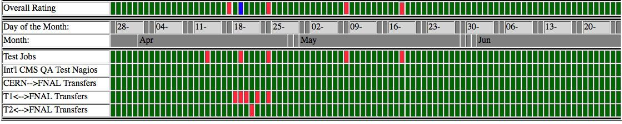
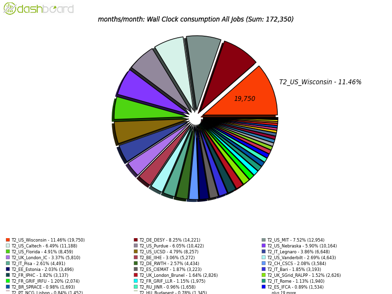
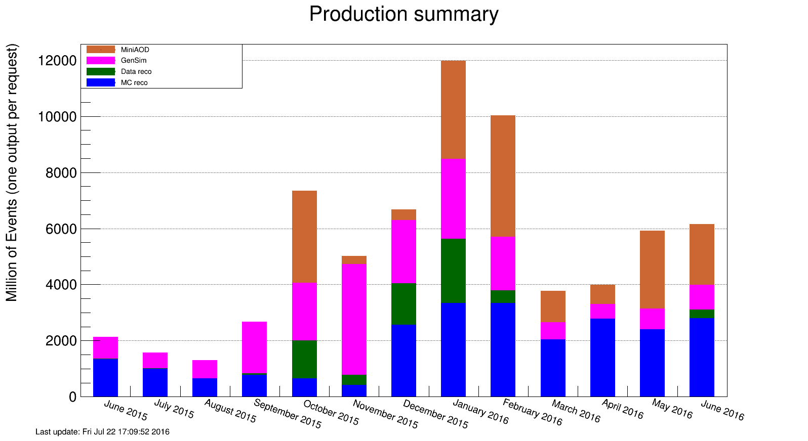

\clearpage

# Software and Computing

As the LHC started into operations for 2016 and quickly produced a dataset larger than that of 2015, U.S. CMS Software and Computing needed to operate at its highest levels while also preparing for a future of even stronger machine performance.  The U.S. computing facilities all had high levels of availability and usage, which allowed for the efficient reconstruction of detector data and the simulation of billions of events that would be needed for analyses targeting ICHEP 2016 in August.  Meanwhile, there was a concerted effort from both the development and operations teams to bring innovations such as multicore processing, premixed pileup samples for simulations and resizeable jobs into production.  While some of these innovations are still coming to full fruition, the pieces are now in place for success.  Work continues on aspects of data access that will make opportunistic resources more useful to CMS, and tests of production workflows on those resources have given positive results.  Software development is already looking forward to 2017, in anticipation of new detector components and even higher instantaneous luminosity.  Looking even further into the future, efforts continue on long-term projects such as improved software packaging, new data access protocols and track reconstruction on new computing architectures.

Date            Milestone
--------------  -----------------------------------------------
April 20        Fermilab dCache upgraded to v2.13, operation
                transferred to Data Management Services group
June 1          WMAgent ready for multicore versions of all
                available multithreaded workflows Fermilab Facilities

  : Major S&C milestones achieved this quarter.

## Fermilab Facilities

This quarter for the Fermilab Facilities marked the beginning of significant data taking at CERN for the year and transfer of much of that data to Fermilab storage facilities.   About 4 PB of custodial data was written to Fermilab tape this quarter.  Early on in the quarter, before the LHC run began in earnest, Fermilab completed the upgrade of its disk-only dCache instance to the latest supported version.  This was essentially a re-build of the disk storage at Fermilab, and utilized the FY15 8 PB disk purchase.  The new disk pools were deployed empty with the new dCache version, and data transferred into it at record rates in time for deployment in April.  In addition to the physical change, the new dCache instance changed operational supervision within Fermilab.  The same group within SCD, Data Management Services, now manages both the public dCache instance for Fermilab as a whole, and the CMS dCache instances, a large step towards the service-based facility management model.

{#fig:sc1}

Figure {@fig:sc1} shows the site readiness metrics for the Tier 1 during the quarter.  The downtime taken on April 18 for the dCache upgrade is seen in blue; following are a few red marks due to transfer inefficiencies immediately following.  Those were understood and resolved by the end of that week, and metrics stayed mostly green since.   Site utilization remained high this quarter, completing the simulation and reprocessing work needed for summer conference physics results.  During this period the Tier-1 facility provided 32.5 million wall hours to CMS.

## University Facilities

The third quarter was a very busy time for the U.S. CMS Tier-2 facilities during a period of intensive data analysis and central production activities for simulated data in the run-up to the summer physics conferences. High performance is expected from the sites at all times, but especially during the critical periods before major conferences. All of the U.S. CMS Tier-2 sites have operated successfully this quarter. On our two official performance metrics based on CMS test jobs, all sites were at least 94% “available” (a 4% improvement on the previous quarter) and 80% “ready”. The availability metric comes from the WLCG and the readiness metric a fine-grained measure of more CMS-specific services. The CMS goal for each of these metrics is 80%. The U.S. CMS Tier-2 centers delivered 47.1% of all computing time by Tier-2 sites in CMS (our commitment to global CMS is > 25%), an increase of 4% over the previous quarter. As shown in Figure {@fig:sc2}, our Tier-2 facilities continue to be seven of the eight most-used Tier-2 sites in all of global CMS.

As for progress on milestones and upgrades, the connection of the Tier-2 sites to the LHCONE VPN by ESNet is still proceeding with only one site remaining. Connection of Tier-3 sites on request is also proceeding, with one completed. Four sites have upgraded to HTCondor 8.4.x and three have deployed IPv6 compliant xrootd. Upgrading to version 3.3 of the OSG software stack, which is essential to do before the end of support at the end of August, has been completed at most sites. One site has also upgraded its worker nodes to RHEL 7, using Docker containers to provide an SL6 environment for CMS, and was actively working on retiring their SRM server. Improvement of HS06 benchmarking and APEL normalization constants has been maintained, with the consistency of the reports to the WLCG being cross-checked monthly.

{#fig:sc2}

Nine Tier-3 sites required assistance from the Tier-3 support team this past quarter on issues related to OSG software upgrades, PhEDEx, networking and basic Linux systems adminstration.  The central PhEDEx service was transitioned to support by the same team that runs PhEDEx for the Tier-1.  Beta testers continue to exercise CMS Connect and a tutorial for new users was held in June.

## Computing Operations

April, May and June was the time when Operations prepared and started the massive production campaign for ICHEP, to be held Aug 3-10.  In this quarter we completed 7.6B DIGI-RECO events (90% of which was targeted towards ICHEP), 2.0B GEN-SIM events and 5.3B MINIAOD events. The LHC started to run and after the initial ramp-up performed beyond expectations. We reconstructed 2.9B events at the Tier-0 and re-reconstructed another 0.2B data events. The Computing Operations project continues to perform as promised. The production summary for MC events is shown in Figure {@fig:sc3}.

{#fig:sc3}

The Computing Operations group has worked on integrating multicore processing, the new Request Manager v2 and the premixing production workflow, all of which are crucial for continued efficient event production. Due to time pressure, none of the three options were implemented for the initial part of the ICHEP processing, but multicore usage was enabled gradually and worked fine. A plan has been developed for the pileup simulation using pre-mixed samples of minimum bias events. It was implemented at a lower priority and steady progress has been made. We are confident pre-mixing can be used for the upcoming large productions, where it will be paramount due to the higher than expected pileup.

To address inefficiencies in operations and to design more effective tools for the operators work we are organizing a Computing Operations internal workshop in the month of August after ICHEP.

## Computing Infrastructure and Services

The CIAS area moved forward on several fronts during this quarter. Final modifications were made to WMAgent workflow management system to enable the submission and modification of workflows to run in multithreaded mode. CMS Computing Operations has performed testing of these workflows and will make the switch at a convenient time.

WMArchive has reached approximately 50% of the final scale (saving 50% of the job report documents) for the last 1.5 months of the reporting period. The service is currently running on pre-production hardware and should move to 100% scale and production hardware during the next quarter.

The Request Manager v2 migration is also proceeding; our CMSSW release validation has switched over entirely to v2.  Computing Operations and the CMS PPD organization are pushing forward on validation and will switch submission to using v2 at a convenient transition point, but are already using v2 for monitoring.

For GlideinWMS, version 3.2.14 was released; it improves the draining of glideins from sites. Support was added for the RHEL7-supplied python version. Most relevant to CMS, changes were made to the ClassAd parsing to enable dynamically resized jobs; this will allow CMS to fit its jobs into a slots with a range of core counts and increase the CPU efficiency of our resources.

Opportunistic work advanced on three different sets of resources: NERSC’s Cori and Edison machines, SDSC’s Comet, and OSG opportunistic resources. In all three cases, production-like workflows were commissioned and successfully executed. We expect to integrate these resources into the GlideinWMS global pool and use them for production work early in Q4. We have an allocation on TACC Stampede and began testing CMS workflow submission there.

The new asynchronous POSIX implementation of XRootd caching proxy was tested under increasing load and realistic access patterns. Caching proxy logging functionality was converted to use standard XRootd trace and logging functions; previously the proxy used XRootd client logging functions).

The XRootd caching proxy was installed at a CMS Tier-3 facility at University of Notre Dame, configured as a caching cluster with a redirector and two high-performance disk servers (10 Gbps network, 12 4TB disks) with intention of adding more disk servers later on. Notre Dame has about 10,000 opportunistic CPUs that can become available to the Department of Physics and all those jobs are directed to go through the caching proxy. As the caching cluster is currently under-sized for such load, we were able to identify several issues in the caching proxy and XRootd POSIX layer that would be otherwise hard to trace. Two relatively minor issues are still present and as they are relatively rare we are still trying to understand their origin (but most likely they are caused by inconsistent mutex use in XRootd POSIX layer).

## Software and Support

The software support effort intensified during Q3 in order to cope with the LHC ramp to full 2016 luminosity production.  The data-taking release series, CMSSW 8_0, had 14 updates for operational issues.  The software development release this quarter is making good progress on achieving 2016 milestones.  Code for the Phase-1 upgrades in HCAL and pixels has been integrated so that the current development release, CMSSW 8_1, can be used to generate simulation samples for 2017.  Work continues on the Fireworks display; an ECAL crystal detailed view has been developed during this quarter. U.S. CMS has contracted with squid developers to add a feature required by Frontier, our distributed database solution.  This feature, called collapsed validation forwarding, was broken in the latest releases.  The latest releases are also the only ones that support IPv6 addressing. Fixing the feature in the latest releases was beyond the capabilities of our local support person, hence the expert contractor.  The contractor finished this work, and the Fermilab personnel are now working to integrate it into a release so that we are now in the good position of having a release that supports both collapsed validation forwarding and IPv6.

In the area of core software, we have removed our dependence on apt, a piece of open source legacy software that is no longer supported.  This effort grew out of discussions in the packaging working group of the HEP Software Foundation (HSF); we hope to gain further improvements in sustainability in this area through similar efforts.  For instance, an outcome of the recent HSF workshop in Paris was that many of the experiments agreed that Spack, a tool developed for the HPC community from LLNL and proposed for HEP use by Fermilab, shows great promise.  Building and packaging large HEP software stacks on new systems and architectures is a task that is being duplicated by many HEP experiments unnecessarily.  It will take some work to adapt the legacy systems to a common one for the field but it will better position us for the future where computing will be more heterogeneous than it is today.

In the near future, CMS Software and Computing management will have to re-plan the work to be done this fall for two reasons.  Highly Ionizing Particles (HIP) produced near the beam at high luminosity are having a serious effect on our tracking and b-tagging efficiency.  Code to both simulate this HIP effect and mitigate its effect in the reconstruction has been developed this quarter but it needs to be validated and deployed in the next.  In addition, given the unexpected performance of the LHC, the pileup distributions we simulated for 2016 are no longer suitable for Monte Carlo (MC) samples, and need to be redone to enhance statistics at high instantaneous luminosity.  Small variations in the pileup distributions between data and MC can be handled with re-weighting techniques, but only with sufficient statistics at relevant pileup levels.  To address both of these problems we will have to make effective use of computing facilities this fall to be ready for 2017 winter conferences.

## Technologies and Upgrade R&D

During this quarter, we finished the initial version of “resizable jobs”.  This is a modification to the HTCondor-based global pool allowing for the number of cores in a given job to be dynamically adjusted based on the runtime environment found on the worker node.  This mechanism is waiting on an updated version of glideinWMS that supports this new mode.

The work with HTTP for data access advanced to a functional testbed at Caltech; a corresponding module for accessing HTTP via DAVIX was submitted to CMSSW.  It is currently under review.  The new module should allow performant access to ROOT files via HTTP (and supports all of CMSSW’s enhancements on top of bare ROOT).  Performance tests are ongoing.

Beyond the WLCG facilities, we have maintained the capability to run at DOE supercomputing facilities (namely NERSC).  This quarter, we worked toward maintaining a stable environment at Cori and Edison, as well as working with the NERSC staff to understand and correct performance deficiencies.  We expect to be able to resume production workflows next quarter.

For the tracker prototype, this quarter continued our focus on improving vectorized track building; further, the prototype is working toward improved integration with realistic CMSSW-based data.  This work is performed in collaboration with personnel supported by NSF awards PHY-1520969, PHY-1521042 and PHY-1520942.
