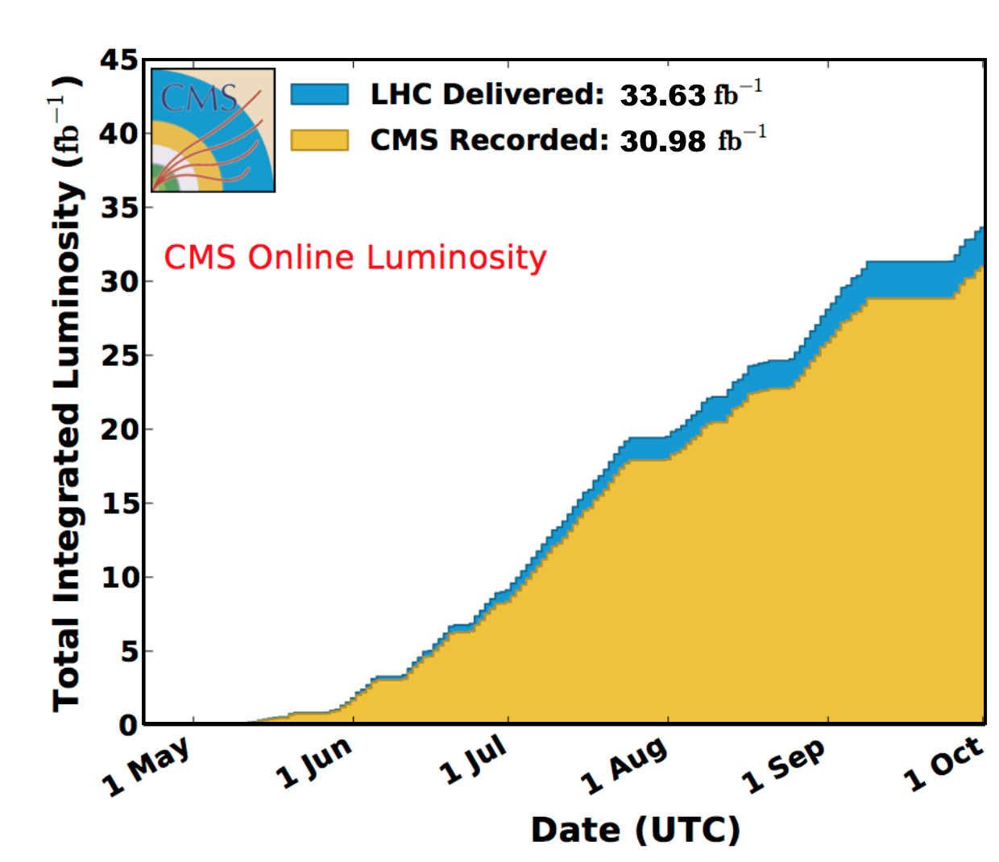

\clearpage

# Program Manager's Summary

During this quarter, the third quarter of  **calendar year 2016** (2016Q3), CMS went through a period of very intense and productive data taking. With outstanding LHC performance and excellent data taking efficiency at 92.5%, CMS already has exceeded its luminosity goal for 2016 which was set at 25 fb$^{-1}$.

The LHC delivered almost 34 fb$^{-1}$ of integrated proton-proton luminosity at 13 TeV, of which CMS collected  31 fb$^{-1}$, as shown in Figure {@fig:lumi}. There were unprecedentedly long periods of uninterrupted running, many weeks with no programmed technical stops. The machine duty factor and availability was much higher than predicted or planned for, overall better than 60 %, to be compared with about 35 % during Run-1 and in 2015. This came both from good system availability and long luminosity lifetimes.

Also, the LHC has now exceeded its design luminosity, regularly reaching instantaneous luminosities of $1.2 \times 10^{34}$ cm$^{-2}$s$^{-1}$ and above and approaching the peak luminosity soft limit of $\sim 1.7 \times 10^{34}$ cm$^{-2}$s$^{-1}$ imposed by the inner triplet magnets. 

To address the unanticipated very high instantaneous luminosities and to understand the impact on the experiment, CMS has initiated a Luminosity Study Group to look at all aspects of the performance of the detector, trigger, DAQ, and computing (hardware and software)

{#fig:lumi}

While we clearly very much welcome the increase in LHC availability and luminosity, the improvements in instantaneous luminosity lead to an increase in the average pile-up  and the overall dataset sizes, producing additional stress on computing.

There is clearly a large impact on computing resources for data storage, reconstruction and analysis. CMS computing resource requests for 2016 were endorsed by the CERN Resources Review Board in May of 2015, based on the then-best prediction of luminosity for 2016.  The higher availability and new LHC performance projections for 2016, 2017, and 2018 predict more data and a large increased demand for resources. Shortfalls were analyzed and are typically 20-30% in each Tier level and category (CPU, disk, tape) relative to the original 2016 request.

CMS and U.S. CMS have worked to mitigate some of the resource impact in this new situation. Some of the approaches taken so far are to 

- reduce the number of AOD and MiniAOD copies and versions, which impacts the availability of datasets for analysis
- decrease RECO and RAW data on disk to only 2-3 months and 50% of the datasets, which makes detector commissioning which is based on RAW data harder and will not allow for fast or emergency data reprocessing in case of unexpected behavior in the data. 
- reduce availability of Run-1 data and MC, impacting ongoing data analysis and publication processes
- started a massive tape deletion campaign

These immediate measures mitigate the additional computing needs down to a level of increase by +20% instead of the expected +40%. Other measures are being considered and their impact is being studied, in particular to further limit the HLT output rate and to reduce number of Monte Carlo events relative to data. Much work needs to be done and has started to understand how to partially mitigate as much as possible the additional resource needs to accommodate improved LHC availability in 2016 and beyond. 

On the detector side, operation of CMS has been excellent. All detectors had high up-time and performance despite high luminosity and pileup. High fraction of channels are working, typically better than 98%. However, there are some problems, expected and unexpected, at high instantaneous luminosity. More  detail is given in the Detector Operations section of this report. 

The Pixel detector performing well even at highest luminosities. However, the strip detectors, as the luminosity increased during the early summer, developed an efficiency problem with the APV amplifier chip, referred to as Highly Ionizing Particle (HIP) problem. Studies during this quarter showed this to be a bit of a misnomer: the design of the APV anticipated the luminosity conditions and in August, settings for the chip were changed such to eliminate the problem.

Muon systems were operating smoothly, but a couple of things were to take note of. Five out of 504 DCFEB boards in the ME1/1 system have shown a problem writing Xilinx EPROMs. This problem is not currently understood and is being studied further. 

Scintillator radiation damage in the HCAL end cap is being tracked carefully. At the start of Run-2 there were worries about the very steep decline of light output. However, the so-called dose rate effect predicts that signal loss per 1/fb would decrease with larger instantaneous luminosity, and that is what has now been observed. So  there is now less worry about light loss extrapolation until the Phase2 upgrade will replace this detector. This is continued to be studied. 

The updated DAQ system continues to perform well with negligible down time. There is good progress in performance optimization of the event builder system. Following extensive testing of the HLT Cloud for operations between LHC fill, the HLT farm is now integrated into and available for the offline data production system.

The cold box unit for cooling the CMS superconducting solenoid performed beautifully, and the repair and refurbishment plan during the shutdown clearly succeeded. 

Computing facility performance was excellent during the quarter, where the Fermilab Tier-1 facility achieved a site readiness metric of 100% in the past six months, where the CMS target is 90%. All resources pledged to WLCG for 2016 are available. The U.S. Tier-1 is highly used and over the quarter provided 47% of the total Tier-1 CPU time used by CMS. Also the U.S. Tier-2 facilities performed very well, with site readiness above 88% where the CMS target is 80%. Also for the Tier-2s all resources pledged to WLCG for 2016 are available.

The Full LHC dataset was processed in time and used by dozens of analyses presented at the ICHEP conference. 

The bulk of production resources can now run with multicore pilots, to fully take advantage of multithreading. Ever-greater use of AAA data federation to provide inputs to production chain, allowing flexibility in workflow location.  Pileup samples used for simulation are now pre-mixed, leading to improved I/O and processing time, enabling us to use a broader set of computing resources. Workflows that used to be confined to the Tier-1-only during Run-1 can now be run at Tier-2s, increasing the flexibility and resource availability of the system. 

There is continued progress with the integration of resources at the NERSC High Performance Computing center. U.S. CMS is running re-reconstruction workflows for production, and work is continuing, with help from the NERSC experts, to increase both scale and efficiency. 

The software group is developing software for 2017 detector upgrades, to take advantage of the all-new 4-layer pixel detector that gives new track-seeding capabilities. This is important as pileup increases. Also, the to-be-upgraded electronics in the HCAL end cap gives TDC capability and effective depth segmentation improving robustness and performance of HCAL reconstruction. 

The highlight of this quarter clearly was the very successful and sustained $pp$ data taking. We achieved excellent performance of detectors, operations, software and computing systems, and problems get solved with good efficiency. 
The LHC continues to perform beautifully, providing both physics opportunities and challenges for data handling and processing, computing resources, software improvements. A wealth of results were shown at ICHEP in Chicago, with major U.S. contributions and leadership, enabled by U.S. CMS Operations. 

