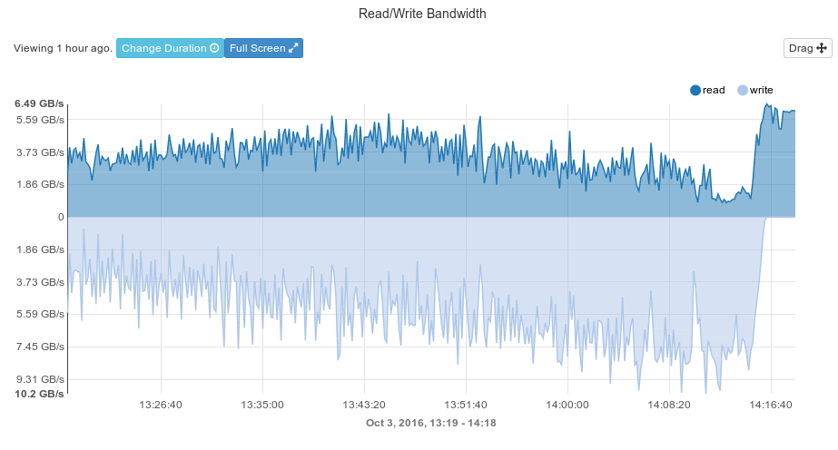

# Detector Operations

During the third quarter of the 2016 spending year, the LHC and the CMS experiment have performed admirably, exceeding expectations in both the luminosity delivered and recorded. Below we review the status of various US contributions to the detector.

## BRIL

The operations of the Pixel Luminosity Telescope (PLT) went smoothly during the last three months. The monitoring and alarm tools are working and allowing fast turnaround in critical situations. The PLT now provides full hit-information for track reconstruction at the significantly higher rate needed to quantify non-luminosity contributions and to obtain a cross check luminosity value.

The PLT is now able to measure sources of background that correlate well with similar measurements performed by the beam conditions monitoring systems. This has been confirmed by study of a fill which included beam gas manipulation. The PLT can measure it in two ways, the occupancy of the PLT in non-colliding but filled bunches, and the occupancy of the PLT preceding a bunch train. The PLT has been prepared to publish online background measurements in parallel to the BCM1F that experiences efficiency degradation due to radiation damage.

Two telescopes in one quadrant are dead and a spare quadrant has been assembled and placed in the laboratory at CERN for further testing. The port card which is responsible for the communication with the detectors is a potential source of failure and three replacement cards are in production. The luminosity measurement quality is continuously checked and values are made accessible for data analyses from a database. The 5% differences in the luminosity calibration between 2015 and 2016 is still under investigation and multiple sources such as changes in beam orbit and profile, details of the VdM scan and changes in efficiency of the luminosity detectors were considered. The change in the beam profile is a likely cause still under investigation as it may also be the source of the CMS/ATLAS difference in 2016.

  Metric                                        Performance
  ------------------------------------------- -------------
  Fraction of telescopes fully operational              82%
  Efficiency of delivery of lumi histograms            >99%
  Uptime of lumi histogram production                   99%

  : BRIL Metrics

  Subsystem   Description                                        Scheduled   Achieved
  ----------- -------------------------------------------- --------------- ----------
  BRIL        Recommission Hardware                                  March      March
  BRIL        Ready to deliver Lumi                                    May        May
  BRIL        Provide online beam background measurement           October
  BRIL        Improved Lumi Numbers for 2016                      December
  BRIL        Recover telescopes                             EYETS 2016/17

  : BRIL Milestones

## Tracker 

### Pixels 

For the pixel detector, only small repairs and maintenance have been needed this quarter.  The Phase 1 upgrade pilot detector has been included in global running, and we are learning how to operate the new DAQ components. Notably, the use of the mini-DAQ by the tracker group has been pioneered due to the work on the pilot detector. We are also training new people in the comissioning and operations of the Phase 1 detector with test stands and for the expected arrival of the first two Phase 1 forward pixel half cylinders.

### Strips

The hardware issue of dynamic efficiency loss in the first layer of the Strip detector has been solved. A specific setting in the readout chip configuration was needed to address the problems. The chip designers are studying the setting in more detail, and we are tuning the tracking simulation for the fix. We are studying noise that persists after collisions. The noise creates non-track clusters during cosmic running and therefore is a nuisance. The strips also have the usual maintenance issues with power supply replacements, etc.

                                     Pixels   Strips
  --------------------------------- -------- --------
  % Working channels                  98.7     96.5
  Fraction of deadtime attributed     18%      15%

  : Tracker Metrics

  Subsystem   Description                        Scheduled   Achieved
  ----------- -------------------------------- ----------- ----------
  Tracker     Ready for Physics                        May        May
  Tracker     Pixel Phase 1 ready to install           Nov

  : Tracker Milestones

## ECAL

The operation of the ECAL achieved its performance milestones in the first quarter of 2016. The second and third quarters have thus been devoted to maintaining the excellent performance. Overall this has been done but there was a significant incident in July that caused concern.  The cooling of the MARATON low voltage supply for EB SM 17 failed and the MARATON interlock did not set,  causing a dramatic increase in temperatrure. On-call U.S. staff came in within 20 mins to fix the problem. A dual interlock system with redundancy to mitigate a such a failure has now been implemented. Live channel performance and resolution performance metrics have been maintained. A re-reconstruction of the data is planned in the fall which will improve the ECAL calibration to better than 2015 levels and to the best that it has ever been due to the larger statistics that is now available.

  Metric                                   Performance
  -------------------------------------- -------------
  Fraction of channels operational: EB          99.07%
  Fraction of channels operational: EE          98.71%
  Fraction of channels operational: ES          99.75%
  Fraction of deadtime attributed                  26%
  Resolution performance                     Excellent

  : ECAL Metrics

  Subsystem   Description                         Scheduled   Achieved
  ----------- --------------------------------- ----------- ----------
  ECAL        Complete LV Connector Repairs           March      March
  ECAL        Reestablish same level of                     
              working channels as fall                April        May
  ECAL        Reestablish L1 Performance                May        May
  ECAL        Confirm resolution performancet          June       June

  : ECAL Milestones

## HCAL

During the third quarter of 2016, the HCAL Operations group focused on completing the commissioning of the new hardware installed during the 2016 year-end technical stop (YETS), and on acquiring good data. The HCAL performed extremely well through September 2016 and only 26 pb$^{-1}$ of data was lost due to HCAL problems, of the 32 fb$^{-1}$ delivered (less than 0.1% ).

During the 2016 YETS the HCAl group installed a split readout from one PMT box for HF where the signals from 22 PMTs go both to the current QIE8 frontends and a prototype Phase 1 upgrade HF QIE10 frontend. This has enabled HCAL to obtain operational experience with the HF Phase 1 upgrade electronics before it is installed in the 2017 extedned year-end technical stop (EYETS). During the September technical stop, the HCAL group installed and commissioned a small system on the Castor table located close to the beamline to study radiation damage to new scintillators that might be used in a possible replacement of some of the HE scintillator during Long Shutdown 2 or as scintillator for the Phase 2 Upgrades. This system uses prototype Phase 1 HE electronics and will enable HCAL group to gain valuable operational experience with this new electronics as well.

During the third quarter, signal loss due to radiation damage in the HE continued roughly as expected as a function of integrated luminosity based on previous years’ data.

**Milestones for this Quarter**

Work out a resource loaded schedule for EYETS work by July. \
Achieved in July. The resource loaded schedule is being updated as appropriate.

June Milestone: Operate HCAL detector efficiently with goal to minimize of data due to HCAL to 1%  or less, maintain calibration at 1-2%  level with efficient noise rejection and improved 25ns energy reconstruction.\
Calibration achieved by end of May, however only at a 3% to 4% level. Calibration and energy reconstruction improvements continue.

Metrics: Fraction of channels working:\
HF: 2 channels out of 1728 dead (99.9% working channels)\
HB: 3 channels out of 2592 dead (99.9% working channels)\
HE: 1 channel out of 2592 dead (99.96% working channels)\
HO: 9 channels out of 2160 dead (99.6% working channels)\
Total: 15 channels out of 9072 dead (99.8% working channels)\
Fraction of downtime and data lost at certification due to HCAL\
Goal: less than 1% for both. Achieved for third quarter: 0.08% downtime
loss and 0.4% additional loss at certification.\
Precision of absolute HCAL absolute energy calibration\
Goal: 2% . Currently 3% to 4% .\
Inter-calibration uniformity between individual HCAL towers (HBHE, HO,
HF)\
Goal 1-2 %  . Currently 3% to 4%  systematic differences between
different phi symmetry methods.\
The plan is to reach goal values for 2016 data re-reconstruction
campaign.

  Subsystem   Description                          Scheduled   Achieved
  ----------- ---------------------------------- ----------- ----------
  HCAL        Ready for Physics                          May        May
  HCAL        Provide resource loaded schedule
              for EYETS work                            July       July
  HCAL        Prepared for HE/HF front end
              electronics installation                   Dec
  HCAL        Complete Rad Dam studies                   Dec

  : HCAL Milestones

## EMU

The CSCs have been operating well, causing very little downtime to CMS during the last quarter. The peak instantaneous luminosities encountered were considerable higher than anticipated, but the CSC system experienced no particular problems related to the high luminosity.  Considerable work was done during the LHC technical stop in September to repair minor problems and maintain a high fraction of working channels.

New firmware was developed to help the recover automatically when the optical outputs are affected by SEUs. The deployment of this firmware was limited due to some problems encountered writing to some of the EPROMs in the DCFEBs. These problems were investigated in the technical stop, but there is not yet a clear understanding. A bit less than 1% of the DCFEBs are currently disabled due to EPROM issues.

After an extensive analysis, the HV settings on wire groups in all chambers were adjusted to make the gas gains much more uniform. The gains were measured after the corrections and showed that the adjustments were very successful with very few outliers, which have been corrected further. This is a prelude to potentially reducing the gas gain in all chambers in order to improve longevity still preserving efficiency.

A new segment-finding algorithm for CSCs was released in the official CMS software in late July. The new, conceptually simpler, algorithm uses roads to locate the hits to assign to a segment, and specifically provides improved pattern recognition in conditions of high occupancy (from e.g. showering muons, or high pileup.) Benchmarking against the default algorithm on recent high-luminosity data is now underway, with the objective of replacing the default algorithm in standard reconstruction before LHC running in 2017.

A plan is still on track for preventing cooling leaks in ME1/1 with epoxy sheaths around the joints in the cooling pipes. The technical method was endorsed by CMS technical coordination. The sheaths still need to undergo radiation testing and a full plan is being developed for treating one end cap during the approaching year end technical stop.  Still, no new leaks have been observed since the original leak in November 2015.

  % Working channels                   98.5%
  --------------------------------- ------------
  Fraction of deadtime attributed        1%
  Median spatial resolution          127 $\mu$m

  : CSC Metrics

  Subsystem   Description                          Scheduled   Achieved
  ----------- ---------------------------------- ----------- ----------
  EMU         CSC ready for collisions                   May      April
  EMU         Extract SEU rates for DCFEBs              June       June
  EMU         Implement additional coincidence
              counters in (O)TMB                        July       June
  EMU         Implement improved CSC segment
              pattern recognition                     August       July
  ----------- ---------------------------------- ----------- ----------

  : EMU Milestones

## DAQ

The DAQ system is pushed on all fronts to its limit due to CMS’s desire to collect a maximum number of events and the unanticipated instanteneous luminosity of the LHC, with increased pileup and related increase in event size. Nevertheless, the DAQ system performed with negligible dead time. The downtime contribution of the DAQ system is $\sim 69$ minutes during the reporting period. The reason for this larger than usual downtime were two independent human mistakes by the DAQ on-call and a PSX service which stopped responding. The documentation has been improved to avoid human mistakes in the future and a watch-dog service was deployed to monitor the responsiveness of PSX services.

{#fig:ppFedBuilder}

Continued progress in our performance optimization of the event builder system allowed it to track the steep increase of the instantaneous LHC luminosity throughout the year. Figure {@fig:ppFedBuilder} demonstrates that the system could build events with a L1 rate of 100kHz for events larger than 2MB (milestone 3). Note that event sizes of more than 1.5MB will only be reached next year after the upgraded pixel detector and HCAL readout electronics has been commissioned.

{#fig:lustre}

The Storage and Transfer System (STS) disk writing and reading performance has increased by 50% following recent firmware updates from the vendor. Nevertheless, a third unit was added to provide 50% more disk space and another 50% boost in performance. Combined improvements provide plenty of headroom for special runs and the heavy-ion period where events sizes are larger than the nominal event sizes in $pp$ collisions or HLT recording rate will be greater than the standard physics rates. The expanded system can handle simultaneous writes (recording of HLT output) and reads (mostly transfers to Tier-0) of $\sim 4.5$ GB/s. At higher recording rates, the Lustre file system gives priority to writing while limiting the read speeds. Initial tests showed that recording rates could be increased to $\sim 6$ GB/s without significant delays on time-critical transfers.

The DAQ validation test stand was expanded to have $\mu$TCA based data sources and a small replica of the Trigger Control and Distribution System (TCDS) (milestone 2) that will be used to provide triggers to $\mu$TCA units. These new units extend the testing capability to include SLinkExpress links of the FEROL unit and allows testing of the new FEROL40 unit developed by the CERN DAQ team. Installation of a minidaq-like DAQ system in the detector assembly area (Bat 904) is complete and instrumental for commissioning Phase1 upgrade deliverables. The initial system will be used by HCAL and ECAL and later will be expanded to 8 units.

  Dead time due to trigger throttling               $\sim 0$
  ------------------------------------- -------------------------------
  Downtime due to DAQ                    69min (6% of total lost lumi)

  : DAQ Metrics

  Subsystem   Description                           Scheduled   Achieved
  ----------- ----------------------------------- ----------- ----------
  DAQ         New HLT Nodes
              installed and commissioned                  May        May
  DAQ         uTCA test system added to DAQ2VAL           Aug        Aug
  DAQ         DAQ2 ready for 2 MB event size
              and 50 event pileup                         Dec        Sep

  : DAQ Milestones

## Trigger

During this quarter the U.S. groups continued their work on the Stage-2 Layer-1 Calorimeter (CaloL1) Trigger Upgrade, and the endcap muon trigger upgrade systems as both continued steady state operations and data-taking.

### Regional Calorimeter Trigger and Stage-2 Layer-1 Calorimeter Trigger

The Layer-1 Calorimeter Trigger (CaloL1), built by the University of Wisconsin group as a part of the complete Calorimeter Phase-1 Trigger Upgrade, has been in continuous operation since p-p data taking started in late April 2016, and has had no downtimes associated with it during the last quarter. Throughout this period, the CaloL1 online software (SWATCH) has been updated to version 0.11.0, and includes updates to the monitoring and thresholds for errors and warnings. The online Data Quality Monitoring (DQM) described in the previous report has been in use by the CaloL1 On-Call, Online Trigger Shifter, and L1 DOCs.  Recently, the calibrations in the calorimeter chain were updated to improve trigger performance, this included CaloL1, CaloL2, a new ECAL spike killer, and new HCAL corrections for radiation damage.

### Endcap Muon Trigger

The Rice University, Northeastern, and University of Florida groups have successfully supported and made incremental improvements to the Phase-1 upgrade for the endcap muon trigger for 2016 physics operations. A new data format was deployed in the muon port card and track-finder processor firmware to incorporate more robust transmission of CSC data over the optical links, leading to less acceptance loss when a particular CSC becomes non-functional. A new version of firmware for the Muon port card to support these data format modifications to the EMTF was generated in early July and was gradually deployed at P5 in August-September on all 60 MPC boards. Six MPC boards were replaced due to various problems with downloading and optical links. They are being investigated at Rice. Two spare MPC boards were shipped from Rice to CERN. The online software monitoring the optical links also now has warning and error level thresholds to alert the shift crew in case of problems. The firmware for the track-finding algorithm was revised to improve the efficiency for high $p_T$ muons and for dimuons, and also the BX assignment. Experts from the university groups have maintained on-call coverage of the system during the physics runs that took place during this quarter.

  Subsystem   Description                             Scheduled   Achieved
  ----------- ------------------------------------- ----------- ----------
  TRIG        Restore RCT for Physics                     March       done
  TRIG        Stage 2 Layer 1 ready for
              Med. Lumi. Physics                          April       done
  TRIG        Commision Stage 2 Layer 1 for
              High Lumi. Physics                            Dec
  TRIG        CSCTF Ready for physics                     April       done
  TRIG        Ship one uTCA Muon Sorter to CERN           April       done
  TRIG        Commission initial uTCA Muon Sorter
              Firmware                                     July
  TRIG        Commission final uTCA Muon Sorter
              Firmware (Ghostbusting)                       Dec

  : Trigger Milestones

  Frac of MPC Channels                              100%
  ------------------------------------------------ ------
  Frac of Upgrade EMUTF Channels                    100%
  Frac of deadtime attributed to Upgrade EMUTF       2%
  Frac of Stage-2 Layer-1 Channels                  100%
  Frac of deadtime attributed to Stage 2 Layer 1     0%

  : Trigger Metrics
