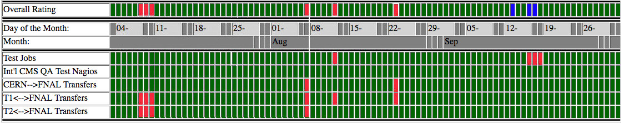
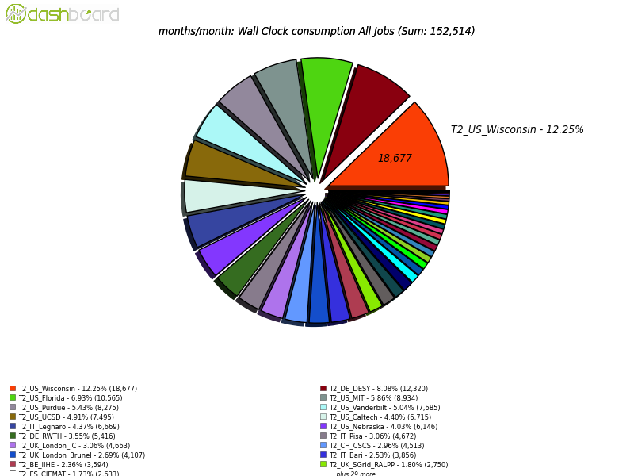
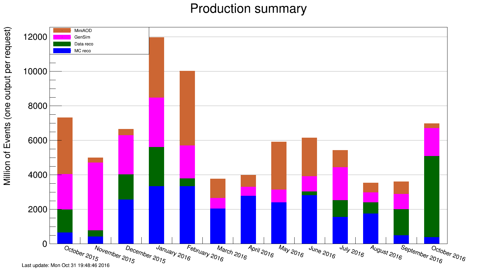

\clearpage

# Software and Computing

The eyes of the physics world were on ICHEP 2016, where the first significant analyses of LHC data from this year were presented in early August. With about a factor of five greater integrated luminosity than was available from the 2015 LHC run, there was significant pressure on the CMS Software and Computing systems to provide the necessary samples for physics analysis in time for the conference. This effort was a complete success, allowing CMS to present tens of new results. The operations teams are credited with the successful operations, processing many billions of events during this period. As usual, the U.S. CMS computing facilities played a key role in this effort, as they hosted the data and ran the jobs for event simulation and reconstruction and user analysis. But improvements never cease: at the same time, the facilities also made significant evolutions in their configurations and support, and CMS operations quickly turned its focus towards the production of samples for 2017 conferences. These efforts are taking advantages of earlier successful projects to deploy systems such as multi-core pilots, which can run multi-threaded applications, now including the simulation code.   Longer-term developments continued, showing progress in new data management and workflow management products that will allow for more efficient and flexible use of facilities. Software releases are being prepared for the heavy-ion run and for the 2017 detector configuration, with some Phase-1 upgrades in place.  A variety of exploratory research projects continue to show interesting results.

Date            Milestone
--------------  -----------------------------------------------
August 2016     Decommission GRAM CEs at Tier-2 sites
August 2016     Upgrade HTCondor CEs at Tier-2 sites to version 8.4.x
August 2016     Upgrade all Tier-2 sites to OSG 3.3+
September 2016  LPC-CAF job submission at Fermilab using CRAB3
September 2016  Completion of Tier-1 Storage transition to FNAL Data Management Services

  : Major milestones achieved this quarter

## Fermilab Facilities

The Fermilab computing facilities continued to provide reliable custodial storage, processing and analysis resources to U.S. CMS collaborators. An additional 4 PB of custodial data was written to Fermilab tape this quarter. Site utilization was high, with the Tier-1 facility providing over 31 million hours of CPU to CMS. In September, CRAB3 submission to the LPC analysis resources was commissioned, allowing U.S. CMS LPC users to use CMS’s official analysis job management system on the LPC CAF. Prior to this users submitted work to the LPC compute resources via direct HTCondor submission and custom-made scripts. Now, users can use the same job automated submission tools for both LPC resources and grid resources, which is a great simplification.

{#fig:sc1} 

Figure {@fig:sc1} shows the site readiness metrics for the Tier-1 during the quarter. Though this metric predominantly shows green for passing, there were several occasions of failed metrics during this period, mostly related to an upgrade and transition of responsibility of the Tier-1 tape dCache storage systems. Red marks during July and August were primarily due to failures in components of the old tape dCache version.

In September the tape dCache installation was upgraded to the same version (2.13) as was already done in the last quarter for the disk instance. This allowed to move responsibility for all Tier-1 storage systems to the Data Management Services department in the Fermilab Scientific Computing Division, which already operates the CMS disk-only dCache and general purpose dCache for all other Fermilab experiments.

In August it was discovered that two of the high-availability transformer systems powering the Feynman Computing Center (FCC) were no longer able to auto-switch to generator backup. A two day downtime was necessary to preemptively repair the auto-switch functionality. All CMS servers and storage are housed in FCC, as are most of the lab’s networking and computing services. Power had not been down in FCC since 2012. The downtime was well coordinated within the lab and with CMS during weeks prior, and impact reduced to only those two days. All critical Tier-1 services and analysis capabilities in the LPC returned to service as planned.

## University Facilities

The fourth quarter was a very busy time for the U.S. CMS Tier-2 facilities during a period of intensive data analysis and greatly increased central production activities for simulated data. High performance is expected from the sites at all times, but especially during the critical periods before major conferences. All of the U.S.  CMS Tier-2 sites have operated successfully this quarter. On our two official performance metrics based on CMS test jobs, all sites were at least 90% "[available](https://www.google.com/url?q=http://wlcg-sam-cms.cern.ch/templates/ember/%23/historicalsmry/heatMap?end_time%3D2016%252F10%252F01%252000%253A00%26granularity%3DDaily%26profile%3DCMS_CRITICAL_FULL%26site%3DT2_US_Caltech%252CT2_US_Florida%252CT2_US_MIT%252CT2_US_Nebraska%252CT2_US_Purdue%252CT2_US_UCSD%252CT2_US_Wisconsin%26start_time%3D2016%252F07%252F01%252000%253A00%26time%3Dmanual%26type%3DAvailability%2520Ranking%2520Plot&sa=D&ust=1478531167530000&usg=AFQjCNEBAOIGM8Ou4dxFsU8bwfq-og6x5A)" and 90% "[ready](https://www.google.com/url?q=http://dashb-ssb.cern.ch/dashboard/request.py/sitereadinessrank?columnid%3D45%26view%3DSite%2520Readiness%23time%3Dcustom%26start_date%3D2016-07-01%26end_date%3D2016-10-01%26sites%3Dmultiple%26timebins%3Dfalse%26nodata%3Dfalse%26binsselect%3Ddefault%26clouds%3Dall%26site%3DT2_US_Caltech,T2_US_Florida,T2_US_MIT,T2_US_Nebraska,T2_US_Purdue,T2_US_UCSD,T2_US_Wisconsin&sa=D&ust=1478531167531000&usg=AFQjCNG0GN9P-Ti2h6WXMbbnFuvS1W2s8Q)".  The CMS goal for each of these metrics is 80%. The U.S. CMS Tier-2 centers delivered  [43.8%](https://www.google.com/url?q=http://dashb-cms-jobsmry.cern.ch/dashboard/request.py/consumptions_individual?sites%3DT2_AT_Vienna%26sites%3DT2_BE_IIHE%26sites%3DT2_BE_UCL%26sites%3DT2_BR_SPRACE%26sites%3DT2_BR_UERJ%26sites%3DT2_CH_CSCS%26sites%3DT2_CN_Beijing%26sites%3DT2_DE_DESY%26sites%3DT2_DE_DESY_Test%26sites%3DT2_DE_RWTH%26sites%3DT2_EE_Estonia%26sites%3DT2_EE_Estonia_Test%26sites%3DT2_ES_CIEMAT%26sites%3DT2_ES_IFCA%26sites%3DT2_FI_HIP%26sites%3DT2_FI_HIP_Test%26sites%3DT2_FR_CCIN2P3%26sites%3DT2_FR_GRIF_IRFU%26sites%3DT2_FR_GRIF_LLR%26sites%3DT2_FR_IPHC%26sites%3DT2_GR_Ioannina%26sites%3DT2_HU_Budapest%26sites%3DT2_IN_TIFR%26sites%3DT2_IT_Bari%26sites%3DT2_IT_Legnaro%26sites%3DT2_IT_LegnaroTest%26sites%3DT2_IT_Pisa%26sites%3DT2_IT_Rome%26sites%3DT2_KR_KNU%26sites%3DT2_MY_UPM_BIRUNI%26sites%3DT2_PK_NCP%26sites%3DT2_PL_Swierk%26sites%3DT2_PL_Warsaw%26sites%3DT2_PT_NCG_Lisbon%26sites%3DT2_RU_IHEP%26sites%3DT2_RU_INR%26sites%3DT2_RU_ITEP%26sites%3DT2_RU_JINR%26sites%3DT2_RU_PNPI%26sites%3DT2_RU_RRC_KI%26sites%3DT2_RU_SINP%26sites%3DT2_TH_CUNSTDA%26sites%3DT2_TR_METU%26sites%3DT2_UA_KIPT%26sites%3DT2_UK_London_Brunel%26sites%3DT2_UK_London_BrunelTest%26sites%3DT2_UK_London_IC%26sites%3DT2_UK_SGrid_Bristol%26sites%3DT2_UK_SGrid_RALPP%26sites%3DT2_US_Caltech%26sites%3DT2_US_Florida%26sites%3DT2_US_MIT%26sites%3DT2_US_Nebraska%26sites%3DT2_US_Purdue%26sites%3DT2_US_UCSD%26sites%3DT2_US_Vanderbilt%26sites%3DT2_US_Wisconsin%26sitesSort%3D2%26start%3D2016-07-01%26end%3D2016-10-01%26timeRange%3Ddaily%26granularity%3DMonthly%26generic%3D0%26sortBy%3D0%26series%3DAll%26type%3Dewa&sa=D&ust=1478531167532000&usg=AFQjCNGbPlSnUq7-o5g2WXgmgbbS9FV-lg) of all computing time by Tier-2 sites in CMS (the U.S. commitment to CMS is > 25%), as shown in Figure {@fig:t2}. Most significantly, multi-threaded workflows have been run on U.S. sites at large scale for the first time last quarter, taking advantage of this long-term development effort in CMS. 

As for progress on milestones and upgrades, the connection of the Tier-2 sites to the LHCONE VPN by ESNet is nearly complete, with one final site that is connected but still in a debugging phase.  Connection of Tier-3 sites on request is also proceeding, with two sites in progress. After completing these sites, the roll-out of LHCONE to the U.S. CMS University Facilities will be complete, unless there are further requests.

Three major milestones were completed last quarter. All sites have decommissioned GRAM CEs, which were replaced earlier by HTCondor CEs and upgraded to HTCondor 8.4.x and version 3.3 of the OSG software stack. Four sites (one more than the previous quarter) have deployed IPv6-compliant xrootd, and all but one site have upgraded worker nodes to cvmfs 2.2.2 or later, which allows us to export AAA data federations.

{#fig:t2}

Eleven Tier-3 sites required assistance from the Tier-3 support team this quarter on issues related to OSG software upgrades, PhEDEx, networking and basic Linux systems adminstration. CMS Connect is up to 18 registered users, who have so far submitted a total of 11K jobs. The Tier-3 support team is also working on R&D for connecting campus clusters to the CMS global pool and preparing for the transition when Bestman support from the OSG ends.

## Computing Operations

The activities in computing operations during the month of July were still dominated by the processing of the incoming data and Monte Carlo production requests that were both used for ICHEP 2016 at the beginning of August. The month of August was dedicated to a cleanup of a number of non-urgent tasks that had accumulated and the first internal Computing Operations workshop was held in this context during the middle of August. The workshop resulted in a list of action items that identifies the short and middle term goals for operations. A number of shortcomings like the long production tails, difficult to manage workflow agent failures and needed monitoring improvements were identified and collected and are now more carefully tracked in the Computing Operations organization. The workshops had excellent attendance and the feedback was very stimulating, and there are plans on a follow-up meeting in the near future. During September activities slowly ramped up and finally towards the end of September the large re-reconstruction campaign of the 2016 data started, to provide a uniform processing of all 2016 data for 2017 winter conferences. The system reacted very well and the campaign got off to a good start.

The re-reconstruction campaign makes use of multicore pilots and runs re-reconstruction jobs as multicore applications. GEN-SIM generations still rely on single-core applications. Some multi-core/single-core competition that sometimes leads to priority inversion is still under investigation.

{#fig:ops}

In Figure {@fig:ops} the number of produced events for the various types of production requests are shown. During this quarter we reconstructed 3.8B MC events, 3.1B data events, and generated 3.3B MC GEN-SIM events and 2.2B MINIAOD events.

On the data management front, the big disk and tape deletion campaigns (freeing of order 30 PB of tape) have been successfully performed using Dynamo, the new dynamic data management framework. New and somewhat more aggressive policies for data cleanup have been implemented and have allowed for more flexibility in the data management, without noticeable impact on users and production.

## Computing Infrastructure and Services

Development work has continued on caching proxies as a means of advancing our previous work in distributed data federations. We continue to stress test the XRootd caching proxy at the single host level. This is done in collaboration with U.S. ATLAS (SLAC and UChicago) and OSG. It is a necessary step both for the Tier-3-in-a-box program and for a possible future deployment at Tier-2 scale. Presentations on these projects were planned for the October CHEP.

Several small improvements were made to the caching software to improve stability as a result of these tests. Investigations of memory management are ongoing, indicating problems in glibc in RHEL 6. Planning for a larger scale distributed multi-host XRootd cache at a scale appropriate for a U.S. CMS Tier-2 have started. The scale envisioned right now is ten hosts with a total of up to 150 disks. The tests will be performed with hardware that is part of the Tier-2 program. In addition, an evaluation of the HTTP protocol as possible future replacement for the XRoot protocol has been undertaken.

GlideinWMS 3.3 was released with improved support for cloud computing resources. This release adds support for EC2 spot pricing and support for submission via GCE (Google Compute Engine). This release also adds support for a new feature which will allow CMS to submit jobs that, at run time, claim a range of core counts. This will allow us to increase the occupancy over time of our GlideinWMS pilots. Finally, GlideinWMS now supports front-end policies specified in external python files through a plugin type architecture. This makes it easier to express complex provisioning policies more easily.

Two improvements increasing magnitude and flexibility of our resources were put in place during the quarter. The ability to direct analysis workflows to the Fermilab LPC CAF (which is not grid accessible) has been put into production, as mentioned in the Fermilab Facilities report. At NERSC, we have commissioned the site for data re-reconstruction and Monte Carlo DIGI-RECO workflows. NERSC has been used in production for re-reconstruction with about 1,000 cores. With increased scale, NERSC could become a significant resource for U.S. CMS computing needs.

## Software and Support

During this quarter the software organization has produced 18 production releases in the CMSSW_8_0_X series. These introduced support for new CMS systems such as CTPPS and fixes for operational issues encountered in the 2016 data taking. Mitigation for the large baseline shifts due to highly ionizing particles in the tracker was developed for both the reconstruction and simulation at the end of July, but fortunately the problem was fixed on the detector so the code did not need to be deployed for prompt reconstruction. Instead, the simulation samples to be made in the fall will include a suitably luminosity-weighted component for the time period when the effect was taking place, along with the appropriate reconstruction code. In addition, the pileup scenario of the simulation will be changed in order to match the distribution for all of the 2016 data taking period.

The heavy-ion program is sufficiently prepared to use the same software release for its data run as the proton-proton program uses.  Some of their specific needs, such as support for the ZDC detector and L1 trigger changes, went into the latest release of the 8_0_X series.

There have been six development releases in the CMSSW_8_1_X series, during this period. A longer than expected timeline to describe the Phase 1 upgraded detectors to be installed over the extended year end technical stop has delayed the final release. However, it is now understood that simulations of the 2017 detector will unlikely be needed for earlier than summer conferences, especially given the late start of data taking in May.

The testing of Geant4 v10.2 has been successful, as has testing in multi-threaded mode. We will use this latest Geant4 release in multi-threaded processes for 2017 simulations. Also of note in this development cycle is the near completion of Phase 2 of the multi-threaded framework, which is needed for many core systems like the newly available KNL HPC machines.

## Technologies and Upgrade R&D

The U.S. CMS Big Data in HEP project has prepared a first comparison of industry big data technologies, led by personnel from Fermilab and Princeton and the NSF-funded DIANA project. A current CMS dark matter search was used to compare the performance of the traditional ROOT-based analysis workflow with a parallel implementation of the same analysis use case using Apache Spark. The first results look encouraging, but more studies are needed to make statements about applicability of industry technologies for HEP analysis.

The project on Kalman filter tracking on parallel architectures showed continued progress on optimizing tracking for Xeon and Xeon Phi KNC platforms, in collaboration with the separate NSF-funded effort on this topic. Progress was also made on porting the parallel tracking algorithm to CUDA/GPUs and first tests with Xeon Phi KNL

There is also continued progress on the long-term effort to investigate future computing platforms for high energy physics. These include new benchmarking measurements on the latest Intel/ARM/PowerPC platforms, and engagements with industry on both hardware platforms and support software (e.g. compilers).

A project exploiting analytics techniques on Apache Spark and ElasticSearch has shown results from analyzing the monitoring data from the CMS data transfer system. The project provides a platform for CMS to aggregate data transfer system monitoring information and facilities to analyze the data.

Public presentations on all of this work were being prepared for the CHEP 2016 conference in October.
