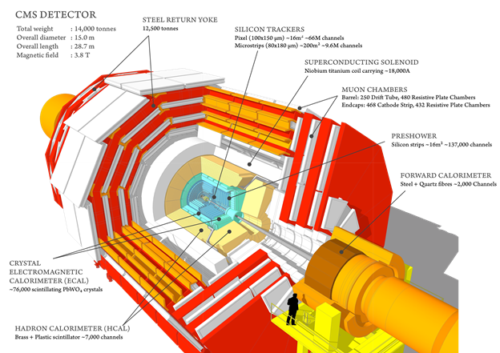

---
title: |
  U.S. CMS Compact Muon Solenoid Operations Program Quarterly Report
  for the Period Ending December 31, 2016
author:
- name: U.S. CMS Operations Program
abstract: |
    \vspace*{-1.0in}
    \ 
tags: [USCMS, report]
bibliography: rb.bib
csl: /Volumes/Users/bauerdic/Docs/_Dev/pandoc-templates/csl/institute-of-physics-numeric.csl
mainfont: Minion Pro
monofont: Courier
...

\makeoddfoot  {qr}{\small{U.S. CMS Operations Program 2016Q4}}{}{\small Page \thepage}
\pagestyle{qr}

\newpage
