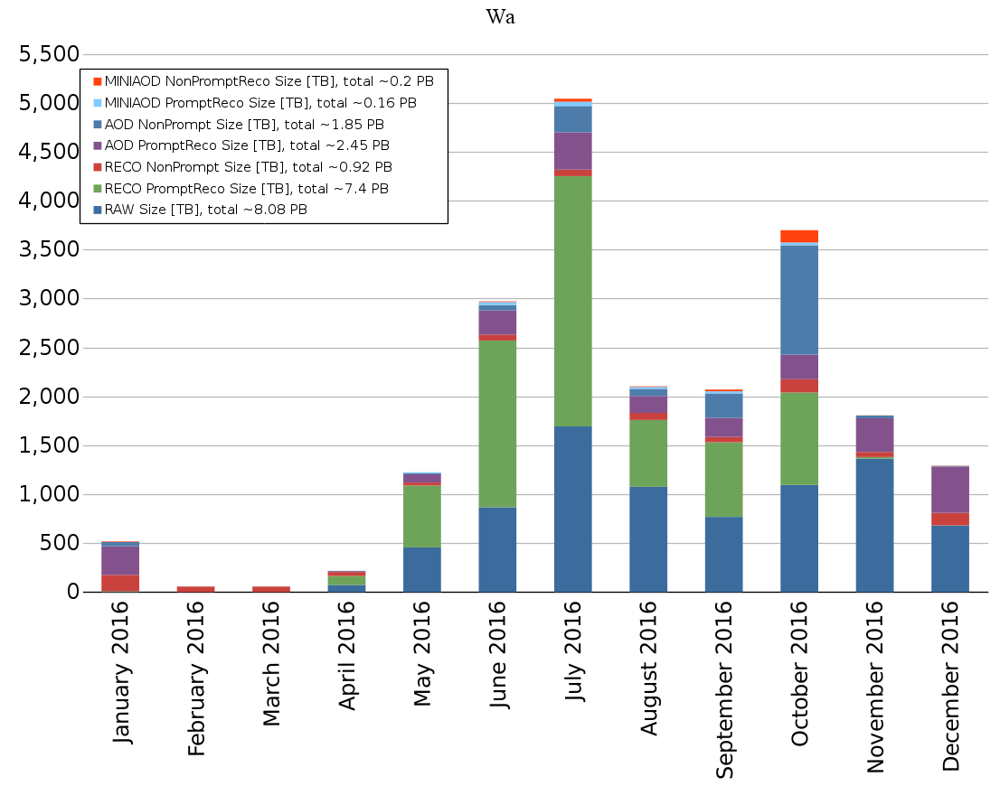
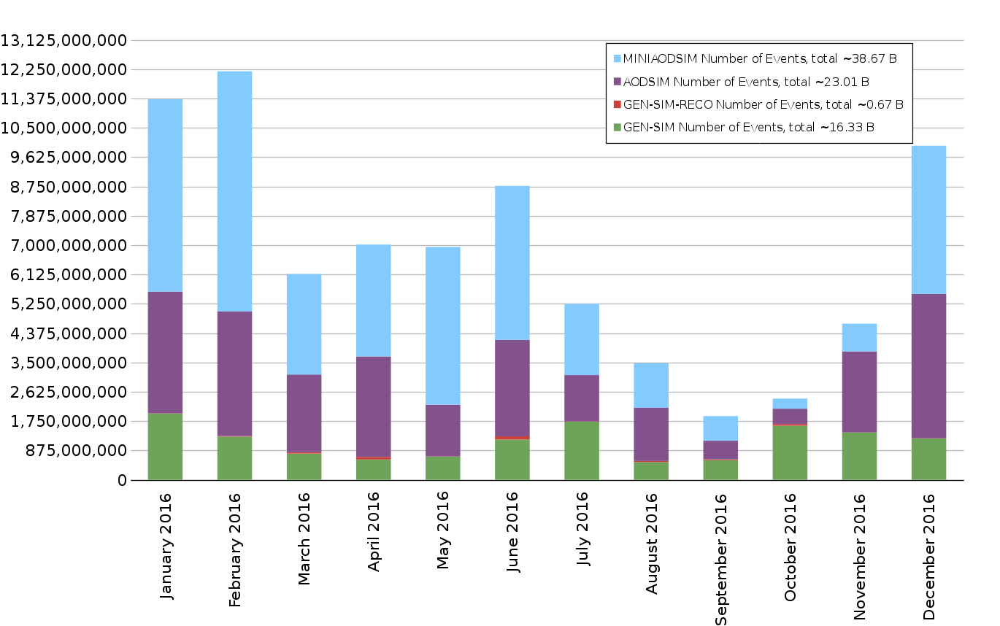

\clearpage

# Software and Computing

The end of a calendar year is always a busy time for the LHC, with the
end of operations for the year and a big push to prepare results from
the year’s dataset for upcoming conferences and subsequent paper
submission. This was clearly reflected in U.S. CMS Software and
Computing Operations for the final quarter of 2017. The computing
facilities at both Fermilab and the universities saw high rates of
utilization thanks to both high demand and excellent availability.
 Computing Operations was extremely busy as it provided a consistent
processing of the 2016 data and started generating simulation samples
needed for analysis of that data. Operations made use of innovations
such as the multi-threaded event framework, multi-core pilot jobs, and
pre-mixed pileup samples to make all of this processing more efficient.
 These technologies were the result of long-term developments in the
Computing Infrastructure and Services and Software and Support areas,
which have continued to push in these directions and additional ones
such as improvements in the workflow systems, advances in processing at
resources such as NERSC and continued development of the software for
new computing architectures. Many of these developments were presented
at the CHEP conference in October 2016. Preparations for the coming LHC
year, such as software to reflect detectors being installed during the
EYETS, are well underway.

-----------------------------------------------------------------------
Date               Milestone
----------------   ----------------------------------------------------
November 2016      Request Manager v1 to v2 transition complete

December 2016      WMArchive put into production

December 2016      Completion of the roll-out of connections the Tier-2 sites to LHCONE VPN by ESNet.

December 2016      For at least 3 sites, implement load-balanced GridFTP servers via DNS or IP as a prelude to decommissioning bestman2.

December 2016      Tier 1 PhEDEx and FTS upgrade complete
-----------------------------------------------------------------------

  : Major milestones achieved this quarter

## Fermilab Facilities

This quarter brought to a close the second year of LHC Run 2.
Throughout the quarter the FNAL Facilities continued to provide
reliable custodial storage, processing and analysis resources to USCMS
collaborators. Site utilization was high, with the facility providing a
record 44 million wall hours of CPU to CMS.

{#fig:sc1}

Figure {@fig:sc1} shows the site readiness metrics for the Tier-1 during the
quarter. After the heavy ion run completed in December, Fermilab upgraded
the PhEDEx and FTS (data transfer) services. A missed step in the
upgrade led to missed metrics on the 17th and 18th. Procedures have
been improved for future upgrades. Overall the site performed very
well, passing metrics 97.5% of the time for the quarter. During LHC
running periods the site passed metrics 99.5% of the time this
quarter.

The Fermilab LPC computing resources continued to be well utilized.  By the
end of this quarter preparations were complete to move LPC users off
aging BlueArc based storage to new NFS servers, with the transition
scheduled first of the year.

## University Facilities

This quarter was an extremely busy time for the U.S. CMS Tier-2
facilities during a period of intensive data analysis and greatly
increased central production activities for simulated data for the
upcoming winter conferences. High performance is expected from the sites
at all times, but especially during the critical periods before major
conferences. All of the U.S. CMS Tier-2 sites operated successfully this
quarter. On our two official performance metrics based on CMS test jobs,
all sites were at least 92%
[available](https://www.google.com/url?q=http://wlcg-sam-cms.cern.ch/templates/ember/%23/historicalsmry/heatMap?end_time%3D2017%252F01%252F01%252000%253A00%26granularity%3DDaily%26profile%3DCMS_CRITICAL_FULL%26site%3DT2_US_Caltech%252CT2_US_Florida%252CT2_US_MIT%252CT2_US_Nebraska%252CT2_US_Purdue%252CT2_US_UCSD%252CT2_US_Wisconsin%26start_time%3D2016%252F10%252F01%252000%253A00%26time%3Dmanual%26type%3DAvailability%2520Ranking%2520Plot&sa=D&ust=1487120578693000&usg=AFQjCNGoCXbmfr03FtQ6vDJbkjGXL7X_ag)
and 90%
[ready](https://www.google.com/url?q=http://dashb-ssb.cern.ch/dashboard/request.py/sitereadinessrank?columnid%3D45%26view%3DSite%2520Readiness%23time%3Dcustom%26start_date%3D2016-10-01%26end_date%3D2017-01-01%26sites%3Dmultiple%26timebins%3Dfalse%26nodata%3Dfalse%26binsselect%3Ddefault%26clouds%3Dall%26site%3DT2_US_Caltech,T2_US_Florida,T2_US_MIT,T2_US_Nebraska,T2_US_Purdue,T2_US_UCSD,T2_US_Wisconsin&sa=D&ust=1487120578694000&usg=AFQjCNEytsx_SpAiEP0RBA2n-0sV0dsw4A)
The CMS goal for each of these metrics is 80%. The U.S. CMS Tier-2
centers
delivered [47.2%](https://www.google.com/url?q=http://dashb-cms-jobsmry.cern.ch/dashboard/request.py/consumptions_individual?sites%3DT2_AT_Vienna%26sites%3DT2_BE_IIHE%26sites%3DT2_BE_UCL%26sites%3DT2_BR_SPRACE%26sites%3DT2_BR_UERJ%26sites%3DT2_CH_CSCS%26sites%3DT2_CN_Beijing%26sites%3DT2_DE_DESY%26sites%3DT2_DE_DESY_Test%26sites%3DT2_DE_RWTH%26sites%3DT2_EE_Estonia%26sites%3DT2_EE_Estonia_Test%26sites%3DT2_ES_CIEMAT%26sites%3DT2_ES_IFCA%26sites%3DT2_FI_HIP%26sites%3DT2_FI_HIP_Test%26sites%3DT2_FR_CCIN2P3%26sites%3DT2_FR_GRIF_IRFU%26sites%3DT2_FR_GRIF_LLR%26sites%3DT2_FR_IPHC%26sites%3DT2_GR_Ioannina%26sites%3DT2_HU_Budapest%26sites%3DT2_IN_TIFR%26sites%3DT2_IT_Bari%26sites%3DT2_IT_Legnaro%26sites%3DT2_IT_LegnaroTest%26sites%3DT2_IT_Pisa%26sites%3DT2_IT_Rome%26sites%3DT2_KR_KNU%26sites%3DT2_MY_UPM_BIRUNI%26sites%3DT2_PK_NCP%26sites%3DT2_PL_Swierk%26sites%3DT2_PL_Warsaw%26sites%3DT2_PT_NCG_Lisbon%26sites%3DT2_RU_IHEP%26sites%3DT2_RU_INR%26sites%3DT2_RU_ITEP%26sites%3DT2_RU_JINR%26sites%3DT2_RU_PNPI%26sites%3DT2_RU_RRC_KI%26sites%3DT2_RU_SINP%26sites%3DT2_TH_CUNSTDA%26sites%3DT2_TR_METU%26sites%3DT2_UA_KIPT%26sites%3DT2_UK_London_Brunel%26sites%3DT2_UK_London_BrunelTest%26sites%3DT2_UK_London_IC%26sites%3DT2_UK_SGrid_Bristol%26sites%3DT2_UK_SGrid_RALPP%26sites%3DT2_US_Caltech%26sites%3DT2_US_Florida%26sites%3DT2_US_MIT%26sites%3DT2_US_Nebraska%26sites%3DT2_US_Purdue%26sites%3DT2_US_UCSD%26sites%3DT2_US_Vanderbilt%26sites%3DT2_US_Wisconsin%26sitesSort%3D2%26start%3D2016-10-01%26end%3D2017-01-01%26timeRange%3Ddaily%26granularity%3DMonthly%26generic%3D0%26sortBy%3D0%26series%3DAll%26type%3Dewa&sa=D&ust=1487120578697000&usg=AFQjCNEvCPxu77yIAjiiuEbwpHUtXBUZxg) of
all computing time by Tier-2 sites in CMS (our commitment to global
CMS is &gt; 25%), as shown in Figure {@fig:sc2}. This is an increase of
3.4% over the previous quarter.

As for progress on milestones and upgrades, the connection of the
Tier-2 sites to the LHCONE VPN by ESNet was completed during this
quarter. We also completed the major milestone that at least 3 sites
implement load-balanced GridFTP servers via DNS or IP, which is a
prelude to decommissioning bestman2. Sites are making progress in
decommissioning BDII, a legacy component. We have a goal to complete
this well before the end of March 2017, when OSG support for BDII is
ending. Sites are also making progress converting at least one CE to
RHEL7, with 3 out of 7 sites completing this milestone before the end of
the quarter. The few other minor incomplete milestones will be carried
over to the next quarter.

{#fig:sc2}

Eight Tier-3 sites required assistance from the Tier-3 support team
this past quarter on issues related to patching the COW Linux kernel
vulnerability, PhEDEx upgrades, networking and basic Linux systems
adminstration. The team is putting significant effort towards preparing
documentation for upcoming OSG software changes connected to gridftp and
HDFS filesystems. CMS Connect effort has shifted to user education and
helping to port user applications to the platform, starting with
gridpack generation, which is a broad need for CMS MC generation. Kenyi
Hurtado presented a poster on CMS Connect at CHEP.

## Computing Operations

The re-reconstruction campaign to provide a uniform 2016 dataset
started end of September 2016. About 50k processing cores were used
during steady-state running and all original processing requests were
completed during October. The reconstruction program was set up to use
four threads, taking advantage of our long-term efforts towards a
multi-threaded software framework. This matched well to the eight-core
pilots of the CMS glide-in system, reaping the fruits of other
development work. But operating multi-core systems at this scale led to
the emergence of new behaviors. Additional lower-priority
single-threaded generation and simulation campaigns being carried out at
the same time were able to regularly push out the jobs of the
re-reconstruction campaign. Investigation of the resulting priority
inversion led to a tuning of the submission infrastructure in favor of
multi-threaded jobs. While this mitigated the issue, unwanted
fragmentation of pilots requires further investigation.

Additional re-reconstruction requests, for both the special LHC runs
with a few bunches with extremely high pileup and the Van der Meer
scans, were received in October. Processing of the special LHC runs led
to significant challenges; the data were recorded with too many events
per processing unit and excessive use of CPU and memory were encountered
due to the very high pile-up. After several attempts the data are now
processed at dedicated machines at the University of Nebraska.  This
experience will be useful for future processing of high-intensity
events.

{#fig:sc3}

Monte Carlo generation for the analyses targeting conferences in Spring
2017 started in the middle of November. After a thorough development
effort, the campaign is an pre-mixed pileup samples, where individual
minimum bias events are generated and combined into a pileup sample
before the start of the campaign. Instead of reading N minimum bias
events during the digitization step to simulate the pile-up condition,
one pre-mixed event is read instead. The pre-mixing approach results in
much lower input data rates and also lower CPU consumption. The
challenge lies in assembling a sample of sufficient size and placing it
at well-networked sites in advance of the campaign. By the end of 2016
Monte Carlo samples totaling 6 billion events were generated for this
campaign. The campaign is ongoing and new sample requests still being
received.

{#fig:sc4}

In addition to these activities, the LHC completed its 2016 run with
heavy-ion collisions. Last year the processing of these high-occupancy
events caused great stress on the Tier-0 system, leading to much
just-in-time development work. This year, the Tier-0 performed well
with no new development needed.

## Computing Infrastructure and Services

During this quarter to workflow team completed the transition of our
Request Manager (ReqMgr) system from version 1 to 2. The new ReqMgr is
much more maintainable and gives us a platform to streamline the
operations process and add more intelligence into the core of the
workflow system. The workflow management system also commissioned the
ability to run jobs whose core count is chosen by the GlideinWMS system
within a range, an improvement which promises to increase the overall
resource utilization and efficiency. NERSC resources were used to run
production workflows for DIGI-RECO and GEN-SIM-DIGI-RECO at scales of up
to 3000 cores submitted through the normal submission infrastructure as
well through a virtual extension (HEPCloud) of the FNAL Tier-1
facility.

Our central web-based infrastructure encountered some scaling issues
this quarter which were addressed by horizontally scaling the DBS
service and beginning to investigate connection throttling to ensure
that we preserve enough capacity for our production systems and only
provide the excess capacity for end-user requests. Associated with this,
a rewrite of the DAS service with Python3 was begun. WMArchive, the
service to store job-related information in a permanent archive, was put
into production during the reporting period.

Two types of benchmarking exercises were performed. We benchmarked the
data caching component of our Tier-3 in a box prototypes, and found the
systems supported close to 10 Gbps read and a little less than half that
write performance. The write-performance limit is understood to be the
fundamental limit of the SATA disk subsystem. We consider this
sufficiently adequate for deployment. As second benchmarking test, we
defined a Tier-2 scale XRootd data caching pilot to be deployed and
operated in Southern California. Initial benchmarking was performed
during Supercomputing 17. A distributed cache of 9 systems with 12 SATA
disks each was exercised with up to 9k clients reading simultaneously.
Maximum I/O performance of 57.8 Gbps reads with simultaneous 45Gbps
writes were achieved. However, at this scale of use, the distributed
cache is so busy that it writes only roughly half the I/O fetched via
the WAN to disk in order to maximize read I/O, rather than having writes
slow down reads. This is the desired functionality of the cache. More
detailed benchmarking is expected to continue next quarter. Both of
these benchmarking efforts were conducted in collaboration with OSG and
PRP, and are described in more details in the PRP monthly reports to
NSF-ACI.

## Software and Support

In this quarter, the framework software team finished Phase 2 of the
multi-threaded framework implementation and is now concentrating on
improving the performance of writing output. This was identified as the
bottleneck in using higher core counts during execution, which was
reported at CHEP from measurements on NERSC Cori, Vesta at ACLF, and KNL
systems. We started the ROOT I/O developer forum to increase
cohesiveness of the I/O optimization effort.

We released the software and reconstruction configuration for the 2016
end-of-year reprocessing pass and the first major release intended for
the 2017 Monte Carlo production. The 2017 geometry that includes the new
detectors being installed during the EYETS was finalized and included in
this release, as well as updates to the visualization solution. We
implemented the possibility to include python packages in CMSSW directly
from the current community package manager (PIP).

The vectorized tracking R&D project made progress in refining the track
fitting and starting on vectorizing the track building stage. Progress
was made in the investigation of optimized HL-LHC tracker detector
layouts that would reduce the amount of computing resources and were
reported at ICHEP 2016.

The optimization of ROOT's performance using the C++ modules
implementation of CMSSW was presented at CHEP and the ISOC++
standardization committee meeting to make it part of the standard and
reduce maintenance effort in the long term.

We presented a study on using Apache Spark for CMS analysis at CHEP.
The study was based on converting ROOT files into a Spark-friendly
format. This was superseded shortly afterwards by developing the
capability to read ROOT files directly from Spark.

The web proxy auto configuration for the distributed access of
alignment and calibration constants was put into operation to support
opportunistic resources and was reported on at CHEP as well.

In total, the U.S. CMS Software and Computing program's software area
submitted 6 contributions to CHEP 2016.

