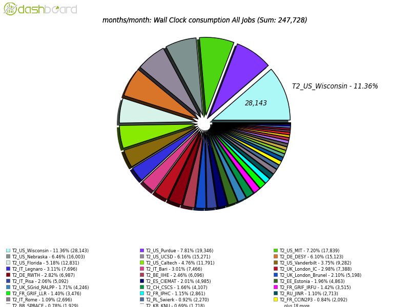

\clearpage

# Software and Computing

This quarter corresponds to the extended year-end technical stop of the LHC, so no new proton-proton collision data was produced. However, Software and Computing activities were very high. The winter conferences were held in March, resulting in heavy use of computing facilities to prepare simulation samples and analyze the 2016 LHC data to prepare physics measurements. The U.S. Tier-1 and Tier-2 facilities performed well throughout the quarter, the operations groups provided the necessary samples, and many interesting results were ready for the conferences.  Notably, the simulation production campaign took advantage of pre-mixed pileup samples, which had been developed by the other work areas during 2016, to allow for more efficient sample production. The development areas continued their efforts to prepare for 2017 LHC run, which will include new detector components in CMS, and for longer-term improvements that take advantage of additional computing facilities and modern software tools.

-----------------------------------------------------------------------
Date              Milestone
----------------  -----------------------------------------------------
January 6         LPC BlueArc storage decommissioned and replaced with NFS mounted disk arrays

February 21       Tier-1 FTS upgrade to v3.5.7

March 15          Deployed Tier-2 pledged resources

March 15          Deployed Tier-1 pledged resources

March 25          Installed Singularity

March 31          Enabled separate settings of CMSSW event streams and threads, optimizing memory usage

March 31          Retired GIP/BDII

March 31          Incorporate LZ4 compression algorithm in ROOT
----------------  -------------------------------------------------------

  : Major milestones achieved this quarter

## Fermilab Facilities

Throughout this quarter the Fermilab Facilities continued to provide reliable custodial storage, processing and analysis resources to U.S.  CMS collaborators. The site was well utilized, with the facility providing 37 million wall-clock hours of processing to CMS. In preparation for the upcoming LHC run the Tier-1 upgraded its FTS (File Transfer Service) service to the latest production version, and took advantage of the downtime to update its dCache storage servers. To support U.S. CMS user analysis demands for the winter conferences in March, the facility temporarily reallocated 2,000 cores from the Tier-1 to the LPC CAF at the beginning of February. Analyzers fully used those resources through mid-March, when they needed to be returned for the 2017 Tier-1 pledge.  The aging LPC BlueArc storage system was also migrated to a pair of newer, better performing NFS mounted Nexsan storage arrays in the beginning of January.

{#fig:t1}

Figure {@fig:t1} shows the site readiness metrics for the Tier-1 during the quarter. Overall, the Tier-1 passed CMS metrics for 95.3% of the quarter. There were four sets of incidents: In late January there was an issue with proxy renewal in data transfers. The FTS service became disabled in four separate incidents in late February due to off-site security scanning activity. Mitigations now are in place to make this service more robust to these scans. In mid-March job output staging was affected by a bug in a new version of xrootd, which was then rolled back. Finally, there was an outage in the GUMS mapping service that prevented grid job authentication for a few hours the following week.

## University Facilities

This quarter began with an extremely busy time for the U.S. CMS Tier-2 facilities during a period of intensive data analysis and greatly increased central production activities for simulated data for the winter conferences. High performance is expected from the sites at all times, but especially during the critical periods before major conferences. All of the U.S. CMS Tier-2 sites operated successfully this quarter. On our two official performance metrics based on CMS test jobs, all sites were at least 91%
"[available](https://www.google.com/url?q=http://wlcg-sam-cms.cern.ch/templates/ember/%23/historicalsmry/heatMap?end_time%3D2017%252F04%252F01%252000%253A00%26granularity%3DDaily%26profile%3DCMS_CRITICAL_FULL%26site%3DT2_US_Caltech%252CT2_US_Florida%252CT2_US_MIT%252CT2_US_Nebraska%252CT2_US_Purdue%252CT2_US_UCSD%252CT2_US_Wisconsin%26start_time%3D2017%252F01%252F01%252000%253A00%26time%3Dmanual%26type%3DAvailability%2520Ranking%2520Plot&sa=D&ust=1492698002600000&usg=AFQjCNFIAo3jMAJ5H51Q6_2sa6V_W90CrA)"
and 93%
"[ready](https://www.google.com/url?q=http://dashb-ssb.cern.ch/dashboard/request.py/sitereadinessrank?columnid%3D45%26view%3DSite%2520Readiness%23time%3Dcustom%26start_date%3D2017-01-01%26end_date%3D2017-04-01%26sites%3Dmultiple%26timebins%3Dfalse%26nodata%3Dfalse%26binsselect%3Ddefault%26clouds%3Dall%26site%3DT2_US_Caltech,T2_US_Florida,T2_US_MIT,T2_US_Nebraska,T2_US_Purdue,T2_US_UCSD,T2_US_Wisconsin&sa=D&ust=1492698002601000&usg=AFQjCNFEUPfSkNeZolXob5CcKjSK7tQPNg)".
The CMS goal for each of these metrics is 80%, but the U.S. CMS performance goal is 90%.

The U.S. CMS Tier-2 centers delivered [48.9%](https://www.google.com/url?q=http://dashb-cms-jobsmry.cern.ch/dashboard/request.py/consumptions_individual?sites%3DT2_AT_Vienna%26sites%3DT2_BE_IIHE%26sites%3DT2_BE_UCL%26sites%3DT2_BR_SPRACE%26sites%3DT2_BR_UERJ%26sites%3DT2_CH_CSCS%26sites%3DT2_CN_Beijing%26sites%3DT2_DE_DESY%26sites%3DT2_DE_DESY_Test%26sites%3DT2_DE_RWTH%26sites%3DT2_EE_Estonia%26sites%3DT2_EE_Estonia_Test%26sites%3DT2_ES_CIEMAT%26sites%3DT2_ES_IFCA%26sites%3DT2_FI_HIP%26sites%3DT2_FI_HIP_Test%26sites%3DT2_FR_CCIN2P3%26sites%3DT2_FR_GRIF_IRFU%26sites%3DT2_FR_GRIF_LLR%26sites%3DT2_FR_IPHC%26sites%3DT2_GR_Ioannina%26sites%3DT2_HU_Budapest%26sites%3DT2_IN_TIFR%26sites%3DT2_IT_Bari%26sites%3DT2_IT_Legnaro%26sites%3DT2_IT_LegnaroTest%26sites%3DT2_IT_Pisa%26sites%3DT2_IT_Rome%26sites%3DT2_KR_KNU%26sites%3DT2_MY_UPM_BIRUNI%26sites%3DT2_PK_NCP%26sites%3DT2_PL_Swierk%26sites%3DT2_PL_Warsaw%26sites%3DT2_PT_NCG_Lisbon%26sites%3DT2_RU_IHEP%26sites%3DT2_RU_INR%26sites%3DT2_RU_ITEP%26sites%3DT2_RU_JINR%26sites%3DT2_RU_PNPI%26sites%3DT2_RU_RRC_KI%26sites%3DT2_RU_SINP%26sites%3DT2_TH_CUNSTDA%26sites%3DT2_TR_METU%26sites%3DT2_UA_KIPT%26sites%3DT2_UK_London_Brunel%26sites%3DT2_UK_London_BrunelTest%26sites%3DT2_UK_London_IC%26sites%3DT2_UK_SGrid_Bristol%26sites%3DT2_UK_SGrid_RALPP%26sites%3DT2_US_Caltech%26sites%3DT2_US_Florida%26sites%3DT2_US_MIT%26sites%3DT2_US_Nebraska%26sites%3DT2_US_Purdue%26sites%3DT2_US_UCSD%26sites%3DT2_US_Vanderbilt%26sites%3DT2_US_Wisconsin%26sitesSort%3D2%26start%3D2017-01-01%26end%3D2017-04-01%26timeRange%3Ddaily%26granularity%3DMonthly%26generic%3D0%26sortBy%3D0%26series%3DAll%26type%3Dewa&sa=D&ust=1492698002603000&usg=AFQjCNGOvFtwmdYOLPq7BjgSgK-neiEeWg) of all computing time by Tier-2 sites in CMS (our commitment to global CMS is &gt; 25%), as shown in Figure {@fig:t2}. This is an increase of 1.7% over the previous quarter.

As for progress on [milestones](https://www.google.com/url?q=https://twiki.cern.ch/twiki/bin/view/CMSPublic/USCMSTier2Upgrades%232017_Upgrades_and_Milestones_dra&sa=D&ust=1492698002604000&usg=AFQjCNHHsL4HIJ4iOvHfABqR4WvnDuW4Lg) and upgrades, the Tier-2 sites have deployed their pledged resources for 2017, installed the Singularity virtualization software, and retired GIP/BDII, all in time before April 1.  As for milestones, four out of seven sites have implemented load-balanced gridFTP as a replacement for Bestman, and five out of seven sites have installed the new CMS space monitoring client package.  Three out of six sites have replaced the legacy WLCG tools with gfal.  Four of seven sites have converted at least one CE to SL7.

{#fig:t2}

Nine Tier-3 sites required assistance from the Tier-3 support team this past quarter on issues ranging from PhEDEx upgrades and troubleshooting to OSG Computing Element (CE) and batch system support. The team collaborated with OSG on writing documentation for replacing Bestman with load-balanced grid-ftp configurations. CMS Connect continues to gain users with over thirty now registered. The team is working with the CMS Generators group to adapt gridpack production to CMS Connect to dramatically broaden the range of CMS computing resources that can contribute to that task. Preparations to deploy the first Tier-3-in-a-box site are underway.

## Computing Operations

An overview of Computing Operations activities is shown in figure {@fig:comOps}. Monte Carlo generation for the analyses targeting conferences in Spring 2017 started in November 2016, with requests from the collaboration arriving through the middle of February. The generation campaign has used an event pre-mixing approach, where individual minimum bias events are generated and combined into a pile-up sample before the start of the campaign. Instead of reading a large number of minimum bias events during the digitization step to simulate the pile-up condition, only one already pre-mixed event is read instead. The pre-mixing approach results in much lower input data rates and also lower CPU usage. Over 9 billion events were generated and provided to the physics groups in time for the spring conferences. About 600 million events with old-style pile-up simulation were also requested and completed by mid-January. About 120K cores were used simultaneously during the campaign, with peaks up to 175K.

Work on refinements to the physics objects used in analysis concluded in the beginning of February. For about 6 billion events the small event format used for analysis, miniAOD, was recreated to include those improvements. The campaign was completed by mid-February, demonstrating our ability for the fast turn around for this kind of processing.

Monte Carlo generation for the Phase-1 and Phase-2 upgrades ran in the second half of February until early March. The Phase-2 upgrade samples stressed the system significantly due to larger event sizes, the required high pileup of 200 minimum bias events, and usage of the old-style pile-up simulation. Job submission had to be adapted so as not to overly stress computing cluster infrastructure.

The recommissioning of the detector in March has resulted in global runs and cosmic data being recorded, the first steps towards regular operations of the Tier-0 facility that will begin in the coming quarter.

{#fig:comOps}

After observing a bottleneck in staging data back from tape at the end of last year, a staging test was conducted at all Tier-1 sites of CMS.  The overall performance was lower than desired due to excessive tape mounts that were triggered by various components of the data management system. Work is ongoing to understand the limits and tune the parameters.

## Computing Infrastructure and Services

This quarter was spent in laying some of the groundwork for future developments and needs.  WMArchive, the new job-level monitoring, was put into production and significant progress was made integrating this data source into MONIT, the new CERN-provided monitoring infrastructure. WMAgent was modified to allow separate settings for the number of processing threads and simultaneous events under reconstruction, an important part of maintaining both efficiency and the memory footprint of upgrade workflows within current bounds. WMAgent versions 1.1.0 and 1.1.1 were released, incorporating these features. The Tier-0 facility was modified to work with the new data transfer system between CMS Point-5 and the Tier-0, which is based on a state machine rather than message passing.

For U.S. CMS use of High Performance Computing (HPC) systems, our workflows were commissioned for *Comet* on *Stampede*, at the level of the startup allocation we were granted. We also put into production the construction of Shifter images for NERSC, which is being done at Fermilab. GlideinWMS improved its monitoring of payloads which serves as a cross-check of the job-level monitoring information.

During the quarter we formed and began modifying DBS and all related software to be able to track event counts per file per 23-second luminosity section (previously we only tracked events per file). DAS completed modifications to be able to run unmodified on both Python 2 and 3, while also developing a much faster client using the Go language, which moves the data aggregation from the DAS server into the DAS client.

## Software and Support

We are focusing on the computational efficiency of the CMS threaded software framework, both for x86 platforms and for very-high thread counts needed for KNL platforms. We made significant improvements in the area of simulation geometry initialization to decrease the application startup time and improved our tools to find concurrency bottlenecks. The work on improving the multi-threaded performance of the I/O layer is on track and progressing well, as well is the work on the C++ modules support in the framework, which will speed up compilation significantly. The integration and testing of extended Python-based analysis toolkit is underway. The latest release cycle now provides access to Theano, TensorFlow and other machine learning toolkits, as well as Jupyter notebooks. The milestone of integrating the LZ4 compression into ROOT was reached. This gives the advantage of 4-7 times faster file reading with only slightly larger file sizes. At this time, CMS prefers to minimize disk usage, so this will not be the default option, but analysts who optimize on speed can also just switch off compression altogether.

In preparation for the start of collision data taking later this year, the calibration and alignment infrastructure (Frontier) now supports the new LHC Run 2 conditions system by supporting HTTP 1.1 chunked encoding.  We are on track to optimize the 2017 geometry description, having completed major components, and are now concentrating on medium and small issues. The release for cosmic ray data taking was completed including the final 2017 geometry layout and is now used in the current cosmic ray campaign. The event display was updated with the latest software release to support the cosmic ray data taking as well. We are on track with developments for the releases for initial collisions and the legacy re-reconstruction of 2016 data. We also published releases for the Phase-2 upgrade MC production for the HL-LHC trigger TDR.

Regarding R&D, we are studying concurrency for web-based apps by evaluating Go instead of Python, having already written Go server and client implementation for our dataset aggregation service (DAS). We are also progressing in using ROOT files directly in big data analytics platforms like Apache Spark. The vectorized tracking R&D project progresses well, now being able to reconstruct tracks in different parts of the detector in parallel. We are concentrating both of GPUs and KNL architectures. We submitted various CHEP proceedings and are awaiting their acceptance, and are preparing to submit conference abstracts to ACAT 2017 and other venues.
