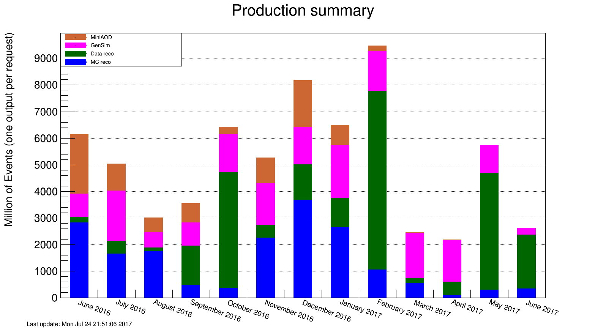

# Summary of Software and Computing activities

The second quarter of 2017 began with a quiet period after preparations for winter conferences, and ended with the start of LHC operations for the year and the incorporation of a new pixel detector into CMS.  As usual, the U.S. CMS computing facilities operated at a high level of availability, while also continuing to upgrade and improve services for users.  The computing operations team kept those facilities busy with a variety of data processing and simulation tasks, concluding with processing of the first 2017 data and preparations for analysis.  The development teams closed out a number of ongoing projects that have improved our operational efficiency and our understanding of system performance, while also starting up several promising efforts that will help us accommodate the strong challenges presented by the HL-LHC.

Date               Milestone
----------------   ----------------------------------------------------
May 15             Ability to have workflows running on a combination of EL6 and EL7 operating systems
June 15            Completed DBS update to track events per luminosity section per file and related WMAgent & DAS code to enable event counts
June 20            SL7 operating system based development capability provided for LPC users
July 1             Allow multiple threads when processing runs and luminosity blocks
July 1             Merged all python packages that are around ROOT into CMSSW
July 1             Integrate geometry changes for 2017 data taking for visualization solution

  : Major milestones achieved this quarter

## Fermilab Facilities

Q3 of the fiscal year brought about the restart of LHC physics running in June.  Throughout this quarter the Fermilab Facilities continued to provide reliable custodial storage, processing and analysis resources to U.S. CMS collaborators.  The site was well utilized, with the facility providing 36 million wall-clock hours of processing to CMS.

During this quarter the facility upgraded EOS storage for the LPC, addressing an issue that caused approximately weekly crashes in the metadata server.  This has greatly improved service reliability for the LPC users.  Also during this quarter the Tier 1 facility passed CMS site availability metrics 100% of the time.   Figure 1 shows the site readiness metrics for the quarter.  The black & yellow band along the bottom of the figure indicates the start of LHC physics operaitons at the beginning of June.

## University Facilities

CMS production and analysis activities this quarter were lighter than typical because the extended year-end technical stop delayed the start of data taking.  Nonetheless, all of the U.S. CMS Tier-2 sites operated successfully this quarter. On our two official performance metrics based on CMS test jobs, all sites were at least 90%
"[available](https://www.google.com/url?q=http://wlcg-sam-cms.cern.ch/templates/ember/%23/historicalsmry/heatMap?end_time%3D2017%252F07%252F01%252000%253A00%26granularity%3DDaily%26profile%3DCMS_CRITICAL_FULL%26site%3DT2_US_Caltech%252CT2_US_Florida%252CT2_US_MIT%252CT2_US_Nebraska%252CT2_US_Purdue%252CT2_US_UCSD%252CT2_US_Wisconsin%26start_time%3D2017%252F04%252F01%252000%253A00%26time%3Dmanual%26type%3DAvailability%2520Ranking%2520Plot&sa=D&ust=1501260249324000&usg=AFQjCNEXRv6GE8BJfVoT6TO2obkO3WEFyQ)"
and 88%
"[ready](https://www.google.com/url?q=http://dashb-ssb.cern.ch/dashboard/request.py/sitereadinessrank?columnid%3D45%26view%3DSite%2520Readiness%23time%3Dcustom%26start_date%3D2017-04-01%26end_date%3D2017-07-01%26sites%3Dmultiple%26timebins%3Dfalse%26nodata%3Dfalse%26binsselect%3Ddefault%26clouds%3Dall%26site%3DT2_US_Caltech,T2_US_Florida,T2_US_MIT,T2_US_Nebraska,T2_US_Purdue,T2_US_UCSD,T2_US_Wisconsin&sa=D&ust=1501260249325000&usg=AFQjCNGx-d3ShRnIAnu01V70Pv_yJihCQA)".
The CMS goal for each of these metrics is 80%, but the U.S. CMS
performance goal is 90%. For the one site that missed the U.S. CMS
performance goal for "ready," the issue has been identified and should
be corrected for the next quarter.

The U.S. CMS Tier-2 centers delivered
[52.8%](https://www.google.com/url?q=http://dashb-cms-jobsmry.cern.ch/dashboard/request.py/consumptions_individual?sites%3DT2_AT_Vienna%26sites%3DT2_BE_IIHE%26sites%3DT2_BE_UCL%26sites%3DT2_BR_SPRACE%26sites%3DT2_BR_UERJ%26sites%3DT2_CH_CSCS%26sites%3DT2_CN_Beijing%26sites%3DT2_DE_DESY%26sites%3DT2_DE_DESY_Test%26sites%3DT2_DE_RWTH%26sites%3DT2_EE_Estonia%26sites%3DT2_EE_Estonia_Test%26sites%3DT2_ES_CIEMAT%26sites%3DT2_ES_IFCA%26sites%3DT2_FI_HIP%26sites%3DT2_FI_HIP_Test%26sites%3DT2_FR_CCIN2P3%26sites%3DT2_FR_GRIF_IRFU%26sites%3DT2_FR_GRIF_LLR%26sites%3DT2_FR_IPHC%26sites%3DT2_GR_Ioannina%26sites%3DT2_HU_Budapest%26sites%3DT2_IN_TIFR%26sites%3DT2_IT_Bari%26sites%3DT2_IT_Legnaro%26sites%3DT2_IT_LegnaroTest%26sites%3DT2_IT_Pisa%26sites%3DT2_IT_Rome%26sites%3DT2_KR_KNU%26sites%3DT2_MY_UPM_BIRUNI%26sites%3DT2_PK_NCP%26sites%3DT2_PL_Swierk%26sites%3DT2_PL_Warsaw%26sites%3DT2_PT_NCG_Lisbon%26sites%3DT2_RU_IHEP%26sites%3DT2_RU_INR%26sites%3DT2_RU_ITEP%26sites%3DT2_RU_JINR%26sites%3DT2_RU_PNPI%26sites%3DT2_RU_RRC_KI%26sites%3DT2_RU_SINP%26sites%3DT2_TH_CUNSTDA%26sites%3DT2_TR_METU%26sites%3DT2_UA_KIPT%26sites%3DT2_UK_London_Brunel%26sites%3DT2_UK_London_BrunelTest%26sites%3DT2_UK_London_IC%26sites%3DT2_UK_SGrid_Bristol%26sites%3DT2_UK_SGrid_RALPP%26sites%3DT2_US_Caltech%26sites%3DT2_US_Florida%26sites%3DT2_US_MIT%26sites%3DT2_US_Nebraska%26sites%3DT2_US_Purdue%26sites%3DT2_US_UCSD%26sites%3DT2_US_Vanderbilt%26sites%3DT2_US_Wisconsin%26sitesSort%3D2%26start%3D2017-04-01%26end%3D2017-07-01%26timeRange%3Ddaily%26granularity%3DMonthly%26generic%3D0%26sortBy%3D0%26series%3DAll%26type%3Dewa&sa=D&ust=1501260249326000&usg=AFQjCNGSkVXrdpMUNGez4fr__aijurYhuQ)
of all computing time by Tier-2 sites in CMS (our commitment to global CMS is &gt; 25%), as shown in Figure 2. This is an increase of 3.8% over the previous quarter.

As for progress on
[milestones](https://www.google.com/url?q=https://twiki.cern.ch/twiki/bin/view/CMSPublic/USCMSTier2Upgrades%232017_Upgrades_and_Milestones_dra&sa=D&ust=1501260249327000&usg=AFQjCNHf_u5WJ1hSRQ8dkir3mrncRT8kcA)
and upgrades, by July 1, the Tier-2 sites had all installed the new CMS disk space monitoring client package and were regularly reporting disk usage and had all (where applicable) replaced the legacy WLCG tools with gfal.  Five out of seven sites have implemented load-balanced gridFTP as a replacement for Bestman and four out of seven sites have converted at least one CE to SL7.

Seven Tier-3 sites required assistance from the Tier-3 support team this past quarter on issues including PhEDEx, OSG software, batch system, and basic Linux troubleshooting and support.  CMS Connect has reached 45 registered users. The first Tier-3-in-a-box site is being deployed at the University of Colorado, and the feasibility of incorporating resources from the research computing center there is being explored.

## Computing Operations

As CMS was not taking data for most of the quarter, this period was rather quiet in terms of data processing and thus an ideal time to perform tests, implement new tools and commission any necessary changes to procedures in preparation for the 2017 run.  A readiness review for the entire operations was performed and successfully completed.

A small number of Monte Carlo samples requested after the spring conferences were completed promptly. Simulations for the Phase 1 upgrades used available computing resources until CMS was ready to re-reconstruct the 6 billion events in the 2016 datasets at the end of April. The worker nodes of the high-level trigger (HLT) farm  were used for offline processing while the LHC was in shutdown/restarting. This revealed a bottleneck in authentication against EOS, the CERN disk storage system. The outages impacted operations and were mitigated by limiting more I/O intensive workflows on both HLT and Tier-0 farm and switching EOS from user-based authentication to subnet authorization for the HLT farm. EOS developers addressed the issue and this solution went into operation in June.

CMS discovered missing files in EOS. Two sources of file loss have been identified: during nameserver failover and in case of xrootd writes with retry. Developers corrected the first and an xrootd client configuration, to disable automatic write retries, was deployed to avoid the second case. We are keeping a close eye on files in EOS to spot any additional issues quickly.

With the start of proton-proton collisions in May, the new transfer system, from the experiment to the Tier-0 facility, was commissioned. A few issues were sorted out -- without any loss of data -- and the new setup was ready for the first physics quality collisions. Additional simulations for the HL-LHC upgrades could be completed before the CMS resumed physics operations. At the end of the quarter, the operations team was preparing for the legacy re-reconstruction of 2016 data by pre-staging the prioritized list of samples.

## Computing Infrastructure and Services

This quarter was spent closing out activities begun earlier. WMArchive, our long term data store of job performance information, began to accept data from CRAB, our analysis system (it already accepts data from WMAgent, the production system). WMAgent was modified and enhanced to enable more workflows to work with the more efficient StepChain workflow and also made some changes be able to increase average job times. Both of these changes are aimed at reducing the number of jobs in the system and increasing the CPU efficiency.

In opportunistic and HPC resources, we were ran workflows on Xeon and KNL nodes at NERSC at comparable efficiencies to what we have been able to achieve on grid sites. We were also able to submit jobs into multi-node GlideinWMS pilots, allowing a better match between requests for CMS workflows and traditional HPC workflows.

This quarter also saw completion of the modifications needed to DBS and all our other software to begin tracking events per luminosity section (23 s of LHC running time) on a per file basis. This gives us the ability to generate better statistics on the makeup of our data and will allow us, in the future, to better split our tasks into jobs and possibly be able to process ranges of events or single events without regard to luminosity section boundaries.

There was development, integration, and debugging activity on Xrootd this quarter. On the development side work was done as members of the international Xrootd collaboration on "serverless caching," i.e. a caching proxy that is run on client side as part of the Xrootd client. For integration, a Tier-2 scale cache was deployed, and integrated with the job submission infrastructure such that jobs submitted with CRAB can overflow to the site that hosts the cache if and only if they analyze datasets that fit the regular expression for the namespace that is cached.  Work is ongoing in improving the monitoring of the cache via various grafana pages. This integration work also fed back into Xrootd development, leading to tuning of the cache to improve file placement, and development of tools to better handle disk losses in a distributed Tier-2 scale cache.

In addition, U.S. CMS has started an evaluation project of Ceph. The initial goals are to validate Ceph as a future replacement of HDFS at the full Tier-2 center scale, compare Ceph performance with HDFS and GlusterFS to separate out limitations in the filesystem from limitations in the teststand, and explore performance of Ceph as a hierarchical storage system, with SSDs for performance and SATA for cost effective volume.  The initial tests of Ceph are very promising, but much more elaborate testing is ongoing.

## Software and Support

Data taking for the running year 2017 started in earnest.  We worked on time-critical software releases for the data taking and commissioning of the new pixel detectors; to prepare for Monte Carlo production campaigns; and to generate simulation samples for the upcoming HL-LHC TDR studies. This included updating the geometry description for the new detector components, especially achieving the milestone for the visualization solution to be ready for the 2017 data taking run. To support various planning activities, we improved our capabilities to query AAA/EOS/CMSSW/CRAB/FTS/DBS/PhEDEx records in Spark and enabled a variety of explorations.

We greatly improved the concurrency of CMS jobs by fully utilizing Intel's Thread Build Block (TBB) tasks to run all modules in the job. This corresponding milestone to allow multiple threads when processing runs and luminosity blocks was completed earlier than originally planned (October 1).  The initial prototype of a mechanism to allow parallel writing to one ROOT output file was successful. The milestone of having multi-threaded I/O by July 1st needs to be moved to October 1, as the challenge requires more coordination with external groups (ROOT, GeantV) to guarantee long term maintainability.  In preparation for the changes to Frontier that will come in Run 3, we finalized the move of query complexity from the client to the server. This concludes the USCMS development part for the December 1 milestone. We are now waiting for international CMS colleagues to write client applications for the new server mode to start scale testing.

Finally, we made progress on important parts of the vectorized tracking R&D work updating to the new 2017 tracker including the new forward and barrel pixel detectors, and studies to optimize the HL-LHC tracker design to reduce the reconstruction time which were presented in international CMS meetings.

