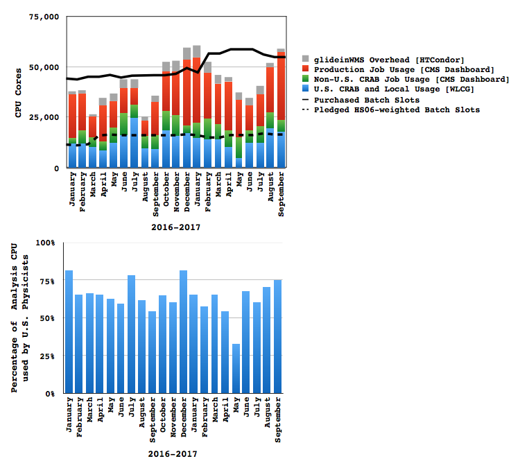

\clearpage

# Software and Computing

The third quarter of 2017 was an incredibly dynamic period for U.S. CMS Software and Computing. There has been a notable increase in the use of the computing facilities. This is driven in part by strong LHC performance throughout the quarter (even at reduced peak luminosities, the trigger rates are largely unchanged), but even more so by greater demands of Monte Carlo production. The necessary software releases were prepared and deployed, and a new system of prioritized sample production led to a steadier demand for resources. This is visible in the pattern of usage of the Tier-2 facilities, and the Fermilab Tier-1 facility was similarly heavily used. All of the facilities continued their excellent performance in the face of this increase in demand. Many developments supported this performance. CMS has been focusing on improving its overall CPU efficiency, and a number of necessary changes have been deployed. Improvements to the workflow management system have reduced the IO load on facilities, improving the performance of owned clusters and enabling new workflows on non-owned resources. Throughout all of this, work has continued to evolve all software and computing systems, and to make the technological leaps necessary to meet the future challenges posed by the HL-LHC.

### Major milestones achieved this quarter

--------------------------------------------------------------------------------
Date    Milestone
------- ------------------------------------------------------------------------
15 Jul  Commission “StepChain” workflows to allow single job, multiple executions of CMSSW for all cases where practical.

31 Jul  Release including high-level particle flow corrections for initial 2017 MC production

1 Aug   Usage of PSST result to supplement SAM investigation complete

1 Aug   Test and incorporate in ROOT if useful, usage of hardware based decompression implementation. Conclusion: too early to use it in production (for ROOT I/O)

8 Aug   All Tier-2 sites upgraded to new CMS temporary file clean-up policy.

6 Sep   LPC EOS hardware and software upgrade and move to central SCD configuration management servers.

16 Sep  Release for large MC production and stable RECO for 2017, delayed by \~1 month due to pixel commissioning.

21 Sep  2nd half of 2017 T1 tape pledge deployed.

30 Sep  In-process fast merging of multiple ROOT file produce by concurrent threads have been successfully incorporated in ROOT, shows good performance for CMS.

30 Sep  Allow multiple threads when processing Runs and LuminosityBlocks.

30 Sep  Able to run all central services on EL7/CC7.

--------------------------------------------------------------------------------

## Fermilab Facilities

This quarter was dominated by strong LHC running throughout the quarter, and large scale data processing in preparation of physics results for upcoming winter conferences. Throughout this quarter the Fermilab Facilities continued to provide reliable custodial storage, processing and analysis resources to U.S. CMS collaborators. The site was well utilized, with the facility providing 44.3 million wall-clock hours of processing to CMS.

During this quarter the facility upgraded EOS storage, deploying new SSD based servers for the LPC. This has greatly improved service reliability for the LPC users, reducing service restarts from a 20 minute outage to about a minute. Also during this quarter the Tier-1 facility passed CMS site availability metrics 99.9% of the time. The one service affecting incident this quarter involved a failure in the File Transfer Service, and resulted in a few hours of transfer outage.  Two downtimes were taken this quarter to move services from old configuration management servers to more centrally maintained services.  Figure @fig:t1 shows the site readiness metrics for the quarter. The yellow band along the bottom of the figure indicates LHC physics operations continuously throughout the quarter.

{#fig:t1}

## University Facilities

As seen in Figure @fig:t2, CMS production and analysis activities this quarter ramped up to maximal levels at our Tier-2 sites during this quarter starting from in mid-August. During this heavily used period, analysis processing consumption by U.S. physicists peaked at 75% of the total analysis CPU delivered by our sites during the month of September.

{#fig:t2}

All of the U.S. CMS Tier-2 sites operated successfully. On our two official performance metrics based on CMS test jobs, all sites were at least 93%
"[available](https://www.google.com/url?q=http://wlcg-sam-cms.cern.ch/templates/ember/%23/historicalsmry/heatMap?end_time%3D2017%252F10%252F01%252000%253A00%26granularity%3DDaily%26profile%3DCMS_CRITICAL_FULL%26site%3DT2_US_Caltech%252CT2_US_Florida%252CT2_US_MIT%252CT2_US_Nebraska%252CT2_US_Purdue%252CT2_US_UCSD%252CT2_US_Wisconsin%26start_time%3D2017%252F07%252F01%252000%253A00%26time%3Dmanual%26type%3DAvailability%2520Ranking%2520Plot&sa=D&ust=1508368753117000&usg=AFQjCNHdI6jvqDd78KxzJnjw0pHZoMZLgg)"
(an increase of +3% over the previous quarter) and 96%
"[ready](https://www.google.com/url?q=http://dashb-ssb.cern.ch/dashboard/request.py/sitereadinessrank?columnid%3D45%26view%3DSite%2520Readiness%23time%3Dcustom%26start_date%3D2017-07-01%26end_date%3D2017-10-01%26sites%3Dmultiple%26timebins%3Dfalse%26nodata%3Dfalse%26binsselect%3Ddefault%26clouds%3Dall%26site%3DT2_US_Caltech,T2_US_Florida,T2_US_MIT,T2_US_Nebraska,T2_US_Purdue,T2_US_UCSD,T2_US_Wisconsin&sa=D&ust=1508368753118000&usg=AFQjCNENcf1osrdGLGiUNgA0-5ZySbAQoA)"
(an increase of +8% over the previous quarter). The CMS goal for each of these metrics is 80%, but the U.S. CMS performance goal is 90%. The U.S.  CMS Tier-2 centers delivered
[51.5%](https://www.google.com/url?q=http://dashb-cms-jobsmry.cern.ch/dashboard/request.py/consumptions_individual?sites%3DT2_AT_Vienna%26sites%3DT2_BE_IIHE%26sites%3DT2_BE_UCL%26sites%3DT2_BR_SPRACE%26sites%3DT2_BR_UERJ%26sites%3DT2_CH_CSCS%26sites%3DT2_CN_Beijing%26sites%3DT2_DE_DESY%26sites%3DT2_DE_DESY_Test%26sites%3DT2_DE_RWTH%26sites%3DT2_EE_Estonia%26sites%3DT2_EE_Estonia_Test%26sites%3DT2_ES_CIEMAT%26sites%3DT2_ES_IFCA%26sites%3DT2_FI_HIP%26sites%3DT2_FI_HIP_Test%26sites%3DT2_FR_CCIN2P3%26sites%3DT2_FR_GRIF_IRFU%26sites%3DT2_FR_GRIF_LLR%26sites%3DT2_FR_IPHC%26sites%3DT2_GR_Ioannina%26sites%3DT2_HU_Budapest%26sites%3DT2_IN_TIFR%26sites%3DT2_IT_Bari%26sites%3DT2_IT_Legnaro%26sites%3DT2_IT_LegnaroTest%26sites%3DT2_IT_Pisa%26sites%3DT2_IT_Rome%26sites%3DT2_KR_KNU%26sites%3DT2_MY_UPM_BIRUNI%26sites%3DT2_PK_NCP%26sites%3DT2_PL_Swierk%26sites%3DT2_PL_Warsaw%26sites%3DT2_PT_NCG_Lisbon%26sites%3DT2_RU_IHEP%26sites%3DT2_RU_INR%26sites%3DT2_RU_ITEP%26sites%3DT2_RU_JINR%26sites%3DT2_RU_PNPI%26sites%3DT2_RU_RRC_KI%26sites%3DT2_RU_SINP%26sites%3DT2_TH_CUNSTDA%26sites%3DT2_TR_METU%26sites%3DT2_UA_KIPT%26sites%3DT2_UK_London_Brunel%26sites%3DT2_UK_London_BrunelTest%26sites%3DT2_UK_London_IC%26sites%3DT2_UK_SGrid_Bristol%26sites%3DT2_UK_SGrid_RALPP%26sites%3DT2_US_Caltech%26sites%3DT2_US_Florida%26sites%3DT2_US_MIT%26sites%3DT2_US_Nebraska%26sites%3DT2_US_Purdue%26sites%3DT2_US_UCSD%26sites%3DT2_US_Vanderbilt%26sites%3DT2_US_Wisconsin%26sitesSort%3D2%26start%3D2017-07-01%26end%3D2017-10-01%26timeRange%3Ddaily%26granularity%3DMonthly%26generic%3D0%26sortBy%3D0%26series%3DAll%26type%3Dewa&sa=D&ust=1508368753121000&usg=AFQjCNE-yYRmsnBpZyuNAiI1_aDpfata2w)
of all computing time by Tier-2 sites in CMS (our commitment to global CMS
is &gt; 25%), as shown in Figure 2. This is a decrease of 1.3% from the
previous quarter.

As for progress on Tier-2
[milestones](https://www.google.com/url?q=https://twiki.cern.ch/twiki/bin/view/CMSPublic/USCMSTier2Upgrades%232017_Upgrades_and_Milestones_dra&sa=D&ust=1508368753122000&usg=AFQjCNE5wdfXwTEzuDFxQblf0WSGgLeYXA) and
upgrades, by October 1st all sites had updated to the new CMS temporary
file cleaning
[policy](https://www.google.com/url?q=https://indico.cern.ch/event/624140/contributions/2532510/attachments/1437332/2211004/StorageBrakeDown2017.pdf&sa=D&ust=1508368753123000&usg=AFQjCNGgHK72qHLxZ1g-vweO04Ennt1O0w).
Four out of seven sites had upgraded to HTCondor 8.6.x and five out of seven to XRootD 4.6.x. Six out of seven sites had migrated to gfal2 away from the deprecated lcg-tools for file transfers.

Eight Tier-3 sites required assistance from the Tier-3 support team this past quarter on issues including PhEDEx, XRootD, OSG software, batch system, and basic Linux troubleshooting and support. A concerted effort was made this quarter to accommodate gridpack production on CMS Connect in support of the upcoming MC production campaign. The first Tier-3-in-a-box site is was deployed at Colorado and basic functionality was established.

## Computing Operations

Preparation of pile-up for the 2017 Monte Carlo campaign started in early July and the Monte Carlo campaign itself in the second half of August. As storage resources became scarce, CMS discarded the larger analysis object data (AOD) for some high statistics Monte Carlo datasets and kept only the much smaller miniAOD data tier. The duration for which reconstruction output of new data is kept on disk, for detector and performance studies, was reduced from three to two months. The lifetime of the last copy of data AOD was reduced by 25%. Together with a deletion campaign those brought the disk space situation under control.

{}

Legacy re-reconstruction of the 2016 data started in the middle of August. Since then the CPU resources have effectively been busy with about 100,000 to 140,000 cores being used for central production activities at CMS sites worldwide.

At the end of this quarter, about 90% of the 2016 data legacy re-reconstruction was complete and over a billion 2017 Monte Carlo events were generated for technical studies. The second part of the 2017 Monte Carlo campaign for physics analysis is currently expected to start in October.

During the third quarter first changes to improve CPU efficiency of CMS jobs were implemented: pilots are now filled depth wise instead of the previous cross pilot filling; idle pilots are retired more quickly; queuing pilots are timed out to react faster to decreased demand; and some fixes in the WMAgents were made eliminating very short production jobs. The effort to improve CPU efficiency is ongoing.

## Computing Infrastructure and Services

This quarter saw steady progress on our goals for the year. All services (DBS, DAS, PhEDEx, WMAgent) are now supported under CC7 and other RHEL 7 based operating systems, paving the way to deprecating older operating systems. The DAS service is able to be run under python3 as well as python2. The python3 version will go into production before the end of the year.

CMS workflows are now routinely submitted using “StepChain,” a new mode of operations where multiple executions of CMSSW are chained into a single job rather than several jobs. This has the operational benefit of lowering site-wide IO rates since intermediate data products are no longer written to and read from site storage. This is also the only mode of operation that is practical for leadership class facilities and cloud resources.

WMArchive is now fully in production, ingesting data from both WMAgent and CRAB jobs. Visualization and refining the system for operations support and resource planning inputs will be the emphasis in the next quarter.

In the area of data federations, progress was made on various design and prototype implementations. Prototyping includes a decision plug-in for the XRootD cache, faster redirection for open requests for files not in the cached namespace, redesign of the client-side monitoring to avoid the need for detailed server-side monitoring, transition planning for migration of MonALISA monitoring to ES/Kibana to be able to aggregate all monitoring by CMS in a coherent place, and design discussions on the interactions between visualization and data federation to achieve response times in visualization servers that is truly interactive on any data known to the global data federation.

Fermilab has begun a review of data management systems for experiments in the HL-LHC and DUNE era. U.S. CMS personnel are active contributors to this effort. A preliminary report is due in the next quarterand a final report in the first quarter 2018. This report will help us chart the future of data management for CMS in the context of work in this area throughout the field.

Finally, discussions on the long term future in the context of a "blueprint activity" have started. This includes events that engage with global CMS, other experiments, OSG, and computer scientists beyond those communities.

## Software and Support

The third quarter of 2017 finalized the CMSSW software releases for data reconstruction and large scale MC production for the 2017 data taking period. The final release was delayed by \~1 month due to commissioning of the new pixel detector. For this and other releases to support legacy 2016 data re-reconstruction and production of MC samples for TDR studies at highest pileup, over 100 individual developments were reviewed, integrated and tested into CMSSW.  We also built new framework light releases using Spack and Apple clang to support the Fireworks event display distribution on macOS.

We reached an important milestone in CMSSW’s multi-threading implementation. The framework can now run modules simultaneously during Run and LuminosityBlock transitions. We made good progress with enabling multi-thread I/O and demonstrated with a prototype that the developed design was feasible. We now have an early production level version of the code.

We are working with the ROOT team to overcome some time and memory performance limitations, and worked on many ROOT issues related to CMSSW and I/O, including reaching two milestones. The expectation is to have the project done by the beginning of 2018.

We further developed a general mechanism for the framework to interact with external computational hardware (GPUs, FPGAs, MICs, ... ) and supported the definition of the new NANOAOD format through framework developments. As for all these developments, the performance of the software stack was checked and tracked. We defined a test suite for most analysis tools in CMSSW and pushed an initial version of CMS python toolkit to the community python package distribution tool PIP. We also made the C++ API of Tensorflow available within CMSSW to simplify the usage of the most prominent community machine learning toolkit for CMS physicists.

The tracking R&D efforts are progressing nicely, with further optimization of the GPU-based Kalman Filter vectorized tracking implementation. We also have implemented for the first time a complete pass of pixel-seeded tracking using vectorized track finding and fitting which is \~95% efficient with regard to CMSSW and has a low fake rate.
