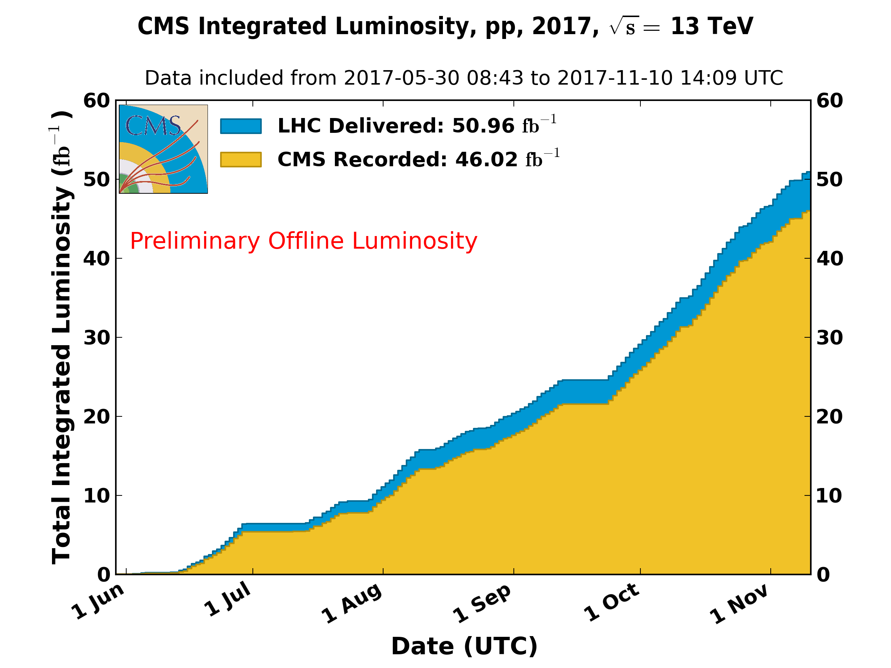
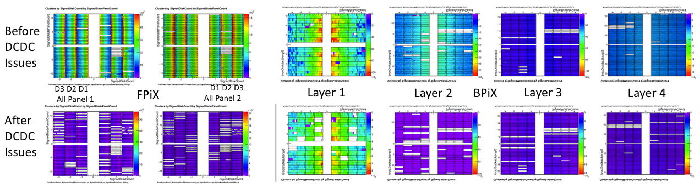

\clearpage

# Detector Operations

The operation of the CMS detector continued relatively smoothly through to the end of the run. The LHC is now off for its annual Year End Technical Stop during which time maintenance will be performed on the accelerator and detectors. Since August the data taking efficiency has consistently been greater than 92.5%, which was the average efficiency last year. 

In October a problem appeared in the pixel system that resulted is some loss of channels which is currently being investigated. It is important to note that even with this issue the new pixel detector is now working better than the old one.

## BRIL

The Pixel Luminosity Telescope (PLT) together with the fast beam condition monitor (BCM1F) and HF provided online luminosity measurements continuously. The fast readout for all telescopes works. Two telescopes are degraded, affecting the full pixel information that is used for track-based studies. 

In addition to luminosity determination, reconstructed tracks in the PLT are also used for fast measurements of the beam spot and allow tracking of beam conditions.  Corrections for efficiency and accidentals are obtained from offline analysis of tracks, and fast turnaround after completion of each fill is being achieved. These corrections change with beam conditions and the expected reduction of efficiency over time. Corrections are also obtained from mini-VdM scans at the start and end of a fill. Luminosity based on full track measurements was broadcast online. Systematic studies led to improved luminosity precision. Preliminary luminosity values have been obtained for the 2018 running (preapproval on 19 Dec).

The PLT will have to be extracted during the year end technical stop. The lab in P5 with two cold boxes was established and spare cards were prepared in case of failures --- the $+z$ side was placed in the P5 lab on December 20 and its functionality tested. It is kept at $-10\,^{\circ}\mathrm{C}$. The $-z$ side will be extracted in January.

  Working Metric                                Performance
  ------------------------------------------- -------------
  Fraction of telescopes fully operational              90%
  Efficiency of delivery of lumi histograms         $>$ 99%
  Uptime of lumi histogram production               $>$ 99%
  Lumi lost                                           0 /pb

  : BRIL Metrics

  Subsystem   Description                   Scheduled         Achieved
  ----------- --------------------------- ----------- ----------------
  BRIL        Update Lumi for 2016            March 1          March 1
  BRIL        Ready for Physics                 May 1            May 1
  BRIL        Improve 2017 Lumi numbers      December   Preapp. Dec 19

  : BRIL Milestones

## Tracker

Operational concerns for the tracker were dominated by the loss of DC-DC
converters in the Pixel. Other major operational issues were downtimes for the strip
cooling, some online timing and High Voltage scans, and incidents where some strip FEDs
getting stuck (sometimes due to power issues). Work was needed in
the reconstruction and simulation to keep up with the changing
conditions in the pixel detector. Data quality for this quarter was very
good as a result of the effort.

### Pixels Detector

Starting October 5th, a number of pixel DCDC converters stopped delivering voltage to pixel modules. This occurred both in the Barrel (BPiX) and Forward (FPiX). DCDC converters became non-functional at power or enable/disable cycles. As a consequence, we shut off the automatic recovery for TBM single event upsets and instead did the recovery during inter-fill periods. In general, we lost about 0.5% of the DCDC we cycled during recovery procedures or power cycles. In December, the FPiX detectors on the plus side of CMS were removed and the DCDC converters examined in detail. Preliminary results indicate an issue in one of the voltage regulators on the chip, though the root cause for the trouble is not proven. During the YETS, the rest of the pixel detector will be removed and new (or refurbished) DCDC converters will be installed prior to re-installation.

### Strip Detector

The main issues in the strips are ongoing maintenance issues, such as
power supply swaps, condition sensors etc. The Operations crew tries to
minimize downtimes as these issue pop-up. The strips are looking to
reduce time spent in SEU recovery and are recognizing the need for
better long term solutions for maintaining the strip FEDs. The strips
will be run colder in 2018 to allow more poorly cooled modules to have
sufficient sensor voltage for physics.

                                         Pixels   Strips
  ------------------------------------- -------- --------
  \% Working channels                     88.6     96.3
  Downtime attributed in pb$^{-1}$        75.5    191.5
  Fraction of downtime attributed (%)     8.7      19.8

  : Tracker Metrics

  Subsystem   Description                          Scheduled   Achieved
  ----------- ---------------------------------- ----------- ----------
  Tracker     Pixel Phase 0 Detector Removed          Feb 15     Jan 23
  Tracker     Pixel Phase 1 Detector Installed        Mar 30     Mar 12
  Tracker     Pixel Phase 1 Detector                         
              Ready for Collisions                     May 5     Jun 16

  : Tracker Milestones

\clearpage

## ECAL

The ECAL continued to operate smoothly in the final three months of the
run. There were no major incidents in any of the systems. Improvements
in the DAQ efficiency came from better monitoring tools and
consolidation of the single event upset (SEU) recovery procedures
between ECAL and the ECAL pre-shower. Increase regularity of updating
the laser corrections in the trigger improved the trigger turn on
efficiency. The low voltage and laser systems operated without major
problems. In December U.S. CMS laser technician David Bailleux received a
CMS detector award for "for outstanding contribution to all technical
aspects of the ECAL and for his dedication to the ECAL laser system."

  Metric                                   Performance
  -------------------------------------- -------------
  Fraction of channels operational: EB           99.1%
  Fraction of channels operational: EE           98.4%
  Fraction of channels operational: ES           99.9%
  Downtime attributed pb$^{-1}$                     42
  Fraction of downtime attributed                   6%
  Resolution performance                          2.5%

  : ECAL Metrics

  Subsystem   Description                      Scheduled   Achieved
  ----------- ------------------------------ ----------- ----------
  ECAL        Refurbish Maraton to provide               
              redundant thermal interlock        March 1     March1
  ECAL        Replace Laser Diode                March 1    March 1
  ECAL        Ready for Beam                       May 1      May 1
  ECAL        Preliminary Calibration            June 15    July 15

  : ECAL Milestones

## HCAL

During the fourth quarter of 2017, the HCAL Operations group focused
continuing to take good data, and preparing for the installation of the
Phase 1 HE upgrades during the 2017-18 YETS.

The upgraded HF with dual anode readout and TDCs continued to perform
well. All the new handles to achieve noise reduction were in place
earlier in the year and a substantial reduction in missing Et trigger
rates was been achieved. Energy recovery using the "other" anode when
one anode has an out-of-time signal was successfully implemented. The
HE, with one upgraded HE readout box (out of 36) installed to obtain
experience with upgraded system, also continued to perform well.

During the quarter, HCAL downtime was only 1.7 pb$^{-1}$ out of more
than 20 fb$^{-1}$ recorded. For calendar 2017, HCAL downtime was
79 pb$^{-1}$ out of 45 fb$^{-1}$ recorded.

Planning to install the complete HE upgrade in 2017-18 YETS is complete.
The plan enables installation even with the significant activity
required to remove and re-install the pixel detector. The Installation
Readiness Review for the HE Phase-1 upgrade during YETS 17/18 was held
November 6, and was successful. The items on the "watch" list from the
review have been completed. This includes the external low voltage for
for the SiPM bias voltage replacing the DC-DC converters.

The observed damage in HE was confirmed to have a significant component
from damage to the HPDs as opposed to just scintillator damage.

A second HE readout box (HEP18) was installed in mid-December after the
start of the YETS. The installation went very smoothly. The time from
being able to access the HE nose to observing single PE peaks on all 192
channels after installation was less than 25 hours.

The final decision on installing the full upgrade will take place in
January and has some dependence on the pixel detector re-work.

Work on the HB Phase 1 upgrades, which will take place in LS2, also
continued.

  Metric                                   Performance
  -------------------------------------- -------------
  Fraction of channels operational: HF           100% 
  Fraction of channels operational: HE         99.85% 
  Fraction of channels operational: HB          99.77%
  Fraction of channels operational: HO          99.72%
  Downtime attributed pb$^{-1}$                   78.9
  Fraction of CMS downtime due to HCAL           3.1% 
  Abs Energy Calibration                            2%
  Inter-calibration Uniformity                      2%

  : HCAL Metrics

  Subsystem   Description                  Scheduled   Achieved
  ----------- -------------------------- ----------- ----------
  HCAL        HF Phase 1 Installed           April 1   March 15
  HCAL        HF Detector Commissioned        June 1      May 1
  HCAL        Ready for Physics               June 1     May 15
  HCAL        Data Loss $<  1\%\$            July 15    July 10
  HCAL        1% to 2% Calibration           July 15     Nov. 1

  : HCAL Milestones

## EMU

The CSC system completed the 2017 proton-proton run with 98.2% of the
channels active. Many of the missing channels come from four chambers
that were disabled at the beginning of 2017 data taking: two chambers
(ME-1/1/34 and ME-1/1/35) without cooling due to water leaks, and two
other chambers (ME-2/1/3 and ME-4/2/21) that are disabled due to low
voltage problems. These will be investigated early in 2018 during the
Year End Technical Stop (YETS).

The CSC detector shutdown started on Dec 4th. The gas system was stopped
and chambers filled with backup gas mixtures (Ar 40%, CO$_2$ 60%). Two
spare ME1/1 chambers are ready to be installed in place of ME-1/1/34
and/or ME-1/1/35 in case we would discover that the source of the
cooling leak is coming from one of the on-chamber cooling circuit,
though we believe this is unlikely. The two spares have been extensively
tested in SX5 using our standard DAQ.

During operations, there were several issues with the Maraton low
voltage supplies, with a total of six Maraton incidents in 2017. Three
of these were random self-switch-off events, and these are the main
concern. Other users of these supplies are being consulted to try to
learn if there is a systematic issue. The other faults were caused by
CANbus communication issues. All will be investigated during YETS.

During collisions, we observed a prominent excess in the local segment
(trigger primitives) in the top region of the ME4/2 ring, where the rate
was about three times higher than other regions in azimuth. Studies with
isolated bunches showed that these segments occurred two and three bunch
crossings later than in-time muons. These segments do not contribute to
the L1 muon trigger rate because they do not correlate with other
stations to form tracks, but they contribute to the DAQ occupancy. It is
being investigated if the source of this effect can be mitigated with
additional shielding.

Another excess was observed in the ME1/1 chambers during cosmic ray
running in the hours following high luminosity runs. These appear to be
the result of activation of material near these chambers. The rate from
this source (about 250 Hz maximum) is negligible during collider
operations.

Both of these features and the results of these studies were reported to
the CMS Technical Integration Group in November.

The chamber gains continued to be studied after the HV changes were
implemented to improve gain uniformity. The goal is now to find a
suitable operating point with lower gain to improve chamber longevity.
The plan is now to analyze the full 2017 data to reduce the gain
uncertainties. The milestone for implementing the reduced-gain HV
settings has been rescheduled for May 2019 in conjunction with the
resumption of collider operations.

A productive mini workshop on CSC local reconstruction was held at CERN
on Dec 12. Several projects from many groups are ongoing towards
developing improved algorithms and searching for new approaches in
reconstruction of CSC hits and segments in order to maximize performance
in high background and occupancy conditions, typical of high-luminosity
running.

A second round of exposure of muon electronics boards at CHARM II was
completed in October, with a total dose of 37.2 kRad. As expected, all
the optical transmitters on the three DCFEBs in the test eventually
failed by the time the exposure reached about 35 kRad. The optical
transmitters were then replaced on the irradiated boards, and subsequent
tests showed the boards to be working properly otherwise.

At the GIF++ facility, irradiation of the ME1/1 and mini-CSC with a
mixture containing 2% of CF$_4$ (instead of the usual 10%) is in
progress. With an accumulated charge comparable to 1/3 HL-LHC we observe
no signs of aging so far. Parallel testing of a mini-CSC in B904 using a
$^{90}$Sr source and 2% CF$_4$ shows stable operation after the
equivalent of one HL-LHC integrated charge. This is of interest for
possible future reduction in the use of CF$_4$, a potent greenhouse gas.

  \% Working channels                  98.2%
  --------------------------------- ------------
  Downtime attributed pb$^{-1}$         25.2
  Fraction of downtime attributed        5%
  Median spatial resolution          126 $\mu$m

  : CSC Metrics

  ------------------------------------------------------
  Subsystem   Description         Scheduled Achieved
  ----------- ----------------- ----------- ------------
  EMU                                 May 1 April 29

  EMU                                July 1 January 29

  EMU         New HV settings      August 1 Reschedule
              for reduced gain              to May 2019
  ------------------------------------------------------

  : EMU Milestones

## DAQ

The DAQ system continues to work without major issues. During the first
few hours of luminosity leveling in each LHC fill, the DAQ handled
1.5 MB events at 90 kHz level-1 trigger rate and the HLT CPUs were up to
90% loaded. The output of the HLT was typical 3 GB/s. The pp-reference
run stressed the storage and transfer system (SMTS) with a very high HLT
output bandwidth of up to 6 GB/s during a couple of days. Thanks to the
close attention of the SMTS and Tier-0 experts, no major problems
occurred.

The only downtime caused by the DAQ system was due to circuit breakers
tripping on a few racks containing filter-farm and builder-unit nodes.
The investigation showed that 4 out of 24 racks had breakers with a too
low current rating. A couple of filter-farm PCs were switched off in the
affected racks to mitigate the problem. The circuit breakers were
replaced after the end of the physics program.

The GEM detector has been integrated into the DAQ system. Provisions for
the upgraded DT readout system ($\mu$ROS) and the new slink-express
sender cards with an optical link developed for the ECAL readout have
been made. Concerning the HLT, 400 Skylake-based machines have been
ordered to replace the old C6220 nodes and the Huawei nodes on loan from
CERN IT. The new machines will increase the HLT CPU capacity by 20%
compared to 2017. This should provide enough margin to cope with any LHC
running condition in 2018 and mitigate any inefficiency from the pixel
detector in case that the DCDC problem cannot be fixed during the YETS.

The DAQ monitoring tools were further improved. The most notable
additions are the recording of the deadtime values together with the DAQ
status information, and the improved diagnostic in the DAQ expert to
pin-point the origin of the dead time. The addition of more case-based
reasoning modules to the DAQ-expert, who proposed recovery procedures to
the DAQ operator, have increased the overall DAQ running efficiency.
Andre Holzner of UCSD received a CMS Detector Award "For crucial
contributions to many aspects of the CMS data acquisition, in particular
the networking and monitoring for run-2."

The development of the online monitoring system (OMS) is progressing.
The second review held in December showed that more work is needed
before the newly developed meta-data catalog can be deployed in
production. The decision has been taken to postpone any further work on
the final back-end system and to concentrate on deploying the new user
interface as quickly as possible in 2018. The aim is to provide all
required services with the new user interface, and to be able to retire
the legacy WbM hardware and processes by end of 2018. The work on the
back-end will resume once these goals have been achieved.

  Dead time due to backpressure       0.65%
  --------------------------------- -------
  Downtime attributed pb$^{-1}$         7.1
  Fraction of downtime attributed     0.07%

  : DAQ Metrics

  Subsystem   Description                        Scheduled   Achieved
  ----------- -------------------------------- ----------- ----------
  DAQ         New sub-systems integrated             Apr 1     Jun 15
  DAQ         Event builder expanded,
              re-optimized for larger events         Jun 1      Apr 1
  DAQ         Old HLT Nodes replaced
              and new nodes commissioned             Jun 1     Jun 21
  DAQ         Prototype of OMS (new WBM)
              ready for field tests                 Dec 31

  : DAQ Milestones

## Trigger

During this quarter the US groups continued their work on the Layer-1
calorimeter (CaloL1) trigger and the endcap muon trigger systems as both
continued reliable data-taking. After completion of 2017 data-taking the
groups worked on preparations for maintenance to be performed during the
year-end shutdown.

### Endcap Muon Trigger

The Northeastern, Rice University, and University of Florida groups have
maintained the EMTF system 24/7 during operations this quarter. A
diagnosis of rare online control PC crashes exposed a clash of system
monitoring requests over PCIe. The EMTF firmware has been reworked and
successfully tested to improve arbitration. The SWATCH online control
software was updated with new reference values for EMTF registers.

A study of an observed higher rate of LCTs (track stubs) originating in
ME4/2 at $\phi \approx 90^\circ$ has been performed. Characteristics are
consistent with beam or radiation induced backgrounds. No significant
impact on tracking performance is observed. A study of the pile-up
dependence of the muon trigger also is ongoing, which shows that
out-of-time segments do have an effect on higher threshold muon
triggers. Options to tighten the timing and spatial matching windows are
under investigation.

To debug occasional serial link errors between certain Muon Port Cards
(MPCs) and the EMTF, two versions of MPC firmware were loaded and the
respective error rates studied. The one with lower error rates
(bypassing elastic buffers in the FPGA) will be uploaded in 2018.

### Layer-1 Calorimeter Trigger

The Layer-1 Calorimeter Trigger (CaloL1), built by the University of
Wisconsin - Madison, is a part of the complete Calorimeter Phase-1
Trigger Upgrade. CaloL1 was in continuous operation during the LHC
physics run in the last quarter of 2017. Before cooling was shut down on
December 6, the system was powered down for the Year-End Technical Stop
(YETS) and currently remains off until cooling is restored and stable.

This was a relatively quiet quarter with a technical stop and two
machine development periods. CMS took p-p data at 13 and 5 TeV and
participated in a short Xe-Xe reference run. The only change to CaloL1
operations was to update the name to an alias for the uTCA bridge PC. If
a PC needs replacement this will make the operation transparent to
CaloL1.

During this quarter, another of the ECAL links developed optical power
issues. This was resolved by simply moving the fiber on the ECAL side to
the RCT position in the dual-transmitter VTTx. In addition, small
discrepancies in the trigger primitives were observed in a couple of
ECAL towers. This became more pronounced near the end of the run,
affecting multiple towers in ieta $\pm20$ and $\pm26$.
ECAL believed it was due to a timing alignment issue.

Final updates are under way to finish the work on the monitoring of the
uTCA via the RCT DCS. During the YETS, the RCT WinCC OA was completely
reinstalled to add a DIM framework and uTCA node to the finite state
machine. A DIM server that is accessed by the DIM framework is now
running as a service on our CaloL1 SWATCH PC and is monitoring the uTCA
by querying University of Wisconsin System Manager on our uTCA bridge
PC. This was done because it makes the bridge PC as generic as possible,
the preference of the CMS Online System Administrators.

  Frac of MPC Channels                                 100%
  -------------------------------------------------- ------
  Frac of Upgrade EMUTF Channels                       100%
  Deadtime attributed to EMTF pb$^{-1}$                 8.4
  Fraction of deadtime attributed to EMTF              0.9%
  Frac of Calo. Layer-1 Channels                       100%
  Deadtime attributed to Calo. Layer-1 pb$^{-1}$          0
  Fraction of deadtime attributed to Calo. Layer-1       0%

  : Trigger Metrics

  Subsystem   Description                         Scheduled   Achieved
  ----------- --------------------------------- ----------- ----------
  TRIG        EMTF commissioned with
              endcap RPC input                      April 1   April 27
  TRIG        EMTF ready for Physics                  May 1     May 29
  TRIG        Calo. Layer-1 commissioned
              with new ECAL/HCAL/HF Calib           April 1     May 19
  TRIG        Calo. Layer-1 Ready for physics       April 1     May 19

  : Trigger Milestones

