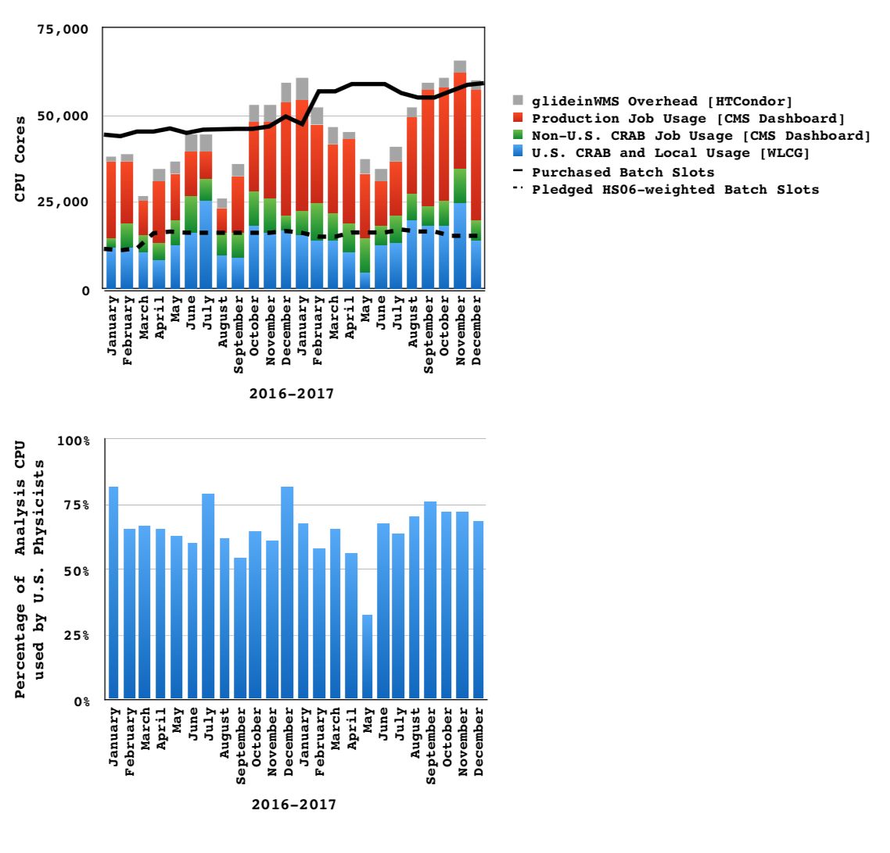
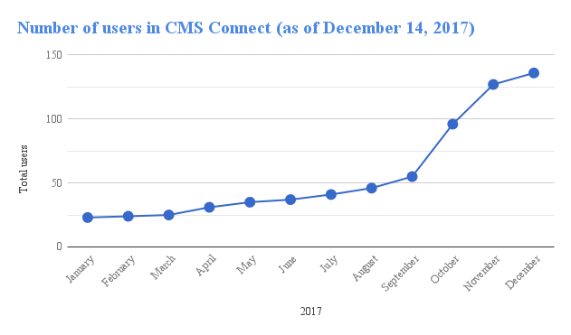
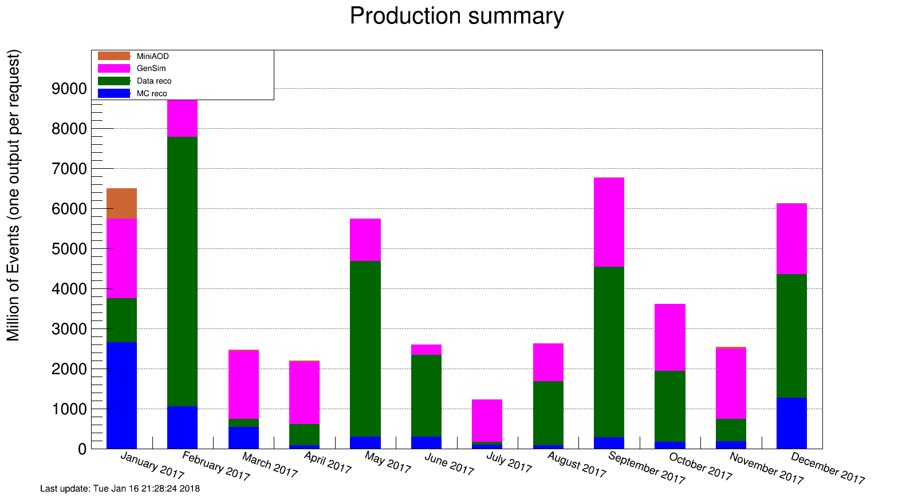

\clearpage

# Software and Computing

The end of a calendar year is always a busy time for Software and Computing, due to the annual push to wrap up data processing for that year's LHC run and to make preparations for winter conferences. Thanks to efforts throughout the quarter and over the holiday break, CMS finished a legacy re-processing of the 2016 data, nearly completed the end-of-year reprocessing of the 2017 data, and made significant progress on simulations for both current data and HL-LHC events needed for TDR development. This was only possible because of the continued excellent performance of the U.S. Tier-1 and Tier-2 facilities. The Fermilab Tier-1 had a nearly flawless quarter, and the Tier-2 sites had high utilization levels that are consistent with the level of activity of U.S. physicists in the collaboration. In addition to those facilities, the CMS Connect service saw a huge increase in usage over these three months.  Long-term development efforts continued in support of the continual improvement of operations. These include the incorporation of new features into the workflow management system and the integration of DOE and NSF HPC centers into regular CMS operations.  Explorations of new data storage and management systems are in their early stages, and a wide variety of software modernization efforts will help optimize CMS software and computing far into the future.

### Major milestones achieved this quarter

--------------------------------------------------------------------------------
Date    Milestone
------- ------------------------------------------------------------------------
4 Dec   Operate until the end of data taking in December the prompt reconstruction according to CMS expectations.

19 Dec  All Tier-2 sites migrated away from the WLCG tools to gfal-2 for file transfers.

31 Dec  Build all CMS software framework external packages with Spack.

31 Dec  Deliver CMS software framework and ROOT builds with C++ Module support.

31 Dec  Integration of suite of data serialization packages in CMSSW for analysis use (eg, to support interoperability with Big Data and Machine Learning tools) and establish machine learning frameworks in the CMS software distribution.

31 Dec  Remove AFS dependency of the CMS software built infrastructure.

31 Dec  Prototype to provide all CMS releases in docker containers.

31 Dec  U.S. University Tier-2 Facilities all met the performance goal for \>90% site "availability": [97.66%](https://www.google.com/url?q=http://wlcg-sam-cms.cern.ch/templates/ember/%23/historicalsmry/heatMap?end_time%3D2018%252F01%252F01%252000%253A00%26granularity%3DDaily%26profile%3DCMS_CRITICAL%26site%3DT2_US_Caltech%252CT2_US_Florida%252CT2_US_MIT%252CT2_US_Nebraska%252CT2_US_Purdue%252CT2_US_UCSD%252CT2_US_Wisconsin%26start_time%3D2017%252F01%252F01%252000%253A00%26time%3Dmanual%26type%3DAvailability%2520Ranking%2520Plot&sa=D&ust=1551051215383000).

31 Dec  U.S. University Tier-2 Facilities all met the performance goal for \>90% site "readiness": [96%](https://www.google.com/url?q=http://dashb-ssb.cern.ch/dashboard/request.py/sitereadinessrank?columnid%3D45%26view%3DSite%2520Readiness%23time%3Dcustom%26start_date%3D2017-01-01%26end_date%3D2018-01-01%26sites%3Dmultiple%26timebins%3Dfalse%26nodata%3Dfalse%26binsselect%3Ddefault%26clouds%3Dall%26site%3DT2_US_Caltech,T2_US_Florida,T2_US_MIT,T2_US_Nebraska,T2_US_Purdue,T2_US_UCSD,T2_US_Wisconsin&sa=D&ust=1551051215385000).

--------------------------------------------------------------------------------

## Fermilab Facilities

Q4 of 2017 was dominated by strong LHC running until the end of the quarter, and large scale data processing in preparation of physics results for upcoming winter conferences. Throughout this quarter the Fermilab Facilities continued to provide reliable custodial storage, processing and analysis resources to U.S. CMS collaborators. The site was well utilized, with the facility providing 45.4 million wall-clock hours of processing to CMS.

{#fig:t1}

Figure @fig:t1 shows the site readiness metrics for the quarter. The yellow band along the bottom of the figure indicates LHC physics operations up until early December, when pp running ended for the year. During this quarter the Tier-1 facility passed CMS site availability metrics 99.2% of the time. There were a handful of short service incidents in the xrootd and FTS services during the quarter all solved within a few hours.

With the end of data-taking at CERN, work began in December to re-factor the Tier-1 CPU resources to using Docker containers, facilitating more dynamic provisioning between the Tier-1 and LPC, and providing SL7 capability in time for the 2018 run.

## University Facilities

As seen in Figure @fig:t2, CMS production and analysis activities this quarter continued to run at full capacity and even exceeded purchased processing power, taking advantage of the sizable opportunistic processing available at the U.S. CMS Tier-2 sites. During this heavily used period, analysis processing consumption by U.S. physicists continued at the 70-75% level of the total analysis CPU delivered by our sites during the last quarter.

{#fig:t2}

All of the U.S. CMS Tier-2 sites operated successfully last quarter. On our two official performance metrics based on CMS test jobs, all sites were at least 95.76%
"[available](https://www.google.com/url?q=http://wlcg-sam-cms.cern.ch/templates/ember/%23/historicalsmry/heatMap?end_time%3D2018%252F01%252F01%252000%253A00%26granularity%3DDaily%26profile%3DCMS_CRITICAL%26site%3DT2_US_Caltech%252CT2_US_Florida%252CT2_US_MIT%252CT2_US_Nebraska%252CT2_US_Purdue%252CT2_US_UCSD%252CT2_US_Wisconsin%26start_time%3D2017%252F10%252F01%252000%253A00%26time%3Dmanual%26type%3DAvailability%2520Ranking%2520Plot&sa=D&ust=1551051215389000)"
and 92%
"[ready](https://www.google.com/url?q=http://dashb-ssb.cern.ch/dashboard/request.py/sitereadinessrank?columnid%3D45%26view%3DSite%2520Readiness%23time%3Dcustom%26start_date%3D2017-10-01%26end_date%3D2018-01-01%26sites%3Dmultiple%26timebins%3Dfalse%26nodata%3Dfalse%26binsselect%3Ddefault%26clouds%3Dall%26site%3DT2_US_Caltech,T2_US_Florida,T2_US_MIT,T2_US_Nebraska,T2_US_Purdue,T2_US_UCSD,T2_US_Wisconsin&sa=D&ust=1551051215389000)".
Note that in previous quarterly reports we had mistakenly used a slightly more restrictive definition of the official WLCG metric. The CMS requirement for each of these metrics is 80%, but the U.S. CMS performance goal is 90%, which we have met for the calendar year 2017
([97.66%](https://www.google.com/url?q=http://wlcg-sam-cms.cern.ch/templates/ember/%23/historicalsmry/heatMap?end_time%3D2018%252F01%252F01%252000%253A00%26granularity%3DDaily%26profile%3DCMS_CRITICAL%26site%3DT2_US_Caltech%252CT2_US_Florida%252CT2_US_MIT%252CT2_US_Nebraska%252CT2_US_Purdue%252CT2_US_UCSD%252CT2_US_Wisconsin%26start_time%3D2017%252F01%252F01%252000%253A00%26time%3Dmanual%26type%3DAvailability%2520Ranking%2520Plot&sa=D&ust=1551051215390000)
and
[96%](https://www.google.com/url?q=http://dashb-ssb.cern.ch/dashboard/request.py/sitereadinessrank?columnid%3D45%26view%3DSite%2520Readiness%23time%3Dcustom%26start_date%3D2017-01-01%26end_date%3D2018-01-01%26sites%3Dmultiple%26timebins%3Dfalse%26nodata%3Dfalse%26binsselect%3Ddefault%26clouds%3Dall%26site%3DT2_US_Caltech,T2_US_Florida,T2_US_MIT,T2_US_Nebraska,T2_US_Purdue,T2_US_UCSD,T2_US_Wisconsin&sa=D&ust=1551051215390000),
respectively).

The U.S. CMS Tier-2 centers delivered
[50.2%](https://www.google.com/url?q=http://dashb-cms-jobsmry.cern.ch/dashboard/request.py/consumptions_individual?sites%3DT2_AT_Vienna%26sites%3DT2_BE_IIHE%26sites%3DT2_BE_UCL%26sites%3DT2_BR_SPRACE%26sites%3DT2_BR_UERJ%26sites%3DT2_CH_CSCS%26sites%3DT2_CN_Beijing%26sites%3DT2_DE_DESY%26sites%3DT2_DE_DESY_Test%26sites%3DT2_DE_RWTH%26sites%3DT2_EE_Estonia%26sites%3DT2_EE_Estonia_Test%26sites%3DT2_ES_CIEMAT%26sites%3DT2_ES_IFCA%26sites%3DT2_FI_HIP%26sites%3DT2_FI_HIP_Test%26sites%3DT2_FR_CCIN2P3%26sites%3DT2_FR_GRIF_IRFU%26sites%3DT2_FR_GRIF_LLR%26sites%3DT2_FR_IPHC%26sites%3DT2_GR_Ioannina%26sites%3DT2_HU_Budapest%26sites%3DT2_IN_TIFR%26sites%3DT2_IT_Bari%26sites%3DT2_IT_Legnaro%26sites%3DT2_IT_LegnaroTest%26sites%3DT2_IT_Pisa%26sites%3DT2_IT_Rome%26sites%3DT2_KR_KNU%26sites%3DT2_MY_UPM_BIRUNI%26sites%3DT2_PK_NCP%26sites%3DT2_PL_Swierk%26sites%3DT2_PL_Warsaw%26sites%3DT2_PT_NCG_Lisbon%26sites%3DT2_RU_IHEP%26sites%3DT2_RU_INR%26sites%3DT2_RU_ITEP%26sites%3DT2_RU_JINR%26sites%3DT2_RU_PNPI%26sites%3DT2_RU_RRC_KI%26sites%3DT2_RU_SINP%26sites%3DT2_TH_CUNSTDA%26sites%3DT2_TR_METU%26sites%3DT2_UA_KIPT%26sites%3DT2_UK_London_Brunel%26sites%3DT2_UK_London_BrunelTest%26sites%3DT2_UK_London_IC%26sites%3DT2_UK_SGrid_Bristol%26sites%3DT2_UK_SGrid_RALPP%26sites%3DT2_US_Caltech%26sites%3DT2_US_Florida%26sites%3DT2_US_MIT%26sites%3DT2_US_Nebraska%26sites%3DT2_US_Purdue%26sites%3DT2_US_UCSD%26sites%3DT2_US_Vanderbilt%26sites%3DT2_US_Wisconsin%26sitesSort%3D2%26start%3D2017-10-01%26end%3D2018-01-01%26timeRange%3Ddaily%26granularity%3DMonthly%26generic%3D0%26sortBy%3D0%26series%3DAll%26type%3Dewa&sa=D&ust=1551051215392000) of
all computing time by Tier-2 sites in CMS last quarter. This is a further decrease of 1.3% from the previous quarter and 2.6% from two quarters ago, indicating that our pressure on CMS to diversify the geographical spread of production work may be having a positive effect.  However, given that over 70% of our U.S. processing resources for analysis is used by local U.S. physicists, as seen in Figure 2, and that we also take our fair share (about 30%) of non-U.S. Tier-2 analysis usage, U.S.-based researchers are doing approximately 50% of the global analysis work in CMS, commensurate with our \~50% resource contribution overall.

As for progress on Tier-2
[milestones](https://www.google.com/url?q=https://twiki.cern.ch/twiki/bin/view/CMSPublic/USCMSTier2Upgrades?rev%3D304&sa=D&ust=1551051215393000) and
upgrades, since the end of the
[previous quarter](https://www.google.com/url?q=https://twiki.cern.ch/twiki/bin/view/CMSPublic/USCMSTier2Upgrades?rev%3D298&sa=D&ust=1551051215393000),
all sites have migrated away from the WLCG tools to gfal-2 for file transfers. One site (Caltech) has migrated to cvmfs 2.4. Migrating the rest will be a carry-over milestone for 2018. Other partial carry-overs for 2018: one site still needs to implement load-balanced gridFTP, one site still needs to upgrade to XrootD 4.6.x, two sites still need to upgrade at least one CE to SL7, three sites still need to upgrade to HTCondor 8.6.x and HTTPS XrootD, and five sites still need to upgrade to version 3.4 of the OSG software stack. We will be including a complete list of 2018 milestones before the time of the next quarterly report.

This was an eventful quarter for the Tier-3 effort. CMS Connect saw a steep increase in users as the CMS gridpack production campaign that is making use of it went into full production, as shown in Figure @fig:us. Over all of 2017, CMS Connect delivered 2.7 million wall hours of computing, of which 78% came during Q4. The Tier-3 team also restructured the central T3 PhEDEx installation so that it could be maintained by multiple team members instead of a dedicated Fermilab intern. Finally, we did not meet our milestone of deploying and operating one Tier-3-in-a-box system this year. We deployed a system at Colorado, but have not been able to bring it into operation due to unanticipated complications.  To keep progress moving, as commissioning on the first Tier-3-in-a-box system at Colorado continued, a second system was deployed at Maryland, and a third one is being prepared for deployment to Puerto Rico early next quarter. (As a side benefit, the Puerto Rico deployment will help the island's recovery efforts from Hurricane Maria.) In addition to those specific developments, the Tier-3 support team continued to provide routine support to individual sites. This quarter, six sites sought assistance on topics ranging from OSG and PhEDEx software to site-planning advice.

{#fig:us}

## Computing Operations

Legacy re-reconstruction of the 2016 data was ongoing at the start of the fourth quarter. The campaign started in August and the remaining half a billion events, 10% of the sample, were processed by middle of October.  The legacy re-reconstruction of the 2016 data was followed by a re-reconstruction of early 2017 data. The campaign included 1.3 billion events and was completed by late October.  Additional re-reconstruction requests of 2017 data came end of November. About 90% of those requests were completed by the end of the year. Requests that came in late December are not yet complete.

Monte Carlo events needed for the 2017 data analysis were generated throughout the quarter. Over 5B events were generated and processed all the way to the small MINIAOD data tier used for analysis.  About 250M Monte Carlo events for the HL-LHC upgrade were also generated during the quarter.  Although the number of events was (relatively) small, the large pile-up and need to rely on standard event mixing (as opposed to the pre-mixing that has been implemented for current simulations) made this campaign a significant consumer of resources and attention.

Overall, CMS data and Monte Carlo processing used all the CPU resources available to the activities. Over the Christmas/New Year holidays 175,000 cores were utilized. During this time a large number of HL-LHC upgrade workflows and workflows with significant validation steps executed allowed us to reach for a few days the maximum number of jobs production could handle. Additional production manager machines are being configured to increase the ceiling.

{}

## Computing Infrastructure and Services

Several improvements were made to the workflow management systems during this quarter. WMAgent was modified to adjust the number of submitted jobs based on the load of the underlying HTCondor schedd.  Porting of the workflow operations layer developed by the operations team into the workflow system continued, beginning with the component that replicates data before assigning workflows. Finally, a mechanism to stop Tier-0 prompt reconstruction processing was implemented and put in the hands of shifters to allow for after-hours pausing of the system until problems are resolved.

Opportunistic use of NERSC reached nearly-final status where the operations teams are submitting production workflows to NERSC resources using a dedicated WMAgent and GlideinWMS pool. The remaining work is to remove the need for the dedicated agent and pool. Also useful for opportunistic use of resources, during this quarter we deployed Frontier caching using CloudFlare, a free, commercial CDN into production.

On the NSF HPC side, U.S. CMS successfully applied for XSEDE
allocations on Bridges and Stampede2.  Stampede2 is a KNL based system,
just like Cori2 at NERSC, while Bridges is an Intel-based HPC system.
Both will be accessed via standard OSG APIs starting in Q1 2018, i.e.
will be treated no differently than any Tier-2 or Tier-1 site in global
CMS. The required integration is being done by OSG, and has started in
Q4.

The WMArchive team focused on visualization this quarter and on supplementing ElasticSearch with FluxDB as a storage backend to be able to visualize data over longer time periods.

On the data management side, a fourth queue for small, high-priority transfers was added to PhEDEx and further tuning of PhEDEx to address operational issues was performed. The PhEDEx team also began exploring delegating tape staging to FTS. In November, CMS held a data management review workshop and agreed to have a comparative review of possible future data management systems in Summer 2018. Members of the U.S. CMS operations program have begun a review of the Rucio data management system as an input to that CMS review, and are participating in an OSG meeting on Rucio in Q1 2018, together with representatives from LIGO and IceCube.

A 200TB XRootd cache at UCSD to cache the 700 TB namespace of all 2016 MINIAOD(SIM) data was in stable operations throughout Q4. We observed peak cache miss rates of up to 30% when the cache is under heavy use, serving up to \~20 Gbps of data to compute nodes at UCSD. We consider this as an indication that the "working set" among the 2016 MINIAOD(SIM) data is larger than 200TB, and are preparing to increase the size of the deployed cache accordingly.

In addition, we started to engage a Computer Science group at U.C. Santa Cruz (Carlos Maltzahn and one of his graduate students) with a focus on storage systems (CEPH) and IO patterns. The student is working towards an analysis of CMS data access patterns with an ultimate goal for R&D on "intelligent" storage systems. This connection is an early pay-off from the NSF S2I2 conceptualization activities that introduced Maltzahn to U.S. CMS.

## Software and Support

The last quarter of calendar year 2017 saw the end of the 2017 proton-proton running period as well as reference runs for 2018.  Releases were built to support data taking as well as to support the end-of-year processing campaigns for data and MC. We also supported releases for HL-LHC upgrade sample production as well as planned the switch to CentOS7-based releases for the 2018 data taking period. We implemented two prototype solutions to provide Docker containers of CMS software releases, either building individual containers per release or using a container with mounted CVMFS file system.

The core software development work concentrated on further improving the multi-threading performance for increasing core counts, with particular progress in alleviating the ROOT I/O bottleneck, which was tackled both on the CMS and ROOT side. We completed the C++ modules introduction to the CMS software framework and ROOT. We observe around 20% memory decrease in ROOT\'s startup phase. We also provided generalized access methods to accelerator hardware like GPUs and FPGAs and made progress in integrating the advanced tracking projects into the CMS software framework. These projects made progress on several fronts, especially in optimizing execution on KNL nodes and GPUs.

We continued the work on a client-server implementation of the CMS visualization solution in preparation for the HL-LHC era. The support for Big Data analysis tools and Machine Learning frameworks was continuously improved, the latter with work on uproot to convert ROOT data structures seamlessly into numpy arrays to allow for data exchange between the different frameworks.

To enable larger opportunistic resource usage on OSG, we enabled the infrastructure to use the commercial Content Delivery Network provider Cloudflare and its free Frontier caching service when local squids are not available.

