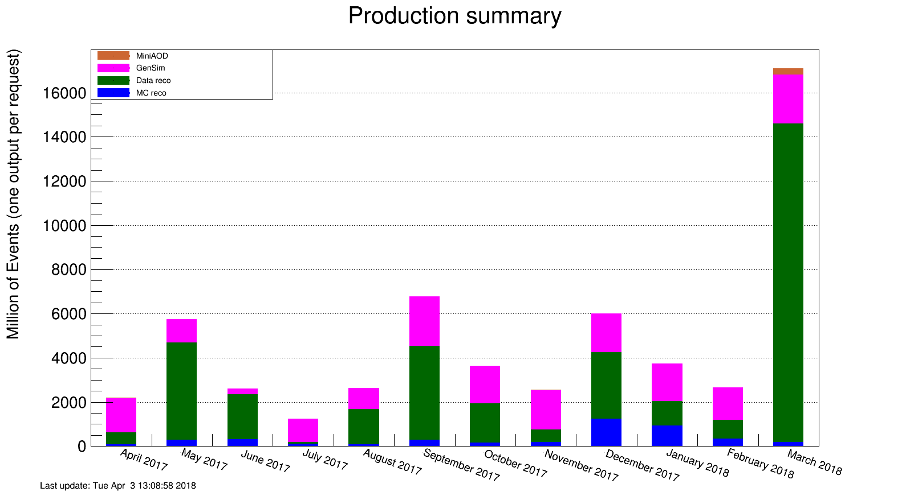
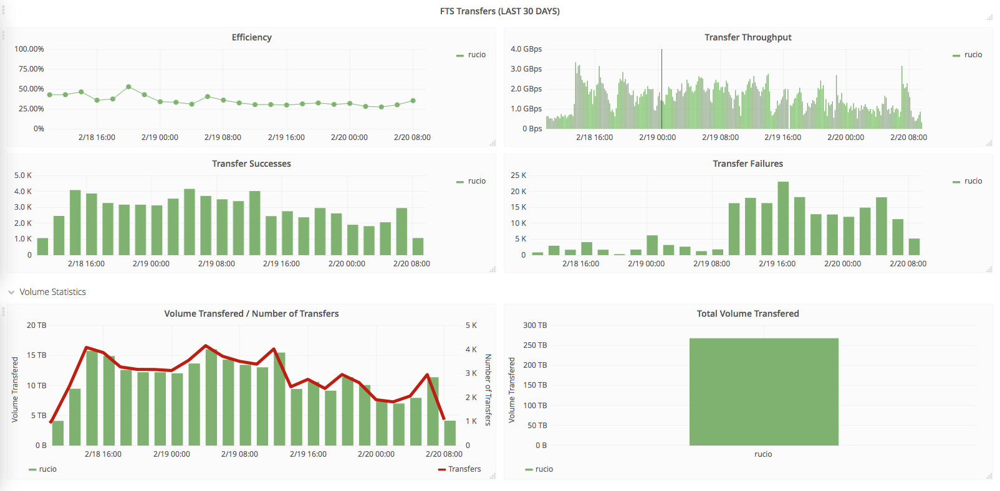

\clearpage

# Software and Computing

U.S. CMS Software and Computing still executed many activities to
support the experiment. For the facilities, the relatively quiet period
was a good opportunity to implement a number of forward looking
technical improvements, while still handling all manner of data
processing activities. These improvements have prepared the facilities
for 2018 data taking. Utilization levels were extremely high throughout
the quarter, as CMS performed re-processing of 2017 data, simulations
for both current, future, and far-future LHC runs, and tested out the
production of the new NANOAOD data format. There has been good progress
in the use of DOE and NSF HPC centers, and in evaluating future data
management systems. A variety of software development activities are
taking advantage of new technologies and new processing architectures.
In this quarter the U.S. computing security effort was re-launched with
a reinforced team that is making progress in clarifying procedures, and
the blueprint effort continues to evaluate new technologies and how they
can be used to meet future resource needs.

## Major milestones achieved this quarter

-------------------------------------------------------------------------------
Date          Milestone
------------  -----------------------------------------------------------------
Feb 1         ROOT and C++ modules: reduce startup memory use by around 20% (achieved)

Feb 1         Visualization: Implement and support Muon and Barrel Calorimeter TDRs

Feb 13        All Tier-2 sites upgraded to XrootD 4.6.x

Feb 28        Full copy of MINIAOD samples placed in U.S.

Mar 1         USCMS regional xrootd redirector and FNAL local redirector upgraded to v. 4.8

Mar 1         Core framework: allow concurrent Luminosity Block transitions

Mar 1         ROOT: Integrate clad, automatic differentiation library that should speed up roofit- and tmva-related computations

Mar 1         Visualization: Implement and support MIP Timing detector Technical Proposal

Mar 8         Fermilab T1 CPU fully converted to SL7 + Singularity

Mar 31        Machine learning R&D: Define and evaluate performance metrics for benchmarks

Mar 31        Geometry/DD4HEP: Proof of principle example

Mar 31        Tier0 migrated from CERN AI to HTCondor
------------  -----------------------------------------------------------------

## Fermilab Facilities

This quarter coveres the winter LHC shutdown and on-going large scale data
processing in preparation of physics results for upcoming winter
conferences. Throughout this quarter the Fermilab Facilities continued
to provide reliable custodial storage, processing and analysis resources
to U.S. CMS collaborators. The site was well utilized, with the
facility providing 40.6 million wall-clock hours of processing to CMS.

Figure @fig:t1 shows the Fermilab site readiness metrics for the quarter. During this
quarter the Tier 1 facility passed CMS site availability metrics 98.9%
of the time. There were some short service incidents in the
xrootd and FTS services during the quarter, all of which were solved
within a few hours.

{#fig:t1}

In time for the 2018 LHC run, Fermilab completed its re-factoring of
the Tier 1 compute farm, updating to Scientific Linux 7 and implementing
worker node deployment via Docker containers. CMS plans to move to
SL7-only releases to process data from the 2018 run, and the
containerization improves flexibility in deploying compute resources.
During this quarter we also upgraded the xrootd redirectors and FTS
services in preparation for the upcoming run.

## University Facilities

As seen in Figure @fig:t2, CMS production and analysis activities this
quarter continued to run at full capacity and even exceeded purchased
processing power, taking advantage of the sizable opportunistic
processing available at the U.S. CMS Tier-2 sites. During this period of
heavy usage, analysis processing consumption by U.S. physicists
continued at the level of 72% of the total analysis CPU delivered by our
sites during the last quarter.

All of the U.S. CMS Tier-2 sites operated successfully last quarter. On
our two official performance metrics based on CMS test jobs, all sites
were at least 98%
"[available](https://www.google.com/url?q=http://wlcg-sam-cms.cern.ch/templates/ember/%23/historicalsmry/heatMap?end_time%3D2018%252F04%252F01%252000%253A00%26granularity%3DDaily%26profile%3DCMS_CRITICAL%26site%3DT2_US_Caltech%252CT2_US_Florida%252CT2_US_MIT%252CT2_US_Nebraska%252CT2_US_Purdue%252CT2_US_UCSD%252CT2_US_Wisconsin%26start_time%3D2018%252F01%252F01%252000%253A00%26time%3Dmanual%26type%3DAvailability%2520Ranking%2520Plot&sa=D&ust=1531160411151000)"
and 87%
"[ready](https://www.google.com/url?q=https://dashb-ssb.cern.ch/dashboard/request.py/sitereadinessrank?columnid%3D234%23time%3Dcustom%26start_date%3D2018-01-01%26end_date%3D2018-04-01%26sites%3Dmultiple%26timebins%3Dfalse%26nodata%3Dfalse%26binsselect%3Ddefault%26clouds%3Dall%26site%3DT2_US_Caltech,T2_US_Florida,T2_US_MIT,T2_US_Nebraska,T2_US_Purdue,T2_US_UCSD,T2_US_Wisconsin&sa=D&ust=1531160411152000)".
The CMS requirement for each of these metrics is 80%, but the U.S. CMS
performance goal is 90%. Only one site missed the enhanced readiness
goal for the quarter, the rest being over 96% "ready".

{#fig:t2}

The U.S. CMS Tier-2 centers delivered
[49.3%](https://www.google.com/url?q=http://dashb-cms-jobsmry.cern.ch/dashboard/request.py/consumptions_individual?sites%3DT2_AT_Vienna%26sites%3DT2_BE_IIHE%26sites%3DT2_BE_UCL%26sites%3DT2_BR_SPRACE%26sites%3DT2_BR_UERJ%26sites%3DT2_CH_CSCS%26sites%3DT2_CN_Beijing%26sites%3DT2_DE_DESY%26sites%3DT2_DE_DESY_Test%26sites%3DT2_DE_RWTH%26sites%3DT2_EE_Estonia%26sites%3DT2_EE_Estonia_Test%26sites%3DT2_ES_CIEMAT%26sites%3DT2_ES_IFCA%26sites%3DT2_FI_HIP%26sites%3DT2_FI_HIP_Test%26sites%3DT2_FR_CCIN2P3%26sites%3DT2_FR_GRIF_IRFU%26sites%3DT2_FR_GRIF_LLR%26sites%3DT2_FR_IPHC%26sites%3DT2_GR_Ioannina%26sites%3DT2_HU_Budapest%26sites%3DT2_IN_TIFR%26sites%3DT2_IT_Bari%26sites%3DT2_IT_Legnaro%26sites%3DT2_IT_LegnaroTest%26sites%3DT2_IT_Pisa%26sites%3DT2_IT_Rome%26sites%3DT2_KR_KNU%26sites%3DT2_MY_UPM_BIRUNI%26sites%3DT2_PK_NCP%26sites%3DT2_PL_Swierk%26sites%3DT2_PL_Warsaw%26sites%3DT2_PT_NCG_Lisbon%26sites%3DT2_RU_IHEP%26sites%3DT2_RU_INR%26sites%3DT2_RU_ITEP%26sites%3DT2_RU_JINR%26sites%3DT2_RU_PNPI%26sites%3DT2_RU_RRC_KI%26sites%3DT2_RU_SINP%26sites%3DT2_TH_CUNSTDA%26sites%3DT2_TR_METU%26sites%3DT2_UA_KIPT%26sites%3DT2_UK_London_Brunel%26sites%3DT2_UK_London_BrunelTest%26sites%3DT2_UK_London_IC%26sites%3DT2_UK_SGrid_Bristol%26sites%3DT2_UK_SGrid_RALPP%26sites%3DT2_US_Caltech%26sites%3DT2_US_Florida%26sites%3DT2_US_MIT%26sites%3DT2_US_Nebraska%26sites%3DT2_US_Purdue%26sites%3DT2_US_UCSD%26sites%3DT2_US_Vanderbilt%26sites%3DT2_US_Wisconsin%26sitesSort%3D2%26start%3D2018-01-01%26end%3D2018-04-01%26timeRange%3Ddaily%26granularity%3DMonthly%26generic%3D0%26sortBy%3D0%26series%3DAll%26type%3Dewa&sa=D&ust=1531160411154000)
of all computing time by Tier-2 sites in CMS last quarter. This is a
further decrease of 0.9% from the previous quarter, indicating that our
pressure on CMS to diversify the geographical spread of production work
may be having a positive effect. However, given that over 70% of our
U.S. processing resources for analysis is used by local U.S. physicists,
as seen in Figure @fig:t2, and that we also take our fair share (\~30%) of
non-U.S. Tier-2 analysis usage, U.S.-based researchers are doing
approximately 50% of the global analysis work in CMS, commensurate with
our \~50% resource contribution overall.

As for the list of Tier-2
[milestones](https://www.google.com/url?q=https://twiki.cern.ch/twiki/bin/view/CMSPublic/USCMSTier2Upgrades?rev%3D316&sa=D&ust=1531160411154000)
and upgrades, our sites have made great progress on fully deploying the OS
switching in Singularity containers, retiring glexec, and upgrading to
OSG version 3.4. One major milestone which was a carryover from 2017,
upgrading to XrootD 4.6.x, was completed this quarter at all
sites.

The U.S. CMS Tier-3 support team provided help to eight sites on issues
ranging from the transition from GUMS to LCMaps authentication, PhEDEx
debugging, and gridftp configuration.  In addition, routine user support
for CMS Connect was provided, and efforts continue to expand GPU
resources available.

## Computing Operations

Additional re-reconstruction requests of 2017 data came in until
mid-February and were one of the main processing activities in the first
two months of the quarter. In total 5.6 billion events were
re-reconstructed in this campaign that started in November. In March a
request to re-reconstruct all data, 14.5 billion events, of an
additional period, 2017-G, was received and quickly completed. Figure @fig:proc
shows the processing activity.

{#fig:proc}

Generating and preparing Monte Carlo events for the 2017 data analyses
was the second largest processing activity. About half of the 10 billion
events requested have been released to the physics groups so far. Most
of the events were simulated using the event pre-mixing method, and the
classical pile-up event handling was used for only about half a billion
events, leading to improved resource usage.

A small number of Monte Carlo events, 130 million, to prepare for the
2018 data taking were generated and processed in January. Additional
HL-LHC upgrade Monte Carlo events, about 226 million, were generated and
simulated during the quarter. Data from the 2017 Xenon-Xenon LHC run
were also re-reconstructed and provided to the heavy-ion group by mid
February. A few small, additional Monte Carlo samples were needed for
the spring conferences and processed with high-priority.

The latest version of the NANOAOD data tier was generated for the 2016
and 2017 data, to allow physics groups to continue tuning this new data
format and converting analyses to use it instead of the larger MINIAOD
samples. Toward the end of the quarter a re-reconstruction request for
the latest 2017 data taking period was received and processing
started.

Overall, the CMS data and Monte Carlo processing used all of the
available computing  resources, about 160,000 cores, during the quarter.
CMS switched to using Singularity to allow a per-job operating system
selection. This is needed to support Scientific Linux 7-based data
processing for 2018 data while still analyzing 2016 and 2017 data using
SL6. The Singularity rollout is almost complete at the U.S. sites.
Singularity provides also job isolation and thus replaces glexec at
sites.

## Computing Infrastructure and Services

Several improvements were made to the workflow management systems
during this quarter. The Tier0 was fully converted from the CERN Agile
Infrastructure to using native HTCondor for job submission. WMAgent, the
production workflow system, was modified to improve the throughput of
high priority workflows and to improve the availability of job log files
for debugging. The internal agent monitoring was also improved. The
WMArchive project is now regarded to be in production and is in
maintenance mode.  Further work in this area is to better utilize this
data from the CERN-provided monitoring infrastructure.

Low-level production use of NERSC continued while we investigated
improved options to integrate the HEPCloud/NERSC resources into the CMS
computing infrastructure; planning is ongoing for ramp-up of these
resources. This will allow us to increase the use of NERSC for CMS
production.

We began commissioning of the PSC/Bridges and TACC/Stampede2 HPC
resources through HEPCloud and an OSG-supported University of Chicago
Hosted-CE shared with ATLAS.

The evaluation of Rucio as a future data management system is
proceeding very well. All technical issues have been solved or have
understood solutions. A small fraction of global CMS data is now visible
in Rucio and test transfers, including to and from tape, are occurring
regularly. Rucio was used to transfer the 670 TB premixed pileup dataset
to NERSC for production processing there. Figure @fig:trans shows a portion of
this transfer with rates up to 3 GB/s. By a modification of the rules in
Dynamo, the CMS dynamic data management system, a full copy of the
MINIAOD data tier has been stored on U.S. CMS disk resources as of
February 2018.

{#fig:trans}

The XRootD caching proxy infrastructure ("XCache") at UCSD has been
augmented with additional servers at Caltech, set to go into production
in the next quarter.  The UCSD team continues to monitor the usage
patterns and working set sizes, as well as following discussions for
possible implementations of a write-through disk cache.  The latter is
an important optimization in any future cache-based storage site.
 Finally, the collaboration with UCSC in the analysis of CMS access
patterns has resulted in a design of a new algorithm for optimizing the
data stored in a cache.

## Software and Support

In the first quarter of 2018, the CMS software teams integrated
releases for legacy processing passes for 2017 data, and prepared the
releases for commissioning and startup of data taken in 2018. We reached
a major milestone in adding the ability to process multiple
LuminosityBlocks concurrently with CMSSW to further increase the
multi-threading efficiency at very high core counts, which is important
for running on KNL and similar architectures. We measured the
performance to fully understand how this new feature can be used, as
well as modified code that was preventing good performance.

The milestone to test and incorporate the bulk I/O API developed in
collaboration with the NSF DIANA project into ROOT has been delayed to
the second quarter of 2018 because of DIANA effort availability. We
switched ROOT to use the LZ4 compression providing a higher compression
factor while reducing CPU consumption. In the context of community
projects, CMS started on the path to migrate our geometry description in
the software, important both for simulation and reconstruction, to the
DD4HEP community package.

Our R&D projects are progressing well.  For instance, the vectorized
Kalman filter package mkFit was further optimized and achieved a x10
speed up compared to the non-vectorized production tracking software
implementation. We are also continuing to investigate vectorized
tracking on GPUs, which so far has not yielded encouraging results. This
work was  reported at the \"connecting the dots\" conference. The
machine learning benchmark suite to guide resource estimates for various
applications is progressing well and has first implementations of
different benchmarks.

In the next major version of ROOT, called ROOT 7, GUI and drawing
components will be updated to use web technologies that are used in
in-browser drawing. This has consequences for the underlying library
called EvE using for FireWorks, the CMS event display. We started
evaluating client-server implementations to update EvE and the event
display.

## Other activities

The U.S. CMS Blueprint activity continued to organize project
discussions around the future directions of CMS software and computing
research and development. The overarching goal of facilitating
discussion of how to ensure that U.S. CMS continues a coherent R&D plan
towards HL-LHC. Topics during this quarter included: 

-   how to evolve the resource models given improvements in workflows,
    changes to the CMS analysis model and new monitoring information
    that helps to better follow how CMS uses its current resources
-   the CMS usage and future needs of the transatlantic network
    bandwidth. We organized a follow-up discussion that included U.S.
    ATLAS and ESnet
-   how to balance resources devoted to CMS (eg, T1/T2) facilities with
    dynamic and opportunistic sites (eg, HPC).
-   how to evolve the resource models given improvements in workflows,
changes to the CMS analysis model and new monitoring information that
helps to better follow how CMS uses its current resources; the CMS usage
and future needs of the transatlantic network bandwidth. We organized a
follow-up discussion that included U.S. ATLAS and ESnet; and how to
balance resources devoted to CMS (eg, T1/T2) facilities with dynamic and
opportunistic sites (eg, HPC).

During the last quarter, the U.S. CMS security team completed the
following activities. The team collected and updated the site security
contact information. This was done as part of an effort to improve
incident response and traceability capabilities. Members of the team
attended and presented a talk at OSG All-Hands Meeting about the site
admins security responsibilities. The team finished the first draft of
the CMS job traceability document. The main goal of this document is to
evaluate the current computing infrastructure and make it more secure
and responsive to attacks. The document will cover the entire lifespan
of a job and discuss how we can trace it, and what tools and
capabilities are available for this. Team members also attended the WLCG
security workshops and regular meetings to represent CMS, and are
regularly attending WLCG Authz Calls.

