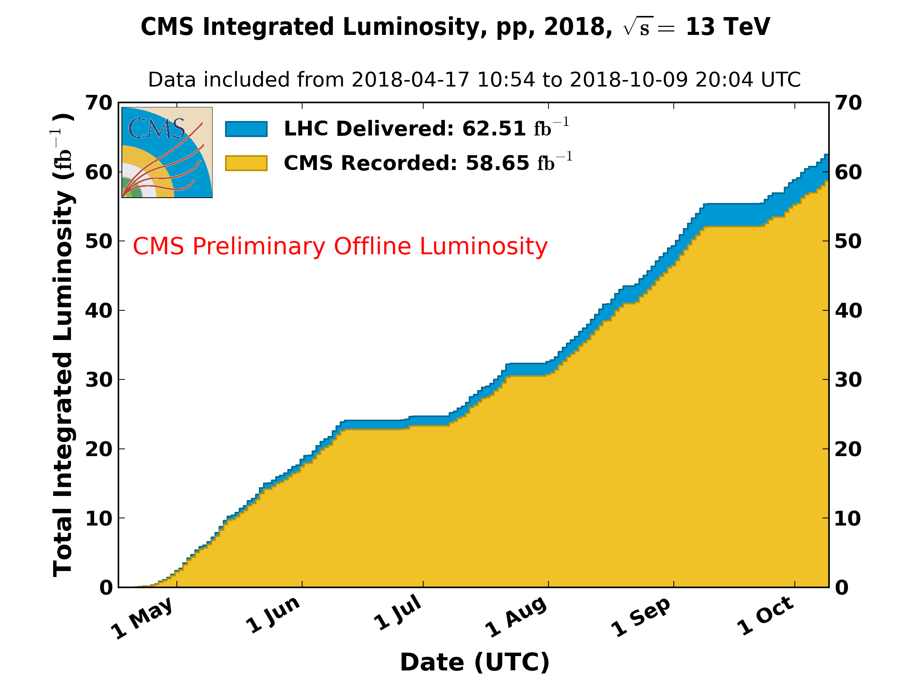

\clearpage

# Detector Operations

During this quarter, the LHC reached its goal of delivering at least 150 pb$^{-1}$ of proton collisions during Run 2, see Figure {@fig:lumi}.  Additional luminosity will be acquired before the switch-over to heavy ion (HI) running in November. During this year's run CMS has maintained a data recording efficiency of about 94%, even with the instantaneous luminosity reaching $2\times 10^{34}\ \mathrm{Hz/cm^2}$. An issue did develop with two sectors of the endcap HCAL (HE) but studies show the impact on physics to be small.

{#fig:lumi}

## BRIL

The Pixel Luminosity Telescope (PLT) together with the fast beam condition monitor (BCM1F) and the forward hadron calorimeter (HF) provide online luminosity measurements continuously. The PLT was the primary luminometer during the majority of physics data taking. First luminosity estimates have been provided for early analyses.

Two out of 16 PLT telescopes exhibit degraded pixel information and therefore are disabled for luminosity evaluation. The silicon pixels reach the end of their expected lifetime due radiation damage. The first remedy to compensate reduced charge collection efficiency was to raise the field voltage. Power supply modules with increased range were installed. The efficiency reduction (a few percent) is measured with the visible cross section obtained with the VdM scan versus obtained from mini-scans at the beginning and end of a fill.

A full recalibration of the detector planes (thresholds) resulted in a major recovery of the efficiency value and reduced the slope of decline with respect to integrated luminosity. HV scans are used to study the working point of the detectors. Recovery procedures for SEU are in place. The first iteration is a reset of the readout loop, and severe SEUr require a full power cycle. Increasingly manual interventions are necessary.

To prepare tor the refurbishment of the PLT the first 40 planes have been certified. Another batch of 20 will arrive from PSI shortly and will be subjected to a qualification program at the CERN test stand. For one full PLT 48 planes are required. Readout cards are assembled at Rutgers to be shipped to CERN. An extensive test program is planned including cold-warm cycling as this turned out problematic in the past for readout components.

  Working Metric                                Performance
  ------------------------------------------- -------------
  Fraction of telescopes fully operational              90%
  Efficiency of delivery of lumi histograms             99%
  Uptime of lumi histogram production               $>$ 99%
  Lumi lost                                           0 /pb

  : BRIL Metrics

  Subsystem   Description                                Scheduled   Achieved
  ----------- ---------------------------------------- ----------- ----------
  BRIL        Pixel Luminosity Telescope reinstalled         March      March
  BRIL        Update Lumi for 2017                           March      March
  BRIL        Ready for Beams                                April      March
  BRIL        Preliminary Luminosity for Conferences          July       July
  BRIL        Improve 2018 Lumi numbers                   December 

  : BRIL Milestones

## Tracker

Both strip and pixel trackers have developed and tested new firmware to cope
with the high rate expected for the HI running. With the new firmware the rate of transmission errors is higher in the pixel detector, but these errors occur only a few times per FED per fill and do not stop the run, so they are considered no significant problem.

### Pixels

We are starting to notice recently that some of the Layer 1 modules in the BPiX do not work well at the beginning of the fill. These modules recover later, but we do not know the root cause of the issue. We have developed special recovery procedures and are developing tools to allow us to monitor readout chip internal values during data taking. Voltages for the BPiX layer 1 and the inner FPiX ring were raised by 50V to increase charge collection. Layer 1 voltages were not raised higher due to a shorting issue with the L1 cables (to be addressed in LS2).

### Strips

The recent issues in the tracker cooling seems to be linked to icing, but this needs more investigation. An added benefit from the new HI firmware in the strips will be a better ability to cope with events that change the baseline response in the front end chips. Nevertheless it was decided not to deploy the HI firmware as it would have required a change of code, e.g. in the High Level Trigger, downstream of the DAQ.

                                          Pixels   Strips
  ------------------------------------- -------- --------
  \% Working channels                       94.4     96.0
  Downtime attributed in pb$^{-1}$          16.2    175.0
  Fraction of downtime attributed (%)          2       19

  : Tracker Metrics

  Subsystem   Description                              Scheduled   Achieved
  ----------- -------------------------------------- ----------- ----------
  Tracker     Pixel Phase 1 Detector Removed              Jan 20     Jan 20
  Tracker     New pixel DC-DC converters installed        Jan 30     Jan 30
  Tracker     Pixel Phase 1 Detector Re-installed         Feb 21     Feb 21
  Tracker     Strips and Pixel Phase 1 Detector
              Ready for Collisions                        May 11     Apr 19

  : Tracker Milestones

## ECAL

The ECAL ran successfully in quarter four with no major issues. Minor
firmware issues with the Data Concentrator Board (DCC) that caused
intermittent problems were resolved. The water pipes to two MARATON LV
supplies were replaced. This is maintenance scheduled for all 136
MARATONs in LS2 but conducted now on these two crates as they will be
inaccessible when the detector is open. Refurbishment of the laser
barracks has begun. Again this is preparatory for the major changes
scheduled in LS2. The re-reco calibrations for the 2018 dataset were
finalized and reconstruction has begun.

  Metric                                   Performance
  -------------------------------------- -------------
  Fraction of channels operational: EB            99 %
  Fraction of channels operational: EE          98.3 %
  Fraction of channels operational: ES          99.9 %
  Downtime attributed pb$^{-1}$                     23
  Fraction of downtime attributed               1.34 %
  Resolution performance                            2%

  : ECAL Metrics

[\[ECALMetrics\]]{#ECALMetrics label="ECALMetrics"}

  Subsystem   Description                                           Scheduled   Achieved
  ----------- --------------------------------------------------- ----------- ----------
  ECAL        ECAL fully powered on with HV/LV fully functional       March 1    March 1
  ECAL        Complete sLINK upgrade and tests                       March 21    April 1
  ECAL        Initial thresholds and calibrations set                 April 1    April 1
  ECAL        Ready for Beam                                         April 15    April 1
  ECAL        Preliminary Calibration                                 June 15 

  : ECAL Milestones

[\[ECALMilestones\]]{#ECALMilestones label="ECALMilestones"}

HCAL
----

### Operations

The newly installed HE Phase-1 upgrade operated very stably; however,
certain events have affected data-taking since July. Following a
CMS-wide power interlock on June 30, the power-on of CAEN A3100HBP
modules that provide low-voltage power to the on-detector HE front-end
electronics led to irreversible damage of two sectors on the HE minus
side, HEM15 and HEM16. An investigation of this incident led to a full
understanding of the problem. A specific power supply unit sent a 22V,
10ms transient pulse to the HEM15 and 16 readout boxes, significantly
exceeding the operating voltage of 10V and damaging components with a
12V rating. This event is associated with an extremely rare and
intermittent vulnerability associated with a calibration EPROM in the
A3100HBP modules. Following the investigation, HCAL has installed a
secondary safety system to mitigate the risk of damage from potential
future transients, and we have been working closely with CAEN to
pinpoint the exact cause of the transient and provide a suitable
long-term solution. The physics impact of this incident is small but
measurable. From studies, the impact on the L1 Trigger is not too severe
(about 10% on some triggers) and also on the HLT. Object reconstruction
quality is the same at the few per cent level so 2018 data will not be
too severely impacted. For the end-of-the year re-reconstruction of
data, the Particle Flow algorithm will be modified for the affected HE
region (40$^\circ$ in phi on the minus endcap) to reduce the impact.

More recently, HCAL has also experienced disruptions to the quality of
specific primary control links between the front-end controllers (FECs)
in the CMS service cavern and the clock, control, and monitoring modules
(CCMs) on the detector. Redundant (secondary) control links were enabled
and have allowed HCAL to continue taking high quality data. In parallel,
we are conducting an investigation to establish the origin of these
instabilities.

\
February 28 Milestone\
HE Phase 1 Installed and Co-60 Calibration completed. This milestone was
achieved Feb. 24.

April 1 Milestone\
HE Detector Commissioned. This milestone was achieved March 15.

June 1 milestone\
Data losses due to HCAL less than 1%. This milestone was achieved at the
end of June. However, the HE front end issues due to the malfunctioning
LV power supplies have caused this to increase to 1.3% currently.

  Metric                                    Performance
  --------------------------------------- -------------
  Fraction of channels operational: HF            100% 
  Fraction of channels operational: HE           94.4% 
  Fraction of channels operational: HB            99.9%
  Fraction of channels operational: HO            99.7%
  Downtime attributed to HCAL pb$^{-1}$             173
  Fraction of CMS downtime due to HCAL            10.9%
  Abs Energy Calibration                           2-3%
  Inter-calibration Uniformity                       2%

  : HCAL Metrics

[\[HCALMetrics\]]{#HCALMetrics label="HCALMetrics"}

  Subsystem   Description                                            Scheduled       Achieved
  ----------- ---------------------------------------------------- ----------- --------------
  HCAL        HE Phase 1 Installed & Co-60 calibration completed        Feb 28         Feb 24
  HCAL        HE Detector Commissioned                                   Apr 1       March 15
  HCAL        Ready for Physics                                         Apr 15        April 1
  HCAL        Data Loss $<  1\%\ $                                      June 1        June 30
  HCAL        1% to 2% Calibration                                      July 1   now 2% to 3%

  : HCAL Milestones

[\[HCALMilestones\]]{#HCALMilestones label="HCALMilestones"}

### HB Installation and Commissioning

The HCAL Barrel (HB) Phase 1 upgrade, planned for LS2, is progressing
well. The HB silicon photomultipliers, selected to be the same type as
those used for the HE upgrade, were delivered on schedule and have
performed very well in quality control tests. The production of 900 HB
QIE cards is complete, and a quality control testing and calibration
campaign was completed at Fermilab in September. Other components of the
HB front end are being produced and tested at sites in the U.S. and
India. All of these components are being shipped to CERN. The production
schedule for the SiPM mounting cards has recently slipped. However, they
are expected to arrive at CERN in time for the schedule to be
maintained, although some contingency has been lost. Assembly in
Building 904 at CERN is expected to go into \"factory mode\" in
mid-November with production complete by mid-January 2019. Assembly and
burn-in of spare modules will continue into February 2019. In
table [\[HB Upgrade Milestones\]](#HB Upgrade Milestones){reference-type="ref"
reference="HB Upgrade Milestones"}, all the needed HB upgrade
electronics are abbreviated "HBE".

  Subsystem   Description                                          Scheduled   Achieved
  ----------- -------------------------------------------------- ----------- ----------
  HCAL        HB Upgrade HBE assembly starts at CERN                 Sept. 1     Sept 1
  HCAL        HB Upgrade HBE production in "factory mode"             Nov 15 
  HCAL        HB Upgrade HBE production complete                      Jan 24 
  HCAL        HB Upgrade Minus end upgrade installation begins      March 15 
  HCAL        HB Upgrade Minus end Upgrade Complete                  July 14 
  HCAL        HB Upgrade Plus end upgrade installation begins         Sept 1 
  HCAL        HB Upgrade Plus end Upgrade Complete                    Dec 20 

  : HB Upgrade Milestones

[\[HB Upgrade Milestones\]]{#HB Upgrade Milestones
label="HB Upgrade Milestones"}

EMU 
----

### Operations at CERN

The CSC system operated very smoothly in this quarter. At the end of
September, 98.5% of the channels in the CSC system were working and
being read out. This is down slightly from 98.7% at the beginning of the
quarter. There are two chambers off due to low voltage issues, inherited
from 2017, and these will not be accessible for repair until Long
Shutdown 2. In August, there was one incident of a Maraton LV power
supply shutting off spontaneously.

Levels of background hits in the CSC chambers were measured at found to
be comparably to those in 2017. In particular, no effect can be observed
from the additional shielding that was installed on the rotating
shielding.

New algorithms and settings were tested for the OTMB boards that form
the trigger primitives from the CSCs. The new firmware allows for
changes of timing matching that can be more robust against loss of
trigger data in high pile-up environments. The firmware was tested at
B904 and at GIF++ and the was installed first on one CSC chamber in CMS.
The initial analysis shown no harm from the new firmware, and additional
data are being accumulated to make a more precise assessment of the
efficiency.

The failure of Finisar optical transceivers in the ME1/1 DCFEBs
continues to be a concern. A total of twelve failed in 2017, and six so
far in 2018. A possible remedy has been developed in the form of an
adapter board with a rad-hard VTTx optical transmitter that could
replace the Finisar on the old DCFEBs. Eight prototypes adapter boards
were built by colleagues from Tomsk State University and tested at CERN
and Rice in September.

In the GIF++ facility, an ME1/1 chamber and a 30x30 cm mini-chamber is
being irradiated with a reduced fraction of CF4 (2% instead of 10%). The
goal is to accumulate three times the expected HL-LHC exposure. So far,
it has accumulated about 1.5 times HL-LHC exposure, and shows no
indication of a reduction in gain. Mini-chambers were also tested at
B904 with 5%, 2% and 0% CF4, and also at PNPI with 5% and 1.6%. None
showed any reduction in gain. The 0% test has accumulated about 1.6
times HL-LHC exposure and will continue up to 3 time HL-LHC.

  \% Working channels                  98.5%
  --------------------------------- ------------
  Downtime attributed pb$^{-1}$         16.5
  Fraction of downtime attributed        1%
  Median spatial resolution          127 $\mu$m

  : CSC Metrics

[\[CSCMetrics\]]{#CSCMetrics label="CSCMetrics"}

  ------------------------------------------------------
  Subsystem   Description         Scheduled Achieved
  ----------- ----------------- ----------- ------------
  EMU                               April 4 March 29

  EMU         New HV settings       July 31 now Oct 8
              for reduced gain              
  ------------------------------------------------------

  : EMU Milestones

[\[EMUMilestones\]]{#EMUMilestones label="EMUMilestones"}

### MEX/1 Detector Improvement

The CMS Electronics System Review for the LS2 CSC on-chamber electronics
improvement was held on 2 July. The main focus of this review was the
ALCT mezzanine boards and the DCFEBv2 boards, but it also covered the
LVDB5, HV and LV infrastructure, and optical fiber additions. The USCMS
Production Readiness Review for the DCFEBv2 board was held in
conjunction with the ESR. Both reviews were successful, and all of the
recommendations from the reviews have been addressed.

Following the completion of the ESR, the orders were set up for the
production of the DCFEBv2 boards and the ALCT mezzanines. In the first
week of September, the orders were placed for production and assembly of
DCFEBv2 boards. The first 10 pre-series boards are expected on 24-Oct,
and after these are tested, the full production can be released. For the
ALCTs, we have placed orders for the longest lead-time parts, and will
begin fabrication later in the Fall. Two changes were made to the
budgets though change requests: the funding for ALCTs originally
requested for 2019 was moved to 2018 to allow both types of mezzanine
cards (LX100 and LX150T) to begin production in time for installation in
LS2, and the budget for the DCFEBv2 was increased by 5% to meet the bid
of a vendor that could still meet the required production schedule.

The low voltage distribution boards (LVDB), which are a Russian
responsibility, progressed according to schedule with the full
production and assembly completed in September.

In September, a second workshop was held on CSC planning for LS2. More
detailed plans were discussed for the movement and refurbishment of
chambers with new electronics. The area in SX5 where the refurbishment
and testing will take place was cleared and remodeled in preparation for
LS2. A tentative assignment was made for teams to work on eight groups
of tasks, including chamber extraction and re-installation, chamber
refurbishment, chamber test stands, installation of new services, and
re-commissioning.

  -------------------------------------------------------------
  Subsystem   Description                Scheduled Achieved
  ----------- ------------------------ ----------- ------------
  EMU-MEX/1   ALCT mezzanine prototype      Apr 30 Apr 6
              received                             

  EMU-MEX/1   Second xDCFEB prototype        May 1 Jun 1
              received                             

  EMU-MEX/1   CSC On-chamber                Jun 15 Jul 2
              Electronics System                   
              Review completed                     

  EMU-MEX/1   Order placed for Maraton      Aug 31 Jun 25
              LV supplies                          

  EMU-MEX/1   Production of xDCFEB           Sep 2 now Nov 15
              PCBs released                        

  EMU-MEX/1   CSC on-chamber optical         Nov 1 
              fibers ready for                     
              installation                         

  EMU-MEX/1   CSC LV junction boxes         Jan 15 
              ready for installation        (2019) 
  -------------------------------------------------------------

  : EMU Milestones - MEX/1 Detector Improvement

[\[EMUMilestones-MEX1\]]{#EMUMilestones-MEX1 label="EMUMilestones-MEX1"}

DAQ
---

The DAQ operation during the reporting period was affected by a couple
of issues. We lost 100 pb$^{-1}$ due to central DAQ problems. 2/3 of the
downtime is due to different kinds of hardware failures. The longest
downtimes were caused by a failure of one of the two CPUs in a readout
unit PC, by a FEROL40 $\mu$TCA crate acting up and crashing the
controller PC, and by dying optics in a Mellanox network cable. In
addition, we experienced many more hardware failures in the HLT farm
than in the past. These failures did not lead to any data loss, but
required manual interventions to restore the system and resurrect events
left behind. An unresponsive DAQ function-manager tomcat is the main
source of downtime from software. The recovery time was prolonged due to
a slow reaction time of the DAQ shifter. Additional downtime was created
due to a bug in the FEROL40 firmware and due to a not-understood problem
in the event-builder software. We observed a couple of problems with EOS
at Tier 0. It caused no data loss, but delayed the transfers by up to a
few hours. The SMTS team needed to do several manual interventions on
the storage manager and transfer system to recover files corrupted or
lost on EOS.

The failure of multiple FUs in one rack revealed a missing feature in
squid-3 used since early 2018, which prevents HLT processes to access
frontier directly in case that the squid hierarchy is broken. The
frontier/squid setup for the HLT farm needs to be revisited during LS2.
This will be also done in view of a possible use for loading conditions
at luminosity-section boundaries instead of run starts only. This would
eliminate the need to inject changing conditions into the event stream.

We deployed the new HLT file-broker at end of July. This tool is used to
distribute files to the HLT processes. It replaces the NFS file-locking
mechanism which caused problems since the beginning of 2018 (c.f. last
quarter's report.) The file broker works flawlessly. The performance
measurements show a slight improvement over old scheme based on locks.

Several software tools saw improvements, too. The event builder reports
per-FED fragment sizes (average and RMS) to the monitoring system. This
feature has been requested by ECAL to ease their monitoring of the
detector. The HLTd and merger code has been improved to better handle
files appearing at the end of run. Additional features and diagnostic
power were implemented in the DAQExpert tool which is used to assist the
DAQ shifter. The Level-0 FM and Level-0 Automator was improved to deal
with races and operator errors.

The work on the online monitoring system (OMS) continues. A new version
was released in August with new pages displaying prescale sets and
prescale changes, the DCS states per luminosity section, and a new run
keys portlet became available. User settings are now reflected in the
URL, which allows to share page-settings between users. New endpoints
were added in the API. New methods have been added to retrieve a HTML
page containing all available endpoints and to retrieve the metadata for
a resource. The work focuses now on the reporting of down- and deadtime,
as well as on weekly, monthly and yearly summaries of the data taking.

CASTOR is being recommissioned after 3 years for upcoming heavy-ion run
and was reintegrated into DAQ system without any problems.

In order to prepare for the heavy-ion run, a data-challenge has been
proposed by CMS DAQ and organized by CERN IT. The aim was to find any
bottle neck in the IT infrastructure caused by the much large throughput
expected from all 4 LHC experiments during the heavy-ion run than during
standard proton physics. The test allowed us to further tune the storage
manager and transfer system to balance recording vs transfer bandwidth.
No evidence for interference between the experiments was observed. We
are reasonably confident that we can record 7 GB/s to the storage
manager during the run with 4.6 GB/s simultaneous transfer to Tier 0,
and transferred up to 7 GB/s while not writing to the storage manager
during interfill periods.

The testbed for the run-3 DAQ system has been commissioned. All hardware
has been installed and the data networks have been configured. Tests of
individual components are being done, while the configuration for the
end-to-end system is being worked on.

  Dead time due to backpressure      0.6%
  --------------------------------- ------
  Downtime attributed pb$^{-1}$      100
  Fraction of downtime attributed     9%

  : DAQ Metrics

[\[DAQMetrics\]]{#DAQMetrics label="DAQMetrics"}

  ---------------------------------------------------------------
  Subsystem   Description                    Scheduled   Achieved
  ----------- ---------------------------- ----------- ----------
  DAQ         First version of OMS GUI           Mar 1      Mar 6
              with limited functionality               
              deployed                                 

  DAQ         Specification and design           Apr 1     Mar 13
              outline for DTH prototype P1             

  DAQ         New HLT nodes commissioned         May 1      Apr 5

  DAQ         Testbed for DAQ 3 installed        Jun 1     Jul 15

  DAQ         First DTH prototype P1 board       Oct 1 

  DAQ         Event-builder & SMTS ready        Oct 31 
              for heavy-ion run                        

  DAQ         All relevant WbM pages            Dec 31 
              migrated to new OMS GUI                  
  ---------------------------------------------------------------

  : DAQ Milestones

[\[DAQMilestones\]]{#DAQMilestones label="DAQMilestones"}

Trigger
-------

During this quarter the US groups continued their work on the Layer-1
calorimeter (CaloL1) trigger and the endcap muon trigger (EMTF) Level-1
trigger systems, and on the field operations of the Trigger Studies
Group, providing improvements and reliable running during 2018 data
taking operations.

### Endcap Muon Trigger

For data-taking operations, we had a successful deployment of an
automated CSC link recovery procedure to minimize the impact on
data-taking quality and efficiency when links occasionally lose
synchronization. However, there were two occurrences of losing trigger
primitives at EMTF in one endcap (38 pb$^{-1}$ downtime), that were
resolved with the reconfiguration of FPGAs. It was suspected this fault
had to do with PCIe reads from the processors, and a fix has been
developed.

During the technical stop in September, several updates to the
infrastructure, firmware, and software were made to improve the
robustness of the muon trigger. The firmware for the Vadatech MCHs in
the EMTF crates was updated to the latest version. An EMTF firmware fix
for the suspected PCIe read errors was deployed, as was an update to
reset the receivers of MPC links after hard reset to further improve
robustness. Further diagnostics were added as well. The online SWATCH
software for EMTF was upgraded to enable the automatic CSC link recovery
procedure (resync requests), where an upper limit to the number of
resync requests when repairing CSC optical links was set to avoid
unnecessary downtime when links cannot be recovered. The online software
also was updated to implement the configuration of registers from text
files to avoid the necessity of recompiling and deploying new online
software releases during operations for every change of a register.

A study of the DQM monitoring plots indicated that the LCT efficiency is
low for several ME1/3 chambers. CSC experts were informed, and the
inefficiency was traced some problems in CFEB connections and timing
that have now been fixed. Additionally, a study of track segment
residuals in EMTF tracks indicates a measurable shift between the
YE1-YE2 disks in one endcap. Using the latest CSC alignment constants
rather than ideal geometry is found to mitigate the position bias,
leading to a small improvement in the turn-on trigger efficiency.
Deployment of constants online was performed after the Technical Stop.

### Layer-1 Calorimeter Trigger

During second quarter of 2018 the CaloL1 was calibrated for a new HCAL
trigger primitives compression scheme, and a new calibration was also
used for CaloL2. The MicroSD cards that failed on two CTP7's and were
replaced in the second quarter. They were overused by writing diagnostic
data to them. Routine writing of diagnostic data to the MicroSD cards is
now stopped, and the problem does not appear in any other cards. New
MicroSDs are ordered and should be swapped on all the cards during long
shutdown, LS2 in 2019--2020. All spare CTP7s not in operation at P5 have
had their MicroSD cards replaced.

During the third quarter there were few problems with ECAL links that
were all promptly reported using CaloL1 DQM, most of the problems were
intermittent, required masking of single ECAL channel, all were unmasked
after the links were fixed by the ECAL group. Once during the run one
CTP7 card went unresponsive, and the card was promptly rebooted. This
caused a loss of $\approx 50$ pb$^{-1}$ of data. The cause is now known
and the card has been replaced. Apart of this the operation was smooth.

The CaloL1 participated in preparation for Heavy Ion runs, scheduled at
the end of the data taking. The firmware was already prepared before and
did not require any additional work, the DQM was updated to display new
trigger information.

### Field Operations Group of the Trigger Studies Group

The US Trigger Project contributes to all aspects of the Field
Operations Group (FOG) to ensure successful operation of the High Level
Trigger. Over the past year, two graduate students and a postdoc have
participated in on call shifts. Until his term recently ended, the
postdoc was also co-convener of the FOG group. The US takes primary
responsibility for the maintenance and continued development of the
trigger rate monitoring software, including the tools for creating and
updating the reference fits.

During 2018 the US led the following activities: Performing on call
shifts and training other new experts in on call shift procedures,
making updates to the rate monitoring software to streamline the process
of creating new reference fits for monitoring trigger rates, did a
thorough re-evaluation of all trigger rate references to make sure they
were all sufficiently accurate reflections of the expected rate for
current triggers, and adding functionality to the rate monitoring tools
so that users can re-run the monitoring over historical runs, rather
than just the data currently being taken, to test updates to shift
monitoring tools. One new graduate student is being trained in current
on call procedures and rate monitoring software development so that an
experienced student will be available after LS2 to help with the
startup.

  Frac of MPC Channels                                100%
  -------------------------------------------------- -------
  Frac of Upgrade EMUTF Channels                      100%
  Deadtime attributed to EMTF pb$^{-1}$                38
  Fraction of deadtime attributed to EMTF              4%
  Frac of Calo. Layer-1 Channels                      100%
  Deadtime attributed to Calo. Layer-1 pb$^{-1}$       50
  Fraction of deadtime attributed to Calo. Layer-1    $5\%$

  : Trigger Metrics

[\[TriggerMetrics\]]{#TriggerMetrics label="TriggerMetrics"}

  Subsystem   Description                         Scheduled   Achieved
  ----------- --------------------------------- ----------- ----------
  TRIG        EMTF commissioned with                        
              endcap RPC input                      April 1   April 27
  TRIG        EMTF ready for Physics                  May 1     May 29
  TRIG        Calo. Layer-1 commissioned                    
              with new ECAL/HCAL/HF Calib           April 1     May 19
  TRIG        Calo. Layer-1 Ready for physics       April 1     May 19

  : Trigger Milestones

[\[TriggerMilestones\]]{#TriggerMilestones label="TriggerMilestones"}
