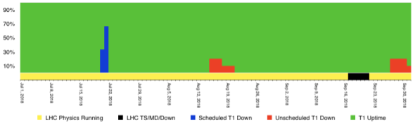

\clearpage

[Summary of Software and Computing activities]{.c2} {#h.8gule4ziae3r .c6}
===================================================

[]{.c0}

[As the LHC moved towards the end of proton collisions for Run 2, U.S.
CMS Software and Computing made progress on enabling the analysis of Run
2 data while also making preparations for Run 3 and beyond.  Utilization
of facilities remained high (modulo a late-summer vacation dip), as the
facilities themselves continued their excellent performance.  Of
particular note for the facilities is that the Fermilab Tier-1 center
has received its new tape library, thus beginning the transition to a
new tape technology.  Computing operations continued to deliver samples
needed for physics analysis, while also working through a number of
operational problems that arose.  A number of development efforts are
taking shape as CMS moves away from home-grown solutions and towards
community projects, both in the short term (with the deployment of the
CRIC site information system and the overhaul of the CMSWeb platform)
and longer term (with the choice of Rucio as the data management system
for Run 3 and beyond, and first steps towards its deployment).  A
variety of activities are enabling the use of non-traditional
architectures and non-traditional facilities, such as those at HPC
centers.  ]{.c0}

[]{.c0}

[Major milestones achieved this quarter]{.c2}

[]{.c0}

[]{#t.ec70c0b57f76f40636a71f8dd5bf62a466d57771}[]{#t.0}

+-----------------------------------+-----------------------------------+
| [Date]{.c0}                       | [Milestone]{.c0}                  |
+-----------------------------------+-----------------------------------+
| [1 July 2018]{.c0}                | [Complete Rucio functional review |
|                                   | in advance of CMS DM review]{.c0} |
+-----------------------------------+-----------------------------------+
| [5 July 2018]{.c0}                | [New Fermilab tape buffer disk    |
|                                   | nodes deployed in                 |
|                                   | production.]{.c0}                 |
+-----------------------------------+-----------------------------------+
| [1 July 2018]{.c0}                | [C++ Modules integration in       |
|                                   | CMSSW]{.c0}                       |
+-----------------------------------+-----------------------------------+
| [1 July 2018]{.c0}                | [Functioning CPU version of       |
|                                   | Machine Learning benchmark]{.c0}  |
+-----------------------------------+-----------------------------------+
| [1 August 2018]{.c0}              | [Create CMSSW interface producer  |
|                                   | for tracking on advanced          |
|                                   | architectures]{.c0}               |
+-----------------------------------+-----------------------------------+
| [1 August 2018]{.c0}              | [Allow concurrent Run transitions |
|                                   | in multi-threaded CMSSW]{.c0}     |
+-----------------------------------+-----------------------------------+
| [1 August 2018]{.c0}              | [\"Pixel tracking \@GPU\"         |
|                                   | integrated/prototyped in          |
|                                   | CMSSW]{.c0}                       |
+-----------------------------------+-----------------------------------+
| [1 August 2018]{.c0}              | [\"Parallel kalman filter\"       |
|                                   | integrated/prototyped in          |
|                                   | CMSSW]{.c0}                       |
+-----------------------------------+-----------------------------------+
| [15 August 2018]{.c0}             | [TS4500 tape robot delivery and   |
|                                   | assembly at FNAL.]{.c0}           |
+-----------------------------------+-----------------------------------+
| [1 September 2018]{.c0}           | [Migration and cleanup of CMS HEP |
|                                   | environment script to             |
|                                   | EOS/CVMFS]{.c0}                   |
+-----------------------------------+-----------------------------------+
| [17 September 2018]{.c0}          | [2018 FNAL CPU purchase           |
|                                   | awarded]{.c0}                     |
+-----------------------------------+-----------------------------------+
| [30 September 2018]{.c0}          | [Use CMS portion of initial       |
|                                   | allocation at NERSC ]{.c0}        |
+-----------------------------------+-----------------------------------+
| [1 October 2018]{.c0}             | [Working GPU version of Machine   |
|                                   | Learning benchmark]{.c0}          |
+-----------------------------------+-----------------------------------+
| [1 October 2018]{.c0}             | [uproot-writing, awkward-arrays   |
|                                   | in uproot published as uproot     |
|                                   | 3]{.c0}                           |
+-----------------------------------+-----------------------------------+

[]{.c2} {#h.98q9s5c6ll0u .c6 .c11}
=======

[Fermilab Facilities ]{.c2} {#h.w7cgrp7uowuj .c6}
===========================

[Q3 of 2018 continued with the LHC proton-proton run.  Throughout this
quarter the Fermilab Facilities continued to provide reliable custodial
storage, processing and analysis resources to U.S. CMS collaborators.
 The site was well utilized, with the facility providing 43.0 million
wall-clock hours of processing to CMS.  ]{.c0}

[]{style="overflow: hidden; display: inline-block; margin: 0.00px 0.00px; border: 0.00px solid #000000; transform: rotate(0.00rad) translateZ(0px); -webkit-transform: rotate(0.00rad) translateZ(0px); width: 624.00px; height: 274.40px;"}

[]{.c0}

[Figure 1 shows the site readiness metrics for the quarter. During this
quarter the Tier 1 facility passed CMS site availability metrics 98.1%
of the time.  The blue in the figure indicates a scheduled downtime in
July for work needed on the power infrastructure in the Feynman
Computing Center.  There were two periods of failing metrics during the
quarter:  In August a bug in dCache triggered by a security-mandated
move to TLS 1.2 encryption resulted in failed data transfers to several
sites.  In September a bad fiber on the incoming 100Gb network link led
to reduced incoming transfer throughput.]{.c0}

[]{.c0}

[At the beginning of the quarter FNAL received new storage nodes to
replace nodes being retired out of the tape dCache pool.  The dCache
pool serves as the disk buffer in front of the tape system, and these
nodes were successfully introduced into production without downtime.  In
September the PO for the batch worker nodes replacing retiring workers
was awarded, with delivery expected late October/early November.]{.c0}

[]{.c0}

[Towards the end of the quarter Fermilab received delivery of new TS4500
tape library and began commissioning.  Legal conflicts between suppliers
of LTO8 media resulted in worldwide unavailability of the LTO8 tape
media.  A decision was made to initially move to the lower capacity M8
(reformatted LTO7) cartridges to be able to commission the robot before
the end of the LHC run.  That media arrived on October 2, allowing
commissioning of the new system to proceed in earnest during Q4.]{.c0}

[]{.c0}

[University Facilities]{.c2} {#h.1n7rsuf66o15 .c6}
============================

[]{.c0}

[As seen in Figure 2, CMS production and analysis activities this
quarter continued to run at high levels relative to full capacity.
August is typically a slower month for CMS computing due to conferences
and holidays. There were also issues with central production during
September which affected usage.]{.c0}

[]{.c0}

All of the U.S. CMS Tier-2 sites operated successfully last quarter. On
our two official performance metrics based on CMS test jobs, all sites
were at least 96%
"[[available](https://www.google.com/url?q=http://wlcg-sam-cms.cern.ch/templates/ember/%23/historicalsmry/heatMap?end_time%3D2018%252F10%252F01%252000%253A00%26granularity%3DDaily%26profile%3DCMS_CRITICAL%26site%3DT2_US_Caltech%252CT2_US_Florida%252CT2_US_MIT%252CT2_US_Nebraska%252CT2_US_Purdue%252CT2_US_UCSD%252CT2_US_Wisconsin%26start_time%3D2018%252F07%252F01%252000%253A00%26time%3Dmanual%26type%3DAvailability%2520Ranking%2520Plot&sa=D&ust=1545931895812000){.c15}]{.c8}"
and 88%
"[[ready](https://www.google.com/url?q=https://dashb-ssb.cern.ch/dashboard/request.py/sitereadinessrank?columnid%3D234%23time%3Dcustom%26start_date%3D2018-07-01%26end_date%3D2018-10-01%26sites%3Dmultiple%26timebins%3Dfalse%26nodata%3Dfalse%26binsselect%3Ddefault%26clouds%3Dall%26site%3DT2_US_Caltech,T2_US_Florida,T2_US_MIT,T2_US_Nebraska,T2_US_Purdue,T2_US_UCSD,T2_US_Wisconsin&sa=D&ust=1545931895812000){.c15}]{.c8}".
The CMS requirement for each of these metrics is 80%, but the U.S. CMS
performance goal is 90%, which all sites met except for Caltech, which
had a series of downtimes due to unrelated technical problems during
September. Nonetheless our commitments to CMS were met with success. The
U.S. CMS Tier-2 centers delivered
[[48.2%](https://www.google.com/url?q=http://dashb-cms-jobsmry.cern.ch/dashboard/request.py/consumptions_individual?sites%3DT2_AT_Vienna%26sites%3DT2_BE_IIHE%26sites%3DT2_BE_UCL%26sites%3DT2_BR_SPRACE%26sites%3DT2_BR_UERJ%26sites%3DT2_CH_CSCS%26sites%3DT2_CN_Beijing%26sites%3DT2_DE_DESY%26sites%3DT2_DE_DESY_Test%26sites%3DT2_DE_RWTH%26sites%3DT2_EE_Estonia%26sites%3DT2_EE_Estonia_Test%26sites%3DT2_ES_CIEMAT%26sites%3DT2_ES_IFCA%26sites%3DT2_FI_HIP%26sites%3DT2_FI_HIP_Test%26sites%3DT2_FR_CCIN2P3%26sites%3DT2_FR_GRIF_IRFU%26sites%3DT2_FR_GRIF_LLR%26sites%3DT2_FR_IPHC%26sites%3DT2_GR_Ioannina%26sites%3DT2_HU_Budapest%26sites%3DT2_IN_TIFR%26sites%3DT2_IT_Bari%26sites%3DT2_IT_Legnaro%26sites%3DT2_IT_LegnaroTest%26sites%3DT2_IT_Pisa%26sites%3DT2_IT_Rome%26sites%3DT2_KR_KNU%26sites%3DT2_MY_UPM_BIRUNI%26sites%3DT2_PK_NCP%26sites%3DT2_PL_Swierk%26sites%3DT2_PL_Warsaw%26sites%3DT2_PT_NCG_Lisbon%26sites%3DT2_RU_IHEP%26sites%3DT2_RU_INR%26sites%3DT2_RU_ITEP%26sites%3DT2_RU_JINR%26sites%3DT2_RU_PNPI%26sites%3DT2_RU_RRC_KI%26sites%3DT2_RU_SINP%26sites%3DT2_TH_CUNSTDA%26sites%3DT2_TR_METU%26sites%3DT2_UA_KIPT%26sites%3DT2_UK_London_Brunel%26sites%3DT2_UK_London_BrunelTest%26sites%3DT2_UK_London_IC%26sites%3DT2_UK_SGrid_Bristol%26sites%3DT2_UK_SGrid_RALPP%26sites%3DT2_US_Caltech%26sites%3DT2_US_Florida%26sites%3DT2_US_MIT%26sites%3DT2_US_Nebraska%26sites%3DT2_US_Purdue%26sites%3DT2_US_UCSD%26sites%3DT2_US_Vanderbilt%26sites%3DT2_US_Wisconsin%26sitesSort%3D2%26start%3D2018-07-01%26end%3D2018-10-01%26timeRange%3Ddaily%26granularity%3DMonthly%26generic%3D0%26sortBy%3D0%26series%3DAll%26type%3Dewa&sa=D&ust=1545931895813000){.c15}]{.c8}[ of
all computing time by Tier-2 sites in CMS last quarter, approximately
unchanged from the previous quarter.]{.c0}

[]{.c0}

[Steady progress to complete milestones and upgrades at the Tier-2 sites
is being made. Generally these fall into a few broad categories of
upgrading to SL7, IPv6, and simplifying the architecture of the sites.
Https-based transfers are now possible between several sites. ]{.c0}

[]{.c0}

[]{.c0}

[]{style="overflow: hidden; display: inline-block; margin: 0.00px 0.00px; border: 0.00px solid #000000; transform: rotate(0.00rad) translateZ(0px); -webkit-transform: rotate(0.00rad) translateZ(0px); width: 624.00px; height: 573.33px;"}

[Figure 2:  How processing resources were used at the U.S. CMS Tier-2
sites, by month. ]{.c0}

[]{.c0}

The U.S. CMS Tier-3 support team provided help to thirteen sites on a
number of issues mainly related to OSG software upgrades, PhEDEx
transfers, XRootD, and basic systems administration.  CMS Connect also
required some work to address dashboard issues and to create a new EL7
login node to prepare for the eventual retirement of the EL6 one.  Work
also began on allowing interactive GPU access via CMS Connect.  The team
tracked issues with GGUS instead of OSG tickets.  There were two Tier-3
related presentations made by team members at CHEP.

[Computing Operations]{.c2} {#h.gv07tbseespo .c10}
===========================

[Digitizing and simulating Monte Carlo events for the 2017 data analyses
was again the largest processing activity in the quarter. About 5
billion events were processed, the remaining third of the requested
Monte Carlo events.]{.c0}

[]{.c0}

[In July small numbers of Monte Carlo events for the 2018 data analyses
were produced with updated software versions. In September generation of
the premixing library with the final software for the 2018 detector
configuration started. This was completed later that month and Monte
Carlo event production using the premix library started. So far 200
million events have been processed. About three quarters of the current
requests will use the resource-efficient, pre-mixing pile-up method,
which takes advantage of computing technologies developed in the
US.]{.c0}

[]{.c0}

[Data processing was impacted by three issues during the quarter:]{.c0}

1.  Storage space at CERN filled up to due temporary files of incomplete
    workflows. Small intermediate files from the processing step are
    merged into large multi-GB files for analysis and archiving. The
    available CPU at CERN from the HLT farm and Tier-0 occupancy had
    been overestimated by more than a factor of two[; thus, too many
    workflows were assigned, requiring more space, progressing more
    slowly and keeping the temporary space occupied. In addition the
    large number of workflows in the system and the non-negligible
    failure rate prevented workflows from finishing. No new workflows
    were assigned to CERN for the next month and a half to work down the
    processing backlog and clear the space used for unmerged
    files.]{.c0}
2.  Misconfigured workflows caused a huge number of very short jobs
    (only minutes long instead of several hours) that brought the global
    HTCondor pool to its limits. For about two weeks we were not able to
    utilize all the compute resources available to CMS[.]{.c0}
3.  [Instabilities of the CERN EOS storage system caused processing
    interrupts and operator interventions. Various issues were in play:
    fuse-mount instabilities due to IP-based authorization and enabling
    IPv6, files getting "lost" during namespace compacting, permission
    issues, and self-inflicted namespace overload. For now EOS is
    behaving stably again but it is not entirely clear whether all
    issues have been addressed.]{.c0}

[]{.c0}

[The Tier-0 reformatted and reconstructed data from the detector as they
were recorded. Two LHC machine development periods fell into this
quarter. During the September machine development transfer tests between
the experiments at P5 and the CERN EOS storage system]{.c0}

[were done in preparation for the heavy-ion data recording in the
following quarter. The performance goal was achieved on the second day
of testing.]{.c0}

[]{.c0}

[500 million events of the parked data for B physics (out of 9.8 billion
recorded so far) were passed through the prompt reconstruction process
end of August.]{.c0}

[]{.c0}

[]{style="overflow: hidden; display: inline-block; margin: 0.00px 0.00px; border: 0.00px solid #000000; transform: rotate(0.00rad) translateZ(0px); -webkit-transform: rotate(0.00rad) translateZ(0px); width: 624.00px; height: 341.33px;"}

[]{.c0}

[Computing Infrastructure and Services]{.c2} {#h.3z769mydqy3h .c6}
============================================

[]{.c0}

[WMAgent has implemented changes related to the dataset parentage which
have been fixed at several levels This was the last standing blocker to
widespread usage of StepChain workflow types, which are well suited to
HPC running. In addition, the WMAgent development team has also
implemented the CRIC client APIs in WMCore; these are already being used
by an agent in production and some analysis services. CRIC is a WLCG
supported replacement for the CMS-only project SiteDB. SiteDB is
scheduled to be fully retired in Q1 2019.]{.c0}

[]{.c0}

[We continue to contribute to the overhaul of CMSWeb led by CERN. In
this quarter, we demonstrated CMSWeb could be converted to a
Kubernetes-based infrastructure with no CMS-specific frontend to
maintain and each backend component converted to Docker.  Work remains
to be done to integrate CMS's authentication scheme; we plan to continue
to improve this prototype with a goal of replacing the current CMSWeb
platform in Q1 2019.]{.c0}

[]{.c0}

[After a comprehensive review, CMS has chosen Rucio as the next
generation CMS data management product.  The transition to Rucio has
begun with the setup of a CMS instance of Rucio on CERN hardware using
the Kubernetes stack. The transition (development, integration, and
corresponding cross-coordination) has begun to be planned out in detail.
 The current goal for full transition from the existing Dynamo/PhEDEx
system Q1 2020.]{.c0}

[]{.c0}

[A variety of technical improvements have been made to the Xrootd
infrastructure used by CMS.  For example, we have improved the cache
purge algorithm to also take into account file-usage. This is needed to
be able to operate several cache instances on the same node and for
serverless caching (e.g., on laptops, desktops).  We have also
implemented new features prerequisite to integrating the Xrootd-based
cache with Rucio.  Finally, improvements have been made to HTTPS-based
third party copy in Xrootd, allowing us to perform copies between sites
without GridFTP.  This helps U.S. CMS (along with OSG) mitigate the risk
from the Globus Toolkit's end-of-support.\
]{.c0}

[We commissioned the Bridges HPC at PSC for CMS and made it directly
usable for CMS production workflows. Using Rucio, we transferred the new
Fall 18 version of the pileup library to make it locally available at
NERSC. This allowed scaling up to about 25k cores in use at NERSC for
CMS production workflows. By the end of reporting period, we had used
nearly all the CMS share of the original 50 Mhour allocation at NERSC as
well as the CMS allocation at Bridges.]{.c0}

[]{.c0}

[Software and Support]{.c2} {#h.d5b286qlnfo1 .c6}
===========================

[]{.c0}

We finalized the integration of the production releases for MC and data
re-miniAOD of 2016 data, main 2018 data and MC processing and 2018
heavy-ions data taking. Progress was made on making CMSSW C++17 standard
compliant and building the visualization on macOS using system
compilers. Work continued on allowing concurrent event processing in
multi-threading mode of CMSSW. We concentrated on run and luminosity
block transitions and IOVs (intervals of validity). We also investigated
the usage of OpenMP 4.5 task APIs in our CMSSW toy framework and started
comparisons to our current TBB implementation, discussed with HPC
experts at the CCE Scalable I/O workshop. We made a lot of progress
establishing a ML suite for benchmarking purposes, by having now the
first GPU based benchmark application available. In addition to
maintenance of the current and near-term geometries of the detector, we
made progress in transitioning to the community geometry description
solution DD4HEP. The community foundation of our visualization package
FireWorks, EvE, was evolved into the ROOT7 era and is ready to be
included into the December ROOT release. We also made progress on the
client-server implementation of our visualization. Kalman filter
tracking on advanced architectures achieved additional speed-ups on
Skylake Gold architectures while retaining the efficiency and purity of
the non-parallel Kalman filter implementation. The GPU pixel tracking
R&D integration in CMSSW made progress by prototyping the use of CUDA
from the framework. Together with DIANA-HEP, we enabled uproot file
writing support for numpy arrays and other types for interoperability of
the HEP analysis environment with industry tools. Ten CHEP contributions
featured topics whose maintenance, integration into production and
scaling to higher scales were supported by the operations program.

[Other activities]{.c2} {#h.c25nhoz4lslv .c10}
=======================

[Blueprint]{.c14} {#h.wfys6vpcizxp .c18}
-----------------

[The Blueprint activity continues to focus on computing model evolutions
and discussions as a means to identify research and development for
HL-LHC. We organized five USCMS blueprint meetings this quarter. These
included: initial results from a HL-LHC CMS cost model; results from the
Big Data Express project at Fermilab, Oak Ridge, and KISTI; concepts for
future analysis facilities; design and results from a caching system at
UCSD; and initial results from the U.S. CMS machine learning benchmark
design project. ]{.c0}

[]{.c0}

The Blueprint team is an active participant in the CMS ECOM2X working
group. Our modeling efforts will be used as a basis for discussion on
how to evolve the CMS computing and analysis model towards HL-LHC. We
have organized initial presentations on our work during Q4. Blueprint
modeling work and results were also presented in a talk at the CHEP
conference.  We are also actively engaged in the WLCG DOMA working
groups to advance the WLCG HL-LHC strategy discussions. In particular,
U.S. CMS co-leads two of the three WLCG DOMA working groups, one on
transfer protocols and one on data access patterns and caching.

[Security task force]{.c14} {#h.r2y2msjfq7l0 .c18}
---------------------------

[]{.c0}

[The security team documented U.S. CMS site security responsibilities
and shared the document amongst the site administrators. This document
provides a set of responsibilities that every site in the U.S. CMS
collaboration must comply with. A list of security policies and
procedures from WLCG, OSG and EGI is included in the appendix.  ]{.c0}

[]{.c0}

[The team also verified and updated the U.S. CMS Incident Response
procedure to be aligned with the Global CMS Incident Response procedure,
and developed an internal procedure for incident response for the U.S.
CMS security task force.  Training remains a priority for the security
team; it prepared training material for incident response and job
traceability, and conducted three training sessions with 17 participants
from 10 Tier-2 sites (including the seven U.S. HEP sites, the nuclear
physics site at Vanderbilt and two sites Brazil.)  A separate session
shared the training and the site security responsibilities with FNAL
site administrators. ]{.c0}

[]{.c0}

[]{.c0}

[]{.c0}

[]{.c0}
