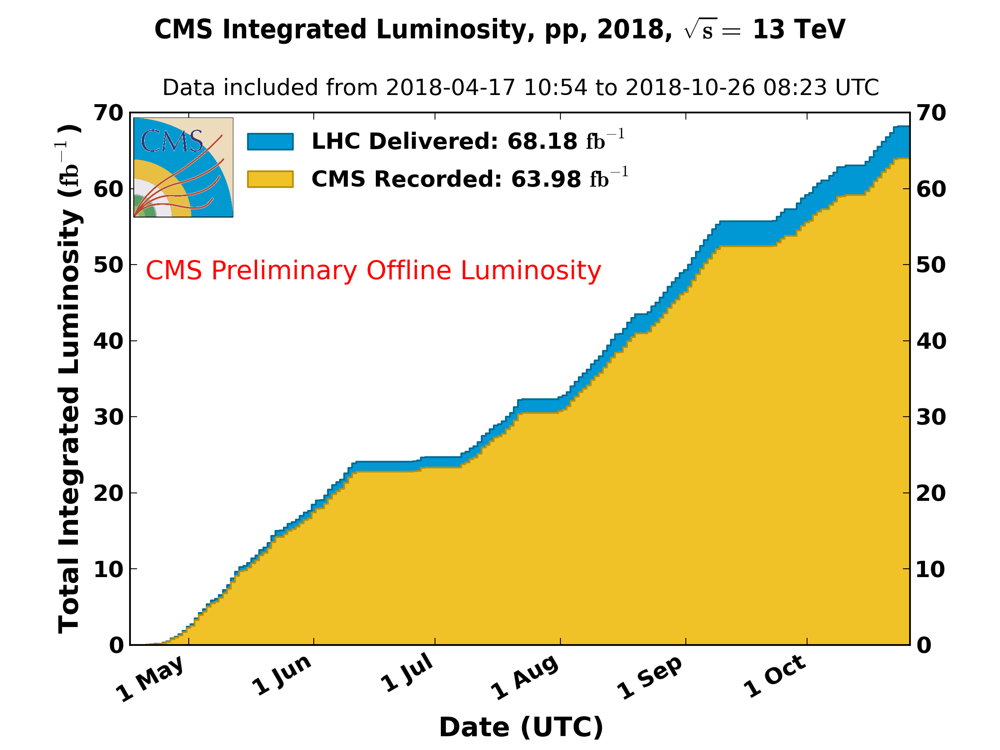

\clearpage

# Detector Operations

Calendar year 2018 proved to be a most successful year for LHC and CMS operation. The LHC delivered record luminosity, and the CMS experiment had the highest recording efficiency to date. After a Heavy Ion (HI) run at the end of the period, the LHC entered into Long Shutdown 2 (LS2). The CMS experiment will take advantage of this period to complete the Phase 1 upgrade by installing the upgraded HCAL barrel electronics.  There will also be significant improvements to the endcap muons system and a variety of improvements, consolidations and maintenance across all of the detector.

{#fig:Lumi}

## BRIL

The Pixel Luminosity Telescope (PLT) successfully ran to the end of Run 2. While the PLT temporarily lost a quarter of the detector at the end of the proton run, the detector could be recovered in time for the HI running. The cause is not yet fully established (it most likely was due to severe Single Event Upsets, SEU). The PLT was unstable during a series of tests in December and experienced drop outs of the same quarter after power cycles. The PLT is at its expected end of lifetime and will be refurbished during LS2. The lab space at CERN is prepared, including the cold boxes, to receive the PLT and to perform detailed post-run studies. The replacement SRA to be installed for Run 3 are being tested and electronic readout cards are being produced at Rutgers and at CERN.

Starting with a comprehensive re-analysis for all BRIL instruments, we conducted a luminosity offline analysis for the full 2018 run.

  Working Metric                                Performance
  ------------------------------------------- -------------
  Fraction of telescopes fully operational              90%
  Efficiency of delivery of lumi histograms             99%
  Uptime of lumi histogram production               $>$ 99%
  Lumi lost                                           0 /pb

  : BRIL Metrics

  -----------------------------------------------------------
  Subsystem   Description                Scheduled   Achieved
  ----------- ------------------------ ----------- ----------
  BRIL        Pixel Luminosity               March      March
              Telescope reinstalled

  BRIL        Update Lumi for 2017           March      March

  BRIL        Ready for Beams                April      March

  BRIL        Preliminary Luminosity          July       July
              for Conferences

  BRIL        Improve 2018 Lumi           December   December
              numbers
  -----------------------------------------------------------

  : BRIL 2018 Milestones

  -----------------------------------------------------------
  Subsystem   Description                Scheduled   Achieved
  ----------- ------------------------ ----------- ----------
  BRIL        Assembly of the               Jun 15
              replacement PLT (2)

  BRIL        Test replacement PLT          Dec 31

  BRIL        Full Run 2 Luminosity         Dec 31
              analysis
  -----------------------------------------------------------

  : BRIL 2019 Milestones

## Tracker

The final stretch of the proton running was smooth for the tracker. HI running was much easier on the detector than in previous runs. Both strip and pixel detectors operated successfully with new firmware to cope with high rate HI running.  Consequently, he number of power cycles needed to recover stuck modules was very small.

### Pixel Detector

It was discovered that some channels are incorrectly masked due to noise during the short period of high voltage ramping at the start of stable beams. Enabling the error recovery mechanisms and pixel readout only after the instability has passed allowed more channels to be maintained good during collisions. Some calibrations were further optimized for speed. Gains in calibrations times between 30 and 90 percent of the original were realized.

### Strip Detector

Once tuned, primarily during the early HI running, the HI hybrid firmware worked well. The new firmware is more sensitive to the thresholds used to determine a hit due to the potential to incur large dead times if too many false hits register.

                                              Pixels   Strips
  ------------------------------------------ -------- --------
  \% Working channels                          94.4     96.0
  pp Downtime attributed in pb$^{-1}$          13.9     96.9
  pp Fraction of downtime attributed (%)       6.2      42.8
  HI Downtime attributed in $\mu$b$^{-1}$      0.07     7.6
  HI Fraction of downtime attributed (%)       0.2      21.1

  : Tracker Metrics

  -----------------------------------------------------------
  Subsystem   Description                Scheduled   Achieved
  ----------- ------------------------ ----------- ----------
  Tracker     Pixel Phase 1 Detector        Jan 20     Jan 20
              Removed

  Tracker     New pixel DC-DC               Jan 30     Jan 30
              converters installed

  Tracker     Pixel Phase 1 Detector        Feb 21     Feb 21
              Re-installed

  Tracker     Strips and Pixel Phase 1
              Detector

              Ready for Collisions          May 11     Apr 19
  -----------------------------------------------------------

  : Tracker 2018 Milestones

  Subsystem   Description                         Scheduled   Achieved
  ----------- --------------------------------- ----------- ----------
  Tracker     Pixel Phase 1 Detector Removed         Jan 31
  Tracker     Pixel initial checkout complete        Aug 31

  : Tracker 2019 Milestones

## ECAL

The run concluded with no major problems for ECAL. The detector performed excellently for both the final part of the proton run, and the HI run in November with no significant data losses.

A review of the planned LS2 activities was conducted in November. During LS2 the main hardware activities will be the replacement of flexible cooling pipes for the Maraton Low Voltage crates, rearrangement of the LV CAN buses, calibration of the High Voltage system, laser tests with longer fibers to assess if it is possible to move the laser barrack, off-detector electronics maintenance, investigations on some known problematic towers to possibly recover some bad channels, oSLB maintenance, DCC firmware tests to investigate very rare CRC errors, improvements of the DCS for finer granularity in the automatic actions, changes in the ECAL Safety system for better redundancy and maintainability, trigger and DAQ developments in view of Run3, and upgrade of the cooling pipes from surface to the underground service cavern in preparation for HL-LHC.

  Metric                                   Performance
  -------------------------------------- -------------
  Fraction of channels operational: EB            99 %
  Fraction of channels operational: EE          98.3 %
  Fraction of channels operational: ES          99.9 %
  Downtime attributed pb$^{-1}$                    0.5
  Fraction of downtime attributed                  2 %
  Resolution performance                            2%

  : ECAL Metrics

  -----------------------------------------------------------
  Subsystem   Description                Scheduled   Achieved
  ----------- ------------------------ ----------- ----------
  ECAL        ECAL fully powered on        March 1    March 1
              with HV/LV fully
              functional

  ECAL        Complete sLINK upgrade      March 21    April 1
              and tests

  ECAL        Initial thresholds and       April 1    April 1
              calibrations set

  ECAL        Ready for Beam              April 15    April 1

  ECAL        Preliminary Calibration      June 15     July 1
  -----------------------------------------------------------

  : ECAL 2018 Milestones

  -----------------------------------------------------------
  Subsystem   Description                Scheduled   Achieved
  ----------- ------------------------ ----------- ----------
  ECAL        Complete First Laser        April 30
              Maintenance

  ECAL        Complete Second Laser        July 31
              Maintenance

  ECAL        Complete infrastructure       Dec 31
              update of laser barracks

  ECAL        Complete replacement of      June 30
              all Maraton input/output
              Cooling Pipes

  ECAL        Complete replacement of      Sept 30
              input HV power
              connectors

  ECAL        Complete modification of      Oct 31
              CANBUS and update DCS
              software

  ECAL        Complete VME PC               Mar 31
              replacement

  ECAL        Complete network upgrade      May 31

  ECAL        Complete upgrade to           Dec 31
              XDAQ15

  ECAL        Complete installation of      Aug 31
              new water pump on
              surface

  ECAL        Complete insulation of        Dec 31
              surface to underground
              area pipes
  -----------------------------------------------------------

  : ECAL 2019 Milestones

## HCAL

### Operations

During this quarter the HCAL group focused on continuing to take data efficiently, and on preparing for HB Phase 1 Upgrade installation during 2019.

The HE Phase-1 upgrade installed during the 2018 shutdown continued to operate well.  However, there are two previously reported issues. First, an over-voltage transient that occurred during the the power-on of the HCAL Endcap CAEN A3100HBP LV power supply modules on June 30, after a CERN wide power cut, caused irreversible damage of two sectors on the HE minus side, HEM15 and HEM16. As previously reported, HCAL has installed a secondary safety system to mitigate the risk of damage from potential future transients, and we have been working closely with CAEN to pinpoint the exact cause of the transient and provide a suitable long-term solution.

The physics impact of this incident is small but measurable. From studies, the impact on the L1 Trigger is not too severe (about 10% on some triggers) and also the impact on the HLT is limited and well understood. Object reconstruction quality is the same at the few percent level, so 2018 data will not be severely impacted.

Second, HCAL has also experienced disruptions to the quality of specific primary control links between the front-end controllers (FECs) in the CMS service cavern and the clock, control, and monitoring modules (CCMs) on the detector for HEP10 and HEM9. Redundant (secondary) control links were enabled for these detectors and allowed HCAL to continue taking high quality data. The investigation to establish the origin of these instabilities continues, and the ngCCMs in HEP10 and HEM9 will be removed as soon as they can be accessed during LS2.

HCAL was ready for the start of data taking in spring 2018, and has been running smoothly including during the HI run, except for the issues noted above. Data losses during offline certification due to HCAL problems were 745 pb$^{-1}$ out of 62.1 fb$^{-1}$ (1.2%). 387 pb${-1}$ of these losses were due to the HE front end problems which were resolved during the run. The data losses due to HCAL were less than 1% on June 30, but the issues discussed above caused this increase to 1.2% averaged over the entire run.

Work on HCAL calibration continues and and calibration accuracy is at
the three percent level.

  ----------------------------------------------------------------------------
  Milestone     Comment
  ------------- --------------------------------------------------------------
  Feb 28        HE Phase 1 Installed and Co-60 Calibration completed. This milestone was achieved Feb. 24.

  Apr 1         HE Detector Commissioned. This milestone was achieved March 15.

  Jun 1         Data losses due to HCAL less than 1%. This milestone was achieved at the end of June. However, the HE front end issues due to the malfunctioning LV power supplies have caused this to increase to 1.2% averaged over the entire run.
  ----------------------------------------------------------------------------

  : HCAL Milestones Performance

  Metric                                    Performance
  --------------------------------------- -------------
  Fraction of channels operational: HF             100%
  Fraction of channels operational: HE            94.4%
  Fraction of channels operational: HB            99.9%
  Fraction of channels operational: HO            99.7%
  Downtime attributed to HCAL             173 pb$^{-1}$
  Fraction of CMS downtime due to HCAL            10.9%
  Abs Energy Calibration                             3%
  Inter-calibration Uniformity                       2%

  : HCAL Metrics

  -----------------------------------------------------------
  Subsystem   Description                Scheduled   Achieved
  ----------- ------------------------ ----------- ----------
  HCAL        HE Phase 1 Installed          Feb 28     Feb 24
              and Co-60 calibration
              completed

  HCAL        HE Detector Commissioned       Apr 1   March 15

  HCAL        Ready for Physics             Apr 15    April 1

  HCAL        Data Loss $<  1\%\ $          June 1       1.2%

  HCAL        1% to 2% Calibration          July 1         3%
  -----------------------------------------------------------

  : HCAL 2018 Milestones

### HB Installation and Commissioning

The HCAL Barrel (HB) Phase 1 upgrade, planned for LS2, is progressing well. The HB silicon photomultipliers, selected to be the same type as those used for the HE upgrade, were delivered on schedule and have performed very well in quality control tests. The production of 900 HB QIE cards is complete, and a quality control testing and calibration campaign was completed at Fermilab in September. Other components of the HB front end are being produced and tested at sites in the U.S. and India. All of these components are being shipped to CERN. The production schedule for the SiPM mounting cards has recently slipped. However, they are expected to arrive at CERN in time for the schedule to be maintained, although some contingency has been lost.

Assembly in building 904 at CERN went into "factory mode" in late November with production expected to complete by mid February 2019. Assembly and burn-in of spare modules will continue into March 2019. As of December 20, 2018, 52 readout modules had been assembled and successfully tested.  During the testing, a number of modules had issues that were successfully resolved. The "internal readiness review (IRR)" for HB installation is scheduled for February 15, 2019. Note that the HB Minus end upgrade will be installed February through June 2019, while the HB Plus end upgrade will be installed from September through December 2019. In the following table HB upgrade electronics is abbreviated "HBE".

  -----------------------------------------------------------
  Subsystem   Description                Scheduled   Achieved
  ----------- ------------------------ ----------- ----------
  HCAL        HB Upgrade HBE assembly      Sept. 1     Sept 1
              starts at CERN

  HCAL        HB Upgrade HBE                Nov 15     Nov 20
              production in "factory
              mode"

  HCAL        HB Upgrade Minus end          Feb 19
              upgrade installation
              begins

  HCAL        HB Upgrade HBE                Feb 28
              production complete

  HCAL        HB Upgrade Minus end         June 30
              Upgrade Complete

  HCAL        HB Upgrade Plus end           Sept 1
              upgrade installation
              begins

  HCAL        HB Upgrade Plus end           Dec 20
              Upgrade Complete
  -----------------------------------------------------------

  : HB Upgrade Milestones

  -----------------------------------------------------------
  Subsystem   Description                Scheduled   Achieved
  ----------- ------------------------ ----------- ----------
  HCAL        extract HEM09 and HEM10      Feb. 10
              CCMs and requalify

  HCAL        extract HEM15 and HEM16       Mar 15
              CCMs, RMs, CUs

  HCAL        install spare modules         June 1
              into HEM15/HEM16

  HCAL        send LV PS units to CAEN       May 1
              for modification to
              reduce risk of future
              over-voltage incidents

  HCAL        design and prototype an        May 1
              LV protection circuit
              compatible with both HE
              and HB LV PS units

  HCAL        produce LV protection         July 1
              modules

  HCAL        install LV protection          Sep 1
              modules in HE

  HCAL        finalize and qualify         April 1
              half-speed FEC and CCM
              firmware

  HCAL        reprogram HE CCMs and          May 1
              FECs

  HCAL        recommission HE with          June 1
              half-speed control links
  -----------------------------------------------------------

  : HB 2019 Operations Milestones

## EMU

### Operations at CERN

At the end of Run II data taking in December, 98.6% of the channels in the CSC system were working and being read out. The average fraction of channels working in 2018 was higher than in 2016 and 2017.

New high voltage settings were implemented in October to prolong the lifetime of the chambers. The HV was lowered in all rings except ME2/1, ME3/1, ME4/1. By design, there was no appreciable change in efficiency.  The resolution was worse by 10-15% in some chambers as a result of the lower gain but this change does not raise concerns about the muon tracking performance.

Additional tests of algorithms for the OTMB boards were carried out late in the year. These included larger regions of shared strips between adjacent boards, changes in the ALCT-CLCT matching windows, and changes in the layer requirements. The results can be studied carefully during LS2 to determine optimal settings for Run 3.

During Technical Stop 2 in Sep-Oct, small improvements were made to the Rotating Shielding between the quadrupoles and the detector. A marginal reduction in background was observed for the top chambers in ME+4/2.

Between the end of data taking and the power-down of the detector for the end of the year, a systematic test was carried out where all EPROMs in the DCFEBs were erased, reprogrammed and tested. EPROMs on all 504 boards programmed successfully.

The failure of Finisar optical transceivers in the ME1/1 DCFEBs continues to be a concern. A total of twelve failed in 2017, and six in 2018. In November, CMS technical coordination approved a program to replace the Finisar transceiver on the old DCFEBs with rad-hard VTTx.  This replacement requires a small adapter board for which prototypes were built by colleagues from Tomsk State University.

A radiation test on CSC electronics was carried out in October at the CHARM facility with a total dose of 38.7 kRad. The boards exposed were a mixture of old electronics and new prototypes. All new prototype boards performed well after exposure, while some of the old boards showed some radiation sensitivity starting at 18-29 kRad. Of note was a fuse failure on the ALCT base boards after a dose 18 kRad, which led to consideration of modifying the boards to bypass this fuse during LS2.

CSC 30x30 cm$^2$ mini-chambers were used to study a gas mixture with 0% CF4.  With a radiation dose equivalent to 3 times HL-LHC exposure, no sign of gain reduction was observed. The chambers were opened after exposure, and some visual changes were evident on the wires and the pads. These are under study.

  \% Working channels                      98.4%
  --------------------------------- ------------
  Downtime attributed pb$^{-1}$                0
  Fraction of downtime attributed             0%
  Median spatial resolution           134 $\mu$m

  : CSC Metrics

### MEX/1 Detector Improvement

Ten pre-series DCFEBv2 boards were delivered to OSU on 24 October, as scheduled. The general quality of the assembly was good, and all ten boards were made to work and passed all the automated tests at OSU. Two boards were sent to CERN and underwent successful tests of programming the FPGAs via GBTx. Work was also carried out at Boston University to set up systematic tests of the GBTx communication that can be done routinely as part of production testing. With the success of the GBTx at CERN, the testing of the pre-series boards was completed and the full production of the pcb's was released on 09-Nov.

Three pre-series ALCT mezzanine LX100 boards were delivered to UCLA at the end of October, where they completed their bench tests successfully.  The production order is being placed. One prototype board was sent to CERN for integration studies.

The machining of all of the parts for the low voltage junction boxes was completed at University of Wisconsin. The parts were shipped to CERN where they were assembled.

The testing was completed for a sample of the longest type of 48-fiber optical fiber assembly tested at on the ME1/1 test stand at CERN. The milestone for fibers ready to install was adjusted to Jun-15 2019. This is in response to the more mature LS2 installation schedule, which indicates that the fibers will not be installed before July 2019T.  Technical coordination and procurement requested a combined proposal for all of the fibers needed for LS2 by CSC, GEM, and RPC, so this was prepared and submitted in December.

In December, a third workshop was held on CSC planning for LS2. More detailed plans were discussed for the movement and refurbishment of chambers with new electronics.

The area in SX5 where the refurbishment and testing will take place was cleared and remodeled in preparation for LS2. A test stand for an ME1/1 chamber was fully reconstituted at SX5. In addition, and ME3/1 chamber was delivered to SX5 and was set up with a separate test stand.

Prototype modifications were made to the DCFEB covers both for the DCFEBv2 boards (for ME1/1), and the DCFEBs with VTTx adapters (for ME2/1, 3/1, 4/1). After appropriate modifications to the copper covers, all chips were able to maintain a good temperature below 40\textdegree C.

The low voltage distribution boards (LVDB), which are a Russian responsibility, progressed according to schedule. All boards were tested and at CERN ready for installation by the end of November. This is not an US project, but an important partner deliverable. Production and testing was completed in Minsk. All 120 boards have been delivered to CERN.

In summary, the new CSC electronics production is on schedule for installation in LS2, starting in March 2019.

  -----------------------------------------------------------
  Subsystem   Description                Scheduled   Achieved
  ----------- ------------------------ ----------- ----------
  EMU                                      April 4   March 29

  EMU         New HV settings for          July 31      Oct 8
              reduced gain
  -----------------------------------------------------------

  : EMU 2018 Milestones

### MEX/1 Detector Improvement

  -------------------------------------------------------------
  Subsystem   Description                Scheduled     Achieved
  ----------- ------------------------ ----------- ------------
  EMU-MEX/1   ALCT mezzanine prototype      Apr 30        Apr 6
              received

  EMU-MEX/1   Second xDCFEB prototype        May 1        Jun 1
              received

  EMU-MEX/1   CSC On-chamber                Jun 15        Jul 2
              Electronics System
              Review completed

  EMU-MEX/1   Order placed for Maraton      Aug 31       Jun 25
              LV supplies

  EMU-MEX/1   Production of xDCFEB           Sep 2        Nov 9
              PCBs released

  EMU-MEX/1   CSC on-chamber optical         Nov 1   now Jun 15
              fibers ready for                           (2019)
              installation

  EMU-MEX/1   CSC LV junction boxes         Jan 15
              ready for installation        (2019)
  -------------------------------------------------------------

  : EMU 2018 Milestones - MEX/1 Detector Improvement

  -------------------------------------------------------------
  Subsystem   Description                Scheduled     Achieved
  ----------- ------------------------ ----------- ------------
  EMU-OPS/1   LV power in place for          Aug 8
              plus end cap

  EMU-OPS/1   Ready to join MWGR with        Sep 1
              ME-1/1

  EMU-OPS/1   Ready to join MWGR with        Nov 1
              ME+234/1

  EMU-MEX/1   First ME-1/1 chamber          Feb 25
              extracted to SX5

  EMU-MEX/1   CSC DCFEBv2 boards ready      Mar 11
              for installation
              ME-1/1

  EMU-MEX/1   ALCT-LX100 ready for          Mar 11
              installation in ME-1/1

  EMU-MEX/1   Full production of            Apr 15
              ALCT-LX150T released

  EMU-MEX/1   ME-1/1 installed and           Jun 2
              commissioned

  EMU-MEX/1   ALCT-LX150T ready for         Jun 10
              installation in ME+234/1

  EMU-MEX/1   First ME+234/1 chamber        Jun 17
              extracted to SX5

  EMU-MEX/1   New LV power in place         Jun 30
              for ME+234

  EMU-MEX/1   ALCT-LX100 ready for          Jun 30
              installation on
              ME2/2,3/2

  EMU-MEX/1   First ME+1/1 chamber          Oct 28
              extracted to SX5

  EMU-MEX/1   OTMB production complete      Nov 15
  -------------------------------------------------------------

  : EMU 2019 Milestones

## DAQ

The operation conditions during the reporting period were diverse. The last weeks of the proton physics data taking were rather smooth.  Occasional backpressure to Pixel FED 1227 was traced to a bad FEROL40 board. The rare problem where the event-builder software gets stuck has not occurred anymore. A bug in EOS caused all transfers from Point 5 to the Tier-0 to fail on a Sunday evening. The subsequent fill was taken without B-physics streams to avoid filling the Lustre file system at Point 5. The problem was caused by an automatic failover to the secondary headnode at CERN IT, which had a buggy version of EOS installed.

The latest Squid version 4.3 was deployed during the technical stop.  This version provides major improvements in handling failed parent peers. The squid hierarchy was simplified, and thus avoids HLT failures when several peers are down.

The HI run was challenging for the filter farm and the storage and transfer systems. Long processing times on the HLT required a lot of manual interventions during the first days. Adjustments to the HLT menu were implemented to avoid most of the long-running algorithms. The HLT output was 6-7 GB/s during fills, which is about twice the rate during proton physics.

The main problem sustaining this rate came from the 4 spinning-disk RAID array used to temporarily store selected events on the builder unit. The I/O capacity was too low and caused large delays in merging the output. The problem was mitigated by moving the output buffer to the RAMdisk used for the input data. The transfer to Tier-0 was at best 4 GB/s during the fill and 6 GB/s during the interfill.  However, there were several periods where the throughput to EOS was very low. The Lustre occupancy became never critical due to problems on LHC side leading to long interfills, which allowed to drain the system.

A failure of the NetApp filer, which hosts the home directories and project space, blocked any runs for 4 hours. We lost about 20 min of HI collisions. The root cause has not been identified and is being followed up with the manufacturer.

A major power cut at CERN occurred the day after the heavy-ion program finished. The recovery of the power and cooling took two days. There were a few hardware failures in the DAQ system. The most critical was a failure on one of the storage elements (OST) of Lustre. The recovery was difficult and required help from NetApp support. Luckily, no data was lost.

The DAQ integration facility in building 904 has been brought up to date and is being used for the burn-in tests for the new HCAL backend electronics, which will be installed during LS2.

Most of the DAQ system has been switched off mid December to limit the power consumption during the yearly cooling maintenance. The majority of HLT nodes (24k cores) have been allocated to the online cloud to process offline workflows.

A new OMS release was deployed in December. It adds runtime, downtime and deadtime analysis pages, as well as summary pages. The last outstanding pages, which contain HLT and run-control information, should become available in January 2019.

  Dead time due to backpressure       0.6%
  --------------------------------- ------
  Downtime attributed pb$^{-1}$        2.9
  Fraction of downtime attributed     1.6%

  : DAQ Metrics

  ---------------------------------------------------------------
  Subsystem   Description                    Scheduled   Achieved
  ----------- ---------------------------- ----------- ----------
  DAQ         First version of OMS GUI           Mar 1      Mar 6
              with limited functionality
              deployed

  DAQ         Specification and design           Apr 1     Mar 13
              outline for DTH prototype P1

  DAQ         New HLT nodes commissioned         May 1      Apr 5

  DAQ         Testbed for DAQ 3 installed        Jun 1     Jul 15

  DAQ         Event-builder & SMTS ready        Oct 31     Oct 31
              for heavy-ion run

  DAQ         All relevant WbM pages            Dec 31
              migrated to new OMS GUI
  ---------------------------------------------------------------

  : DAQ 2018 Milestones

  ---------------------------------------------------------------
  Subsystem   Description                    Scheduled   Achieved
  ----------- ---------------------------- ----------- ----------
  DAQ         Migrated all DAQ s/w to            Feb 1
              gitlab

  DAQ         SRCMS and XDAQ releases from      Mar 15
              gitlab deployed

  DAQ         Core XDAQ packages built           Jun 1
              with C++11/14

  DAQ         Evaluated storage-manager          Aug 1
              h/w for Run 3

  DAQ         OMS DB tables fully replace        Oct 1
              legacy tables from WbM/SCAL

  DAQ         Central DAQ hardware choices       Nov 1
              finalized
  ---------------------------------------------------------------

  : DAQ 2019 Milestones

## Trigger

During this quarter the US groups continued their work on the Layer-1 calorimeter (CaloL1) trigger, endcap muon trigger (EMTF), and global Level-1 trigger systems, and on the field operations of the Trigger Studies Group, providing improvements and reliable running during 2018 data taking operations.

### Endcap Muon Trigger

Data-taking operations went smoothly with no downtime attributed to the EMTF system during the last quarter for either proton or ion running, including a high pile-up fill. Work was done to improve the configurability and diagnostics of the automatic CSC link recovery procedures to improve system robustness. Also some register settings stored in text files were moved to database tables.

A comprehensive study of the EMTF trigger rates during 2017 and 2018 was done, which indicates how algorithmic improvements have reduced the pile-up dependence of trigger rates. Projections matched actual results from the high pile-up run conducted this quarter. Studies on future algorithm changes such as using an improved CSC bend angle, and vetoing halo muons for a displaced muon trigger, are underway and could lead to improvements for Run 3.

### Layer-1 Calorimeter Trigger

During the fourth quarter of 2018 CaloL1 provided smooth data taking in heavy-ion collisions. A few problems with ECAL links were discovered using CaloL1 DQM and were fixed. The trigger rates for some centrality triggers were unstable, but this effect was not caused by the trigger system itself. With the start of the heavy-ion collisions it was observed that the jet rates increased, and to get it under control special masks were provided for high pseudorapidity ECAL and HCAL towers. Some ECAL towers were hot for short periods of time and were fixed by the ECAL group. The CaloL1 was turned off at the beginning of December together with the CMS detector.

### Global Trigger

Throughout 2018, we developed and maintained the emulator software for the Global Trigger ($\mu$GT), which involved improving the fidelity of the emulator itself and updating the unpacker software to include a variety of new trigger algorithms. We also added increased flexibility to the emulator framework and continued to maintain the $\mu$GT Data Quality Monitoring software. During the past year, we provided a series of L1 Trigger Menus to serve both the startup needs and the physics goals of the experiment during operations. In support of that, we routinely performed L1 rate estimations, produced prescale columns, and developed a software package to facilitate a more rapid estimation of L1 rates due to any variations in running conditions.

### Field Operations Group of the Trigger Studies Group

The Field Operations Group (FOG) activities for this past quarter focused on the ending of proton running and heavy ion (HI) running. Near the end of the proton run, trigger rate references were evaluated to see which ones needed to be updated for the last weeks of running. Following that support was given in preparing the HI trigger menu and for monitoring the HI run. At the conclusion of the 2018 run, FOG activities have largely ramped down, but are expected to start ramping back up in the 2nd half of 2019 in preparation for Run 3.

  Frac of MPC Channels                                  100%
  -------------------------------------------------- -------
  Frac of Upgrade EMUTF Channels                        100%
  Deadtime attributed to EMTF pb$^{-1}$                    0
  Fraction of deadtime attributed to EMTF                 0%
  Frac of Calo. Layer-1 Channels                        100%
  Deadtime attributed to Calo. Layer-1 pb$^{-1}$           0
  Fraction of deadtime attributed to Calo. Layer-1     $0\%$

  : Trigger Metrics

  Subsystem   Description                         Scheduled   Achieved
  ----------- --------------------------------- ----------- ----------
  TRIG        EMTF commissioned with
              endcap RPC input                      April 1   April 27
  TRIG        EMTF ready for Physics                  May 1     May 29
  TRIG        Calo. Layer-1 commissioned
              with new ECAL/HCAL/HF Calib           April 1     May 19
  TRIG        Calo. Layer-1 Ready for physics       April 1     May 19

  : Trigger 2018 Milestones

  ---------------------------------------------------------------
  Subsystem   Description                    Scheduled   Achieved
  ----------- ---------------------------- ----------- ----------
  TRIG        Architecture for bringing         Aug 30
              GE1/1 signals to EMTF
              specified

  TRIG        EMTF online software              Aug 30
              framework extended to
              include GE1/1

  TRIG        Neural network PT assignment      Dec 31
              implementation into EMTF
              firmware

  TRIG        Initial algorithm to include      Dec 31
              GE1/1 into EMTF

  TRIG        Remove legacy BMTF firmware       Dec 31
              and keep only Kalman filter

  TRIG        Modify the Kalman filter          Dec 31
              algorithm to use the
              upgraded trigger primitives

  TRIG        Deinstall old RCT hardware       Sept 30

  TRIG        Exchange microSDs in all         Sept 30
              CTP7 cards

  TRIG        Calo Trig: Fix the cable         Sept 30
              trays in P5

  TRIG        Calo Trig: Initial                 Jul 1
              demonstration of pileup
              mitigation algorithms
              involving machine learning

  TRIG        Calo Trig: Performance            Dec 31
              results of pileup mitigation
              algorithms involving machine
              learning

  TRIG        Assess needs for any rate         Dec 31
              monitoring software
              developments

  TRIG        Update rate monitoring            Dec 31
              software to adapt to
              evolution in DAQ
              infrastructure
  ---------------------------------------------------------------

  : Trigger 2019 Milestones

