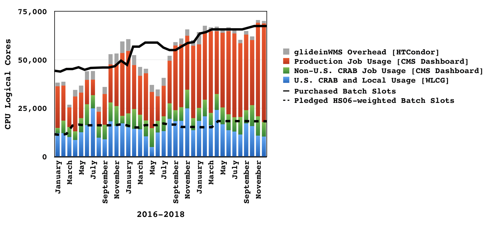

\clearpage

# Software and Computing

The final quarter of 2018 marked the end of the Run 2 proton collisions, a heavy-ion run, and the end of LHC operations until 2021. Computing operations were generally successful, with significant progress in preparing data and software releases for the upcoming winter conferences. Challenges were mostly associated with the high data rates of HI collisions, and they were met thanks to previous experience and careful preparation for this run.  Difficulties with the Monte Carlo production system at the end of the previous quarter were resolved, allowing all facilities to return to a level of full utilization. CMS made good use of the NERSC HPC systems.

The U.S. Tier-1 and Tier-2 facilities were as robust as ever, with high levels of availability to the experiment. All sites made continued progress with a variety of technology upgrades. The most significant of these was the commissioning of a new tape library system at Fermilab, which has proceeded months ahead of the expected schedule.  The experiment's computing infrastructure continues to be upgraded, with an increasing use of community- and industry-standard tools to avoid a reliance on in-house products. In particular, CMS is making rapid progress with migration to the Rucio data management system, which was developed for the ATLAS experiment but is now becoming a community project. A variety of software developments have targeted the improved use of heterogeneous processing architectures.

## Major milestones achieved this quarter

------------------------------------------------------------------------
Date            Milestone
--------------- --------------------------------------------------------
15 Oct 2018     Functional installation of Rucio on CERN hardware, no high avaiability.

6 Nov 2018      IBM TS4500 tape library system fully in production at FNAL.

15 Nov 2018     Release of a new DAS version that is capable of integrating Rucio data.

3 Dec 2018      Successful transition of LPC user metadata handling to the new FERRY service.

10 Dec 2018     Setup multiple Oracle DBs at CERN for Rucio.

10 Dec 2018     Migration of the Detector Database Core application to the new CERN IT-supported DD4HEP.

11 Dec 2018     CMSWeb migrated from SiteDB to CRIC.

31 Dec 2018     All milestones and upgrades at 5 of the 7 Tier-2 sites completed. Remaining sites either have a plan to complete in January 2019 or are held up by campus networking providers.

31 Dec 2018     Analysis prototype demonstration of using functional programming, based on optimized community library [`awkward-array`](https://github.com/scikit-hep/awkward-array).

31 Dec 2018     Integration of vectorized Kalman filter tracking `mkFit` into CMSSW.

31 Dec 2018     Upgrade to Frontier Squid-4 and developed and deployed outage monitoring for the Web Proxy Auto Discover.

------------------------------------------------------------------------

Table: Software & Computing milestones.

## Fermilab Facilities.

Throughout this quarter the Fermilab computing facilities continued to provide reliable custodial storage, processing and analysis resources to U.S. CMS collaborators. The site was well utilized, with the facility providing 43.1M wall-clock hours of processing to CMS.

{#fig:t1}

Figure @fig:t1 shows the site readiness metrics for the quarter. During this quarter the Tier-1 facility passed CMS site availability metrics 98.5% of the time. The blue in the figure indicates a scheduled downtime in December to apply security updates to the tape and disk storage nodes.  There were two periods of failing metrics during the quarter. Early in the quarter a bad fiber on the incoming 100Gb network link led to reduced incoming transfer throughput. In October a failing storage node caused failing transfers, which affected site availability.

The quarter marked a major milestone for the Tier-1 with the successful commissioning of the IBM TS4500 tape robot library. First replicated datasets began to be written to it in late October for commissioning, and the system was fully in production by the beginning of November. By the end of the quarter over 5 PB of data, including nearly all of the raw data from the 2018 HI run, was successfully written to tapes in the new library, months ahead of schedule.

There was much work on the LPC CAF during this quarter, including successful transition from the Vulcan user metadata service to the new FERRY service. Preparations for upgrading the LPC EOS storage system also were nearly completed, with the upgrade scheduled in January. The refactoring of the LPC HTCondor batch resources also made significant progress with a test pool being deployed for users to aid transition.  This refactoring aligns the LPC HTCondor resources with the Docker container migration done earlier in the year for the Tier-1 batch farm.  The move of these LPC resources to production was also scheduled during the EOS upgrade downtime in January.

## University Facilities

As seen in Figure @fig:t2, CMS production and analysis activities this quarter recovered to run at high levels relative to full capacity.  Problems with central CMS production world-wide in the late 3rd and early 4th quarters of 2018 prevented full utilization of the sites.  Total analysis usage has remained steady, although analysis activity by U.S. researchers has dropped from an average of 70% of total usage of our sites to about 60% in the past quarter. We will track the evolution of this metric in future quarters.

{#fig:t2}

All of the U.S. CMS Tier-2 sites operated successfully last quarter. On our two official performance metrics based on CMS test jobs, all sites were at least 97% (+1% over the previous quarter) "[available](https://www.google.com/url?q=http://wlcg-sam-cms.cern.ch/templates/ember/%23/historicalsmry/heatMap?end_time%3D2019%252F01%252F01%252000%253A00%26granularity%3DDaily%26profile%3DCMS_CRITICAL%26site%3DT2_US_Caltech%252CT2_US_Florida%252CT2_US_MIT%252CT2_US_Nebraska%252CT2_US_Purdue%252CT2_US_UCSD%252CT2_US_Wisconsin%26start_time%3D2018%252F10%252F01%252000%253A00%26time%3Dmanual%26type%3DAvailability%2520Ranking%2520Plot&sa=D&ust=1549216759263000)" and 88% (+0%) "[ready](https://www.google.com/url?q=https://dashb-ssb.cern.ch/dashboard/request.py/sitereadinessrank?columnid%3D234%23time%3Dcustom%26start_date%3D2018-10-01%26end_date%3D2019-01-01%26sites%3Dmultiple%26timebins%3Dfalse%26nodata%3Dfalse%26binsselect%3Ddefault%26clouds%3Dall%26site%3DT2_US_Caltech,T2_US_Florida,T2_US_MIT,T2_US_Nebraska,T2_US_Purdue,T2_US_UCSD,T2_US_Wisconsin&sa=D&ust=1549216759263000)".  The CMS requirement for each of these metrics is 80%, but the U.S. CMS performance goal is 90%, which all sites met except for Caltech.  Nonetheless our commitments to CMS were met with success. The U.S. CMS Tier-2 centers delivered [50.8%](https://www.google.com/url?q=http://dashb-cms-jobsmry.cern.ch/dashboard/request.py/consumptions_individual?sites%3DT2_AT_Vienna%26sites%3DT2_BE_IIHE%26sites%3DT2_BE_UCL%26sites%3DT2_BR_SPRACE%26sites%3DT2_BR_UERJ%26sites%3DT2_CH_CSCS%26sites%3DT2_CN_Beijing%26sites%3DT2_DE_DESY%26sites%3DT2_DE_DESY_Test%26sites%3DT2_DE_RWTH%26sites%3DT2_EE_Estonia%26sites%3DT2_EE_Estonia_Test%26sites%3DT2_ES_CIEMAT%26sites%3DT2_ES_IFCA%26sites%3DT2_FI_HIP%26sites%3DT2_FI_HIP_Test%26sites%3DT2_FR_CCIN2P3%26sites%3DT2_FR_GRIF_IRFU%26sites%3DT2_FR_GRIF_LLR%26sites%3DT2_FR_IPHC%26sites%3DT2_GR_Ioannina%26sites%3DT2_HU_Budapest%26sites%3DT2_IN_TIFR%26sites%3DT2_IT_Bari%26sites%3DT2_IT_Legnaro%26sites%3DT2_IT_LegnaroTest%26sites%3DT2_IT_Pisa%26sites%3DT2_IT_Rome%26sites%3DT2_KR_KNU%26sites%3DT2_MY_UPM_BIRUNI%26sites%3DT2_PK_NCP%26sites%3DT2_PL_Swierk%26sites%3DT2_PL_Warsaw%26sites%3DT2_PT_NCG_Lisbon%26sites%3DT2_RU_IHEP%26sites%3DT2_RU_INR%26sites%3DT2_RU_ITEP%26sites%3DT2_RU_JINR%26sites%3DT2_RU_PNPI%26sites%3DT2_RU_RRC_KI%26sites%3DT2_RU_SINP%26sites%3DT2_TH_CUNSTDA%26sites%3DT2_TR_METU%26sites%3DT2_UA_KIPT%26sites%3DT2_UK_London_Brunel%26sites%3DT2_UK_London_BrunelTest%26sites%3DT2_UK_London_IC%26sites%3DT2_UK_SGrid_Bristol%26sites%3DT2_UK_SGrid_RALPP%26sites%3DT2_US_Caltech%26sites%3DT2_US_Florida%26sites%3DT2_US_MIT%26sites%3DT2_US_Nebraska%26sites%3DT2_US_Purdue%26sites%3DT2_US_UCSD%26sites%3DT2_US_Vanderbilt%26sites%3DT2_US_Wisconsin%26sitesSort%3D2%26start%3D2018-10-01%26end%3D2019-01-01%26timeRange%3Ddaily%26granularity%3DMonthly%26generic%3D0%26sortBy%3D0%26series%3DAll%26type%3Dewa&sa=D&ust=1549216759265000) of all computing time by Tier-2 sites in CMS last quarter, up about 2.6% from the previous quarter.

Site personnel made strong efforts to wrap up any remaining milestones and upgrades before the end of the calendar year. Generally these fall into a few broad categories of upgrading to SL7, implementing IPv6, and simplifying the architecture of the sites. Two planned upgrades for 2018, upgrading to HTCondor 8.8 and HDFS 3, were cancelled due to lack up upstream software releases. Upgrading all processing nodes to SL7 is difficult for sites that co-locate storage and processing, so such sites will be allowed to meet this milestone in 2019 as long as progress has been shown, e.g. installing newly purchased processing nodes with SL7.

The IPv6 milestones (storage access, stageout, XRootD, transfers) have been achieved at every site except MIT where IPv6 is still not available from their facility and at Caltech where everything is in place except reverse-DNS at their campus. Neither of these cases is the fault of the Tier-2 sites since they depend on their host institutions for networking. The only other milestones that were not achieved in 2018 were upgrading the remaining one-third of worker nodes and CE's at Wisconsin as well as stageout by https, and a few upgrades at MIT that they promised to complete by the end of January 2019.

The U.S. CMS Tier-3 support team provided help to ten sites on a number of issues mainly related to OSG software upgrades, Singularity, PhEDEx transfers, XRootD, basic systems administration, in particular upgrading to EL7. Routine CMS Connect support continued and techniques were established and documented to use CMS Connect to access GPU resources interactively as well as to launch a Spark cluster (leveraging the VC3 software). Finally, the team provided support for three U.S. CMS Tier-3 sites that started running production jobs (Baylor, Colorado, and Rutgers).

## Computing Operations

The proton-proton data taking period was completed at the end of October. It was followed by a month-long HI run in which CMS recorded 5.3 PB of raw data. Switching the Tier-0 configuration for HI operations was smooth. All pp data are now archived, and were passed through prompt reconstruction (with the exception of the parked B physics data). Distribution and archival of the HI data will be completed in early January 2019.

Processing during the fourth quarter was dominated by four activities: generating a new version of miniAODs (19 billion events), re-reconstructing early 2018 data (2.6 billion events), and Monte Carlo generation for the 2017 (1 billion events) and the 2018 (6 billion events) detector configurations.

The MiniAOD v3 production made the staging and transfer of the large AOD datasets necessary which caused congestion in the workflow management system and thus CPU resources of CMS were not being fully utilized for a brief period end of October.

Issues with EOS/Unified at CERN required manual intervention for a large number of processing requests. The setup is in the process of being changed and the Unified system that orchestrates production workflows will be modified to use a shared filesystem other than EOS.

With the end of the data taking the high level trigger farm is now being utilized for offline data and Monte Carlo processing. Over the December holiday period data processing ran steadily with about 200k cores in use, while analysis used about 50k cores, see Figure @fig:co.

{#fig:co}

The last quarter of 2018 was also the last quarter of the NERSC allocation year. For 2018, CMS, the Fermilab FIFE experiments, and SciDAC were allocated a combined 93M hours on the NERSC supercomputer. The total allocation was 97% utilized, with CMS using 42M hours of NERSC CPU. CMS has received an allocation of 82M hours at NERSC for 2019. In addition, CMS used a total of 4.5M hours on the Bridges supercomputer at the Pittsburgh Supercomputing Center during 2018. A new XSEDE request was being prepared for submission in January 2019.

## Computing Infrastructure and Services

Work on Rucio has progressed considerably during this quarter as the team builds up and transitions from PhEDEx to Rucio. The effort on Rucio or Rucio-related issues is split roughly evenly between U.S. CMS members and CMS members outside the U.S., with overall leadership provided by U.S. CMS members.  A fully working Rucio testbed has been installed on CERN hardware using Kubernetes and Docker, tools widely used in industry. This testbed is easily replicated and that replica will become the production system. The CMS DAS (Data Aggregation Service) has been integrated with Rucio and is able to give users a coherent view of data from DBS, Rucio, and other services. CMS Rucio has been moved onto production Oracle hardware at CERN.

In this quarter, we helped migrate additional computing services from the CMS-specific SiteDB information service to the CERN-supported CRIC. By utilizing a service developed and supported by CERN as opposed to an internal one, we hope to reduce the overall maintenance burden.

U.S. CMS continues to support the CERN-led effort to modernize the CMSWeb stack. This development project will provide CMS with more agility for updating services and replaces the decade-old custom infrastructure U.S. CMS developed for web service deployments with an industry standard one based on Kubernetes. As with the SiteDB to CRIC transition, we believe utilizing software supported by an external community will help reduce CMS's maintenance burden. Additionally, this overhaul has allowed us to start modernizing the authentication and authorization mechanisms used by CMS. A first part of this, the ability for CMSWeb to issue "SciTokens" ([www.scitokens.org](https://www.google.com/url?q=http://www.scitokens.org&sa=D&ust=1549216759271000)) to access CMS's distributed storage was put into the CMSWeb testbed during Q4.

In the XRootd/XCache project, per-directory access/usage statistics collection were implemented, which will also be the basis of implementation of per-directory quotas. The team assisted in debugging and understanding problems reported by StashCache and ATLAS and attended the newly created XCache DevOps meetings.

## Software and Support

Reconstruction software release integration was very active during this quarter. The main task was to support the heavy ion data taking, requiring optimization of the RAW data formats and their compression. In addition to supporting the releases for 2018 proton-proton data and MC processing and the MTD detector TDR production, a 20% speed-up of the MINIAOD production workflow was achieved without any changes in physics output.

The framework activities concentrated on enabling new advanced code developments in GPU, vectorized tracking and machine learning based on TensorFlow, where contributions have been submitted to the TensorFlow community. Further improvements of the multi-threading performance have been achieved, especially for non-event data that is not bound to any event or luminosity-section boundaries. Studies continued to compare TBB-based multi-threading with a similar implementation based on OpenMP, where several fruitful discussions with the OpenMP development team led to improvements on both sides. We were also requested to report at an ATLAS workshop on how CMS stores metadata in its production ROOT file

The Frontier infrastructure was migrated to frontier-squid-4 and CentOS 7, and we deployed a new outage monitor for the Web Proxy Auto Discovery.

The migration to the DD4HEP framework to describe and use the CMS detector geometry from various places in CMSSW progresses well, achieving the milestone of migration of the DDCore application.

The CMS visualization solution Fireworks was released on macOS Mojave, and EvE7, the evolution of the community solution for ROOT-based detector and event visualization, was integrated into the main ROOT repository.

The evolution of analysis tools using functional programming and industry technologies saw a large boost in this quarter with a dedicated analysis porting effort using the underlying community libraries like awkward-array to efficiently analyze columnar data.

The R&D on vectorized tracking on advanced hardware included a first version into CMSSW and is testing and optimizing its performance, especially on Intel Skylake Gold nodes important for HPCs.

## Other activities

The security team aims to revise the security processes and documents to guarantee secure operation of U.S. CMS sites. The team completed an initial version of the CMS computing workflow description covering both production and analysis use cases. A main document describes these in detailed separate diagrams, along with an additional diagram describing the workflow from the site perspective. Using the feedback given by the U.S. CMS management team, the security team is modifying these diagrams and adjusting them accordingly.

The Blueprint activity continues to focus on computing model evolutions and discussions as a means to identify research and development for HL-LHC. We organized four U.S. CMS blueprint meetings this quarter.  These included discussions on strategies for how caching data can improve data availability metrics (or reduce cost) at sites; developments by the CMSSW framework group to support the use of accelerators by CMSSW algorithms; understanding the drivers that define disk needs for HL-LHC; and developments in the WLCG tape working group and their impact on HL-LHC strategies for data management. Planned blueprint meetings for next quarter include detailed modeling of network and tape-recall needs for HL-LHC, additional discussions of caching strategies, and the ongoing scitoken project.

We also initiated a new effort towards an analytics driven model of the needs of data resident on disk and its evolution. We presented an initial study of how much, and what sorts, of data are used each month (or each week) by CMS analysts at the WLCG DOMA working group in December. This work will further support the CMS ECOM2X working group as it evolves towards a HL-LHC software and computing strategy for CMS.
